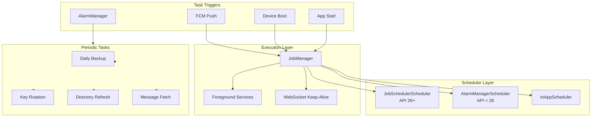
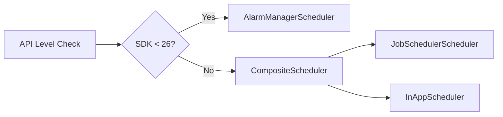
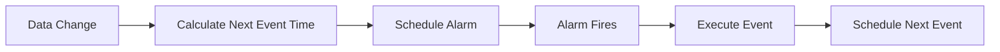
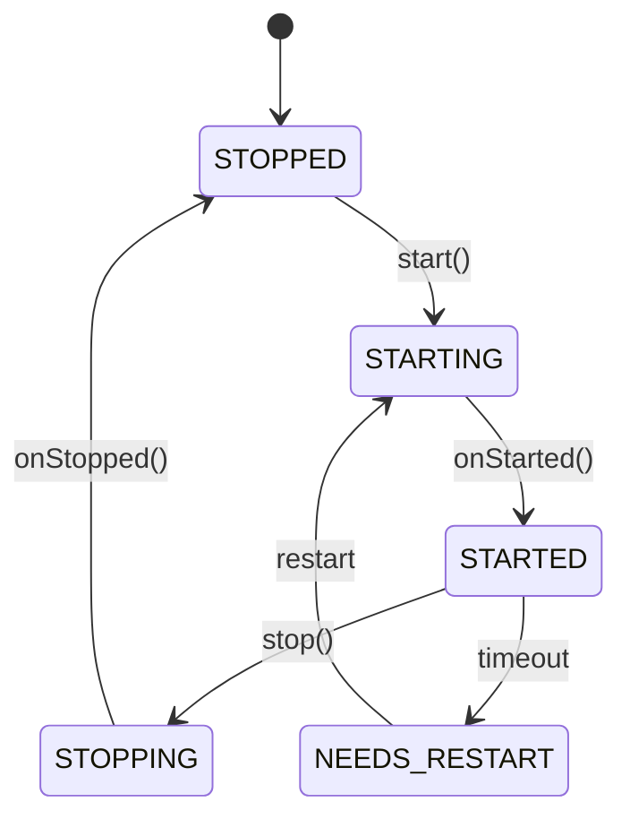
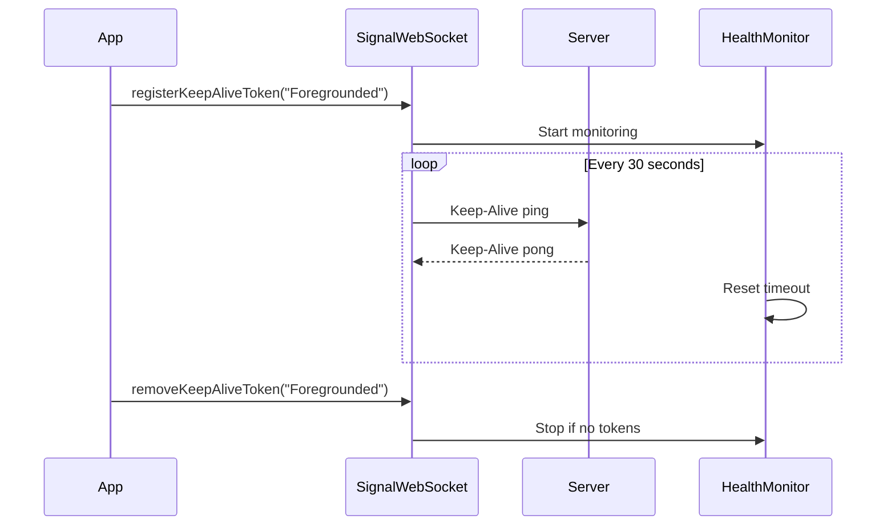
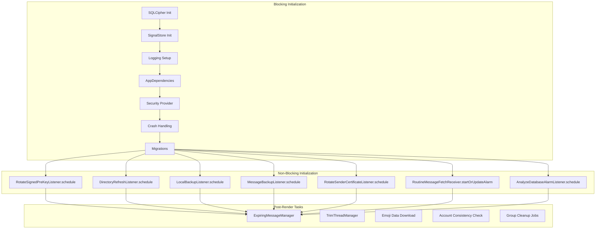
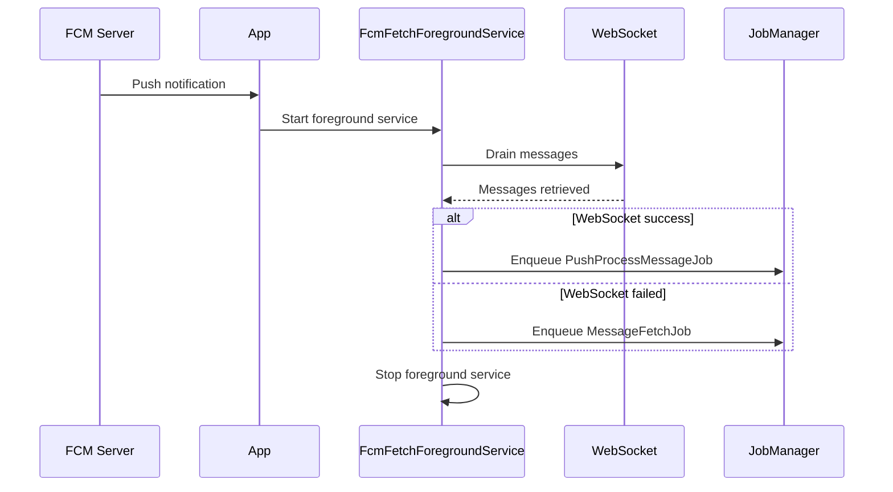

# Background Tasks

**Audience:** Developers, Architects

This document describes how Signal-Android handles background operations, scheduled tasks, and process lifecycle management.

## System Overview

Signal-Android does **NOT** use AndroidX WorkManager. Instead, it implements a custom `JobManager` system with AlarmManager-based scheduling for periodic tasks.



---

## 1. Scheduler Architecture

### 1.1 No WorkManager - Custom JobManager

Signal uses a purpose-built `JobManager` instead of AndroidX WorkManager for:

| Advantage | Description |
|-----------|-------------|
| Fine-grained control | Custom retry logic, constraints, priorities |
| Performance | Optimized for Signal's workload patterns |
| Persistence | Encrypted job storage with SQLCipher |
| No Google dependencies | Works without Google Play Services |

### 1.2 Scheduler Selection by API Level



**Source:** `app/src/main/java/org/thoughtcrime/securesms/jobmanager/JobManager.java:74-75`

```java
Build.VERSION.SDK_INT < 26 
    ? new AlarmManagerScheduler(application)
    : new CompositeScheduler(new InAppScheduler(this), new JobSchedulerScheduler(application))
```

### 1.3 Scheduler Types

| Scheduler | API Level | Purpose |
|-----------|-----------|---------|
| `AlarmManagerScheduler` | < 26 | Legacy alarm-based scheduling |
| `JobSchedulerScheduler` | ≥ 26 | System JobScheduler integration |
| `InAppScheduler` | All | Immediate execution when app is foregrounded |

---

## 2. Periodic Jobs

### 2.1 PersistentAlarmManagerListener (Base Class)

Base class for all periodic scheduled tasks using AlarmManager.

**Source:** `app/src/main/java/org/thoughtcrime/securesms/service/PersistentAlarmManagerListener.java`

```java
public abstract class PersistentAlarmManagerListener extends BroadcastReceiver {
    // Override these methods
    protected abstract long getNextScheduledExecutionTime();
    protected abstract void onAlarm(Context context, long scheduledTime);
    protected boolean shouldScheduleExact() { return false; }
}
```

### 2.2 Registered Periodic Tasks

| Task | File | Interval | Purpose |
|------|------|----------|---------|
| `MessageBackupListener` | `service/MessageBackupListener.kt` | Daily | Schedule backup jobs |
| `DirectoryRefreshListener` | `service/DirectoryRefreshListener.java` | Periodic | Refresh contact directory |
| `LocalBackupListener` | `service/LocalBackupListener.java` | Periodic | Local backup scheduling |
| `RotateSignedPreKeyListener` | `service/RotateSignedPreKeyListener.java` | Periodic | Rotate signed prekeys |
| `RotateSenderCertificateListener` | `service/RotateSenderCertificateListener.java` | Periodic | Rotate sender certificate |
| `AnalyzeDatabaseAlarmListener` | `service/AnalyzeDatabaseAlarmListener.kt` | Periodic | Database optimization |
| `RoutineMessageFetchReceiver` | `messageprocessingalarm/RoutineMessageFetchReceiver.java` | Configurable | Periodic message fetch |

### 2.3 Routine Message Fetch

```kotlin
// Schedules repeating alarm for message fetching
AlarmManager.setRepeating(
    AlarmManager.ELAPSED_REALTIME_WAKEUP,
    triggerAtTime,
    RemoteConfig.backgroundMessageProcessInterval,
    pendingIntent
)
```

**Source:** `app/src/main/java/org/thoughtcrime/securesms/messageprocessingalarm/RoutineMessageFetchReceiver.java`

---

## 3. Timed Event Management

### 3.1 TimedEventManager

Manages time-based events triggered by data state rather than fixed intervals.

**Source:** `app/src/main/java/org/thoughtcrime/securesms/service/TimedEventManager.java`



### 3.2 Event-Based Managers

| Manager | File | Purpose |
|---------|------|---------|
| `ScheduledMessageManager` | `messages/ScheduledMessageManager.kt` | Send scheduled messages |
| `ExpiringStoriesManager` | `messages/ExpiringStoriesManager.kt` | Delete stories after 24hr |
| `ExpiringArchivedStoriesManager` | `messages/ExpiringArchivedStoriesManager.kt` | Archive story cleanup |
| `PinnedMessageManager` | `messages/PinnedMessageManager.kt` | Pinned message management |
| `DeletedCallEventManager` | `database/DeletedCallEventManager.kt` | Call log cleanup |

---

## 4. Foreground Services

### 4.1 Service Types

| Service | File | Purpose |
|---------|------|---------|
| `GenericForegroundService` | `service/GenericForegroundService.kt` | Generic task execution |
| `FcmFetchForegroundService` | `gcm/FcmFetchForegroundService.kt` | FCM message fetching |
| `BackupMediaRestoreService` | `service/BackupMediaRestoreService.kt` | Media restore operations |
| `AttachmentProgressService` | `service/AttachmentProgressService.kt` | Attachment progress |
| `BackupProgressService` | `service/BackupProgressService.kt` | Backup progress notification |
| `IncomingMessageObserver.ForegroundService` | `messages/IncomingMessageObserver.kt:590` | WebSocket maintenance |
| `IncomingMessageObserver.BackgroundService` | `messages/IncomingMessageObserver.kt:623` | Process keep-alive |

### 4.2 SafeForegroundService Pattern

Base class providing safe foreground service lifecycle:



**Source:** `app/src/main/java/org/thoughtcrime/securesms/service/SafeForegroundService.kt`

### 4.3 Foreground Service Constraints

| Constraint | Value | Purpose |
|------------|-------|---------|
| Timeout (Android 12+) | 6 hours | Max foreground service duration |
| Notification | Required | User-visible notification |
| Type | `dataSync`, `specialUse` | Service type declaration |

---

## 5. Keep-Alive Mechanisms

### 5.1 WebSocket Keep-Alive



**Source:** 
- `lib/libsignal-service/src/main/java/org/whispersystems/signalservice/api/websocket/SignalWebSocket.kt`
- `app/src/main/java/org/thoughtcrime/securesms/net/SignalWebSocketHealthMonitor.kt`

### 5.2 Keep-Alive Configuration

```kotlin
// SignalWebSocket.kt
const val KEEP_ALIVE_RESPONSE_TIMEOUT = 20.seconds
const val KEEP_ALIVE_INTERVAL = 30.seconds

// Health Monitor
pingInterval = KEEP_ALIVE_INTERVAL
timeout = KEEP_ALIVE_RESPONSE_TIMEOUT
```

### 5.3 Process Keep-Alive (Legacy)

**KeepAliveService** - Sticky service for API < 26 to prevent process termination:

**Source:** `app/src/main/java/org/thoughtcrime/securesms/jobmanager/KeepAliveService.java`

```java
// Only used on API < 26 where background restrictions are less strict
if (Build.VERSION.SDK_INT < 26) {
    context.startService(new Intent(context, KeepAliveService.class));
}
```

---

## 6. Boot & Startup Handling

### 6.1 Boot Receiver

**Source:** `app/src/main/java/org/thoughtcrime/securesms/jobmanager/BootReceiver.java`

```java
@Override
public void onReceive(Context context, Intent intent) {
    Log.i(TAG, "Boot received. Application is created, kickstarting JobManager.");
    // JobManager initialization triggers pending job execution
}
```

**Manifest Declaration:**
```xml
<receiver android:name=".jobmanager.BootReceiver"
          android:exported="false">
    <intent-filter>
        <action android:name="android.intent.action.BOOT_COMPLETED" />
    </intent-filter>
</receiver>
```

### 6.2 App Startup Sequence

**Source:** `app/src/main/java/org/thoughtcrime/securesms/ApplicationContext.java:161-240`



### 6.3 Periodic Task Registration on Startup

```java
// ApplicationContext.java - Non-blocking initialization
RotateSignedPreKeyListener.schedule(context);
DirectoryRefreshListener.schedule(context);
LocalBackupListener.schedule(context);
MessageBackupListener.schedule(context);
RotateSenderCertificateListener.schedule(context);
RoutineMessageFetchReceiver.startOrUpdateAlarm(context);
AnalyzeDatabaseAlarmListener.schedule(context);
```

---

## 7. FCM Wake-Up Flow

### 7.1 FCM Message Handling



**Source:** `app/src/main/java/org/thoughtcrime/securesms/gcm/FcmFetchManager.kt`

### 7.2 Background Time Limits

```kotlin
// IncomingMessageObserver.kt
private val maxBackgroundTime: Long
    get() = if (censored) 10.seconds.inWholeMilliseconds 
            else 2.minutes.inWholeMilliseconds
```

---

## 8. Background Task Categories

### 8.1 By Trigger Type

| Trigger | Tasks |
|---------|-------|
| **FCM Push** | Message fetch, notification processing |
| **Boot** | JobManager restart, periodic task scheduling |
| **Alarm** | Backups, key rotation, directory refresh |
| **App Start** | Initialization, cleanup, consistency checks |
| **Data Change** | Scheduled messages, expiring stories |

### 8.2 By Priority

| Priority | Tasks |
|----------|-------|
| **High** | Message sending, FCM response, calls |
| **Default** | Attachment upload/download, profile fetch |
| **Low** | Backups, cleanup, optimization |
| **Lower** | Analytics, non-essential sync |

---

## 9. Best Practices

### 9.1 Choosing Task Type

| Use Case | Recommended Approach |
|----------|---------------------|
| One-time work with constraints | `JobManager.add(job)` |
| Sequential work | `JobManager.startChain().then().enqueue()` |
| Recurring work | Extend `PersistentAlarmManagerListener` |
| Data-driven timing | Use `TimedEventManager` |
| Long-running visible work | `GenericForegroundService` |
| Immediate response to FCM | `FcmFetchForegroundService` |

### 9.2 Battery Optimization

```kotlin
// Batch jobs together when possible
AppDependencies.jobManager.startChain(job1)
    .then(job2)
    .then(job3)
    .enqueue()

// Use constraints to avoid wasted work
Parameters.Builder()
    .addConstraint(NetworkConstraint.KEY)
    .addConstraint(BatteryNotLowConstraint.KEY)
    .build()
```

### 9.3 Foreground Service Guidelines

1. Always show notification with progress
2. Handle 6-hour timeout on Android 12+
3. Stop service when work completes
4. Use appropriate service type (`dataSync`, `specialUse`)

---

## 10. Debugging Background Tasks

### 10.1 JobManager Inspection

```kotlin
// Check pending jobs
val jobTracker = AppDependencies.jobManager.tracker
jobTracker.forEach { job ->
    Log.d("JobDebug", "Job: ${job.factoryKey}, state: ${job.state}")
}
```

### 10.2 AlarmManager Debug

```bash
# List scheduled alarms (requires root or debug build)
adb shell dumpsys alarm | grep signal
```

### 10.3 Foreground Service Monitoring

```bash
# List foreground services
adb shell dumpsys activity services | grep foreground
```

### 10.4 Common Issues

| Issue | Cause | Solution |
|-------|-------|----------|
| Jobs not running | Constraint not met | Check network, battery, call state |
| Alarms not firing | Battery optimization | Add app to battery whitelist |
| FCM not received | Play Services issue | Check Google Play Services |
| Foreground service killed | System memory pressure | Reduce service duration |

---

## See Also

- [Job System](Job-System.md) - JobManager architecture and job creation
- [Architecture](Architecture.md) - Overall system architecture
- [Media Lifecycle](Media-Lifecycle.md) - Attachment processing jobs