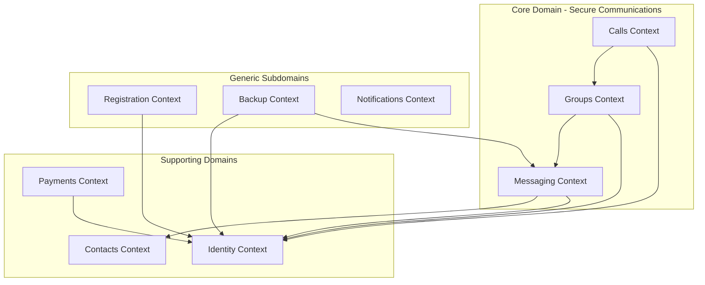

# Business Domain

> **Domain-Driven Design (DDD)** perspective on Signal's core business concepts, bounded contexts, and ubiquitous language.

## Domain Overview

Signal operates in the **Secure Communications** domain, providing privacy-preserving messaging, voice/video calls, and payments. The core value proposition is that users can communicate securely without trusting Signal or any third party with their message content.

## Bounded Contexts

## Context Map

| Context | Type | Description |
|---------|------|-------------|
| **Messaging** | Core Domain | Direct and group message exchange |
| **Calls** | Core Domain | Voice and video communication |
| **Groups** | Core Domain | Group management and group messaging |
| **Identity** | Supporting | User identity and cryptographic keys |
| **Contacts** | Supporting | Contact management and discovery |
| **Payments** | Supporting | MobileCoin cryptocurrency transactions |
| **Registration** | Generic | Account creation and verification |
| **Backup** | Generic | Data backup and restoration |
| **Notifications** | Generic | Push notification handling |

---

## Messaging Context

### Ubiquitous Language

| Term | Definition | Code Location |
|------|------------|---------------|
| **Message** | An encrypted unit of communication between users | `MessageRecord`, `MessageTable` |
| **Thread** | A conversation with one or more recipients | `ThreadRecord`, `ThreadTable` |
| **Recipient** | A Signal user or group that can receive messages | `Recipient`, `RecipientTable` |
| **Attachment** | Binary data (image, video, file) attached to a message | `Attachment`, `AttachmentTable` |
| **Reaction** | Emoji response to a message | `ReactionRecord`, `ReactionTable` |
| **Quote** | A referenced message within another message | `Quote` in `MessageRecord` |
| **Mention** | @-reference to a user in a message | `Mention`, `MentionTable` |
| **Expiration Timer** | Duration after which a message is deleted | `ExpireTimer` in `ThreadRecord` |
| **Read Receipt** | Notification that a message was read | `ReadReceipt` |

### Domain Events

| Event | Trigger | Handler |
|-------|---------|---------|
| **MessageSent** | User sends a message | `MessageSendJob` |
| **MessageReceived** | Server delivers a message | `IncomingMessageProcessor` |
| **MessageRead** | User reads a message | `MarkReadHelper` |
| **MessageDeleted** | User deletes a message | `DeleteMessagesDialog` |
| **ReactionAdded** | User reacts to a message | `ReactionEvent` |
| **ThreadArchived** | User archives a conversation | `ThreadTable.archiveConversation` |

### Business Rules

1. **End-to-End Encryption**: All messages are encrypted before leaving the device
2. **Forward Secrecy**: Each message uses new cryptographic keys
3. **Message Integrity**: Messages cannot be tampered with in transit
4. **Disappearing Messages**: Messages are deleted after the specified timer
5. **Message Requests**: Messages from unknown contacts require acceptance

### Aggregate Roots

| Aggregate | Root Entity | Repository |
|-----------|-------------|------------|
| **Message** | `MessageRecord` | `MessageTable` |
| **Thread** | `ThreadRecord` | `ThreadTable` |
| **Draft** | `Draft` | `DraftTable` |

---

## Groups Context

### Ubiquitous Language

| Term | Definition | Code Location |
|------|------------|---------------|
| **Group V2** | Modern Signal group with server-side management | `GroupTable`, `GroupManagerV2` |
| **Group ID** | Unique identifier for a group | `GroupId` |
| **Group Member** | A participant in a group | `GroupTable.Member` |
| **Group Admin** | A member with administrative privileges | `GroupTable.Member` (admin role) |
| **Group Invite Link** | Shareable link to join a group | `GroupInviteLinkUrl` |
| **Group Access Control** | Permissions for membership and attributes | `GroupAccessControl` |
| **Group Call** | Voice/video call within a group | `CallLinkTable` |

### Domain Events

| Event | Trigger | Handler |
|-------|---------|---------|
| **GroupCreated** | User creates a new group | `GroupManagerV2.createGroup` |
| **MemberAdded** | New member joins group | `GroupManagerV2.updateGroup` |
| **MemberRemoved** | Member leaves or is removed | `GroupManagerV2.updateGroup` |
| **AdminPromoted** | Member becomes admin | `GroupManagerV2.updateGroup` |
| **GroupTitleChanged** | Group name updated | `GroupManagerV2.updateGroup` |

### Business Rules

1. **Group Size Limit**: Maximum 1,000 members per group
2. **Admin Approval**: Admins can require approval for new members
3. **Invite Links**: Can be revoked by admins
4. **Disappearing Messages**: Set at group level, applies to all members
5. **Group V2 Required**: All groups use Group V2 protocol with server-side encryption

---

## Calls Context

### Ubiquitous Language

| Term | Definition | Code Location |
|------|------------|---------------|
| **Call** | Voice or video communication session | `CallTable` |
| **Call Link** | Shareable link to join a call | `CallLinkTable` |
| **Call State** | Current status of a call (ringing, connected, ended) | `CallState` |
| **SFU** | Selective Forwarding Unit for group calls | Signal server infrastructure |
| **RingRTC** | Signal's WebRTC implementation | `ringrtc` library |

### Domain Events

| Event | Trigger | Handler |
|-------|---------|---------|
| **IncomingCall** | Remote user initiates call | `WebRtcCallService` |
| **CallAnswered** | User accepts incoming call | `WebRtcCallActivity` |
| **CallDeclined** | User rejects incoming call | `WebRtcCallService` |
| **CallEnded** | Call terminates | `WebRtcCallService` |
| **GroupCallJoined** | User joins group call | `CallLinkTable` |

### Business Rules

1. **End-to-End Encryption**: All calls use SRTP with Signal Protocol keys
2. **One Call at a Time**: User can only be in one active call
3. **Group Calls via SFU**: Large group calls use selective forwarding
4. **Call Links**: Links can have admin restrictions

---

## Identity Context

### Ubiquitous Language

| Term | Definition | Code Location |
|------|------------|---------------|
| **ACI (Account ID)** | Primary account identifier | `Aci` |
| **PNI (Phone Number ID)** | Secondary identifier for phone number | `Pni` |
| **Identity Key** | Long-term public key for user | `IdentityKey`, `IdentityTable.kt:48` |
| **Profile Key** | Key for accessing user profile | `ProfileKey`, `ProfileKeyUtil` |
| **Session** | 1:1 encrypted channel between two devices, established via X3DH | `SessionTable.kt:22`, `SessionRecord` |
| **Sender Key** | Shared key for efficient group messaging, per-sender per-group | `SenderKeyTable.kt:27`, `SenderKeyRecord` |
| **Distribution ID** | Unique identifier for a group's sender key session | `DistributionId.java:14` |
| **SignalProtocolAddress** | Identifies a recipient+device combination | `SignalProtocolAddress(name, deviceId)` |
| **Device** | Linked device with unique device ID (1=primary, 2+=linked) | `SignalProtocolAddress.deviceId` |
| **PreKey** | One-time key for new sessions | `OneTimePreKeyTable` |
| **Signed PreKey** | Medium-term key signed by identity | `SignedPreKeyTable` |
| **Kyber PreKey** | Post-quantum key for new sessions | `KyberPreKeyTable` |

### Domain Events

| Event | Trigger | Handler | Code Location |
|-------|---------|---------|---------------|
| **SessionEstablished** | First message to recipient via X3DH | `SignalServiceMessageSender` | `SignalServiceMessageSender.java:2841-2855` |
| **SenderKeyDistributed** | New member joins group, receives SKDM | `SenderKeyDistributionSendJob` | `SenderKeyDistributionSendJob.java:81-139` |
| **IdentityChanged** | Contact's identity key changes | `SafetyNumberChangeDialog` | `SignalBaseIdentityKeyStore.java:85-106` |
| **DeviceLinked** | New device provisioned via QR code | `LinkDeviceRepository` | `LinkDeviceRepository.kt:52-151` |
| **SenderKeyRotated** | Member leaves group, key rotated | `SenderKeyUtil.rotateOurKey` | `SenderKeyUtil.java:18` |
| **SessionArchived** | Session invalidated or identity changed | `SessionTable.archiveSession` | `SessionTable.kt:180-190` |

### Aggregate Roots

| Aggregate | Root Entity | Repository | Code Location | Consistency Rules |
|-----------|-------------|------------|---------------|-------------------|
| **Session** | `SessionRecord` | `SessionTable` | `SessionTable.kt:22-240` | Each session maintains independent ratchet state per device pair |
| **Sender Key** | `SenderKeyRecord` | `SenderKeyTable` | `SenderKeyTable.kt:27-78` | Per-sender, per-group key session with chain key and ratchet |
| **Identity** | `IdentityKey` | `IdentityTable` | `IdentityTable.kt:48-250` | Long-term key with verification status and trust history |

### Business Rules

1. **Identity Key Rotation**: Users can rotate their identity key
2. **Safety Number Change**: Users are warned when contact's key changes
3. **Session Management**: Sessions are created on first message exchange via X3DH
4. **Key Exhaustion**: New PreKeys are uploaded when supply is low
5. **Sender Key Efficiency**: One encryption for all group members instead of N individual encryptions
6. **Key Rotation on Leave**: Sender keys rotated when membership changes to prevent removed members from decrypting
7. **Multi-Device Sessions**: Each device maintains separate sessions with the same identity key
8. **Trust on First Use**: New identity keys are trusted by default, changes require verification

---

## Contacts Context

### Ubiquitous Language

| Term | Definition | Code Location |
|------|------------|---------------|
| **Recipient** | Entity that can receive messages (user or group) | `Recipient`, `RecipientTable` |
| **System Contact** | Contact from device address book | `ContactAccessor` |
| **Signal Contact** | Recipient with a Signal account | `RecipientTable.registered` |
| **Username** | Optional Signal username | `Username` |
| **Profile** | User's display name and avatar | `Profile` |
| **Message Request** | Conversation with untrusted recipient | `MessageRequestViewModel` |

### Domain Events

| Event | Trigger | Handler |
|-------|---------|---------|
| **ContactDiscovered** | Phone number found in Signal network | `CdsiLookup` |
| **ProfileUpdated** | Contact updates their profile | `ProfileHelper` |
| **RecipientBlocked** | User blocks a recipient | `BlockUnblockDialog` |
| **MessageRequestAccepted** | User accepts message request | `MessageRequestState` |

---

## Payments Context

### Ubiquitous Language

| Term | Definition | Code Location |
|------|------------|---------------|
| **Wallet** | Local MobileCoin wallet | `Wallet` |
| **Payment** | A single transaction | `Payment`, `PaymentTable` |
| **Balance** | Available MobileCoin amount | `Balance` |
| **Fee** | Transaction fee | `Fee` |
| **Public Address** | MobileCoin receiving address | `MobileCoinPublicAddress` |
| **Mnemonic** | Recovery phrase for wallet | `Mnemonic` |

### Business Rules

1. **No Custodial Storage**: Wallet keys never leave the device
2. **Privacy**: Transactions use MobileCoin's privacy-preserving design
3. **Fee Estimation**: Fees are estimated before transaction submission
4. **Geographic Restrictions**: Payments may be restricted in some regions

---

## Registration Context

### Ubiquitous Language

| Term | Definition | Code Location |
|------|------------|---------------|
| **Registration** | Process of creating a Signal account | `RegistrationActivity` |
| **Verification Code** | SMS/voice code to verify phone number | `VerificationCode` |
| **CAPTCHA** | Challenge to prevent automation | `Captcha` |
| **SVR2 PIN** | User PIN for secure key backup | `Svr2Pin` |
| **Device Transfer** | Migrating account from another device | `DeviceTransferActivity` |

### Business Rules

1. **Phone Number Required**: Account requires a verified phone number
2. **Rate Limiting**: Registration attempts are rate-limited
3. **PIN Optional**: SVR2 backup is optional but recommended
4. **Device Linking**: Additional devices can be linked after registration

---

## Cross-Cutting Concerns

### Security

- All domains use encryption at rest (SQLCipher)
- Network communication uses TLS + Signal Protocol
- Keys are stored in Android Keystore when possible

### Privacy

- Minimal metadata stored on servers
- No message content stored server-side
- Contact discovery uses encrypted contact intersection

### Offline Support

- Messages are queued when offline
- Jobs retry with exponential backoff
- Local database is the source of truth

---

## Related Documentation

- [C4 Component Diagram](C4-Component-Diagram.md) - Technical implementation of domains
- [Database](Database.md) - Data persistence for domain entities
- [Security & Cryptography](Security-Cryptography.md) - Cryptographic primitives