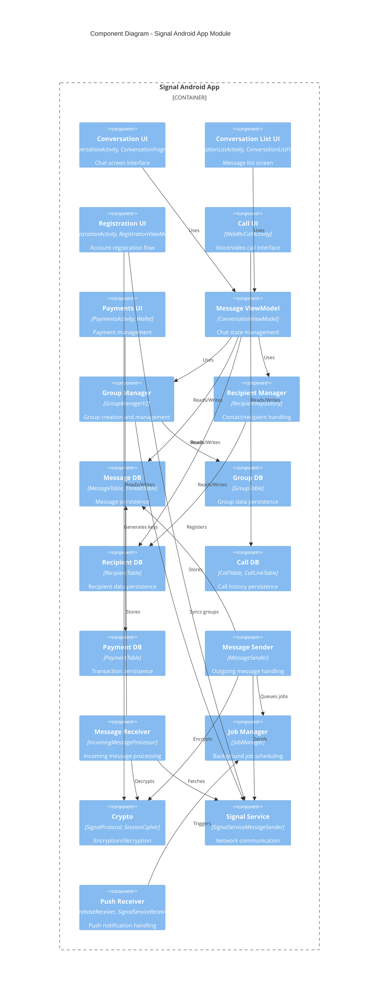
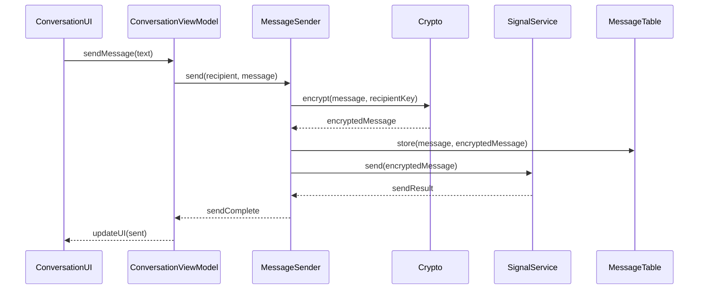
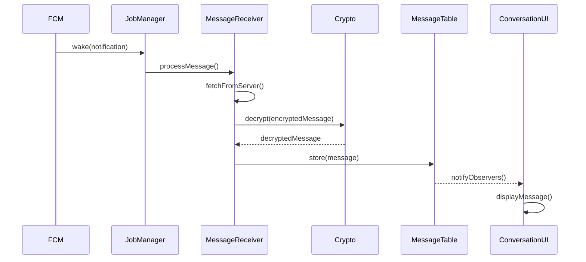
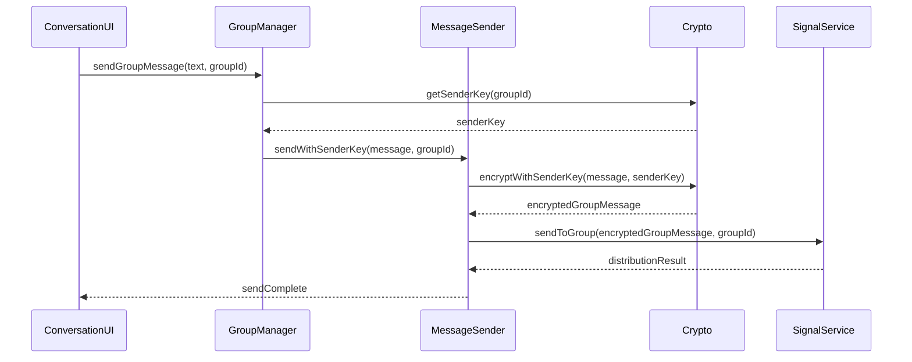
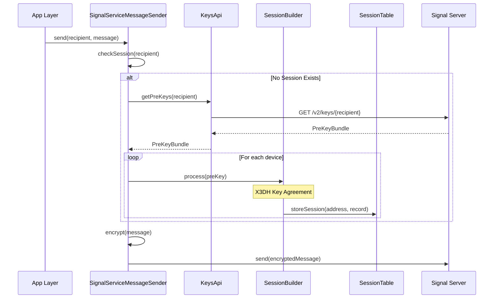
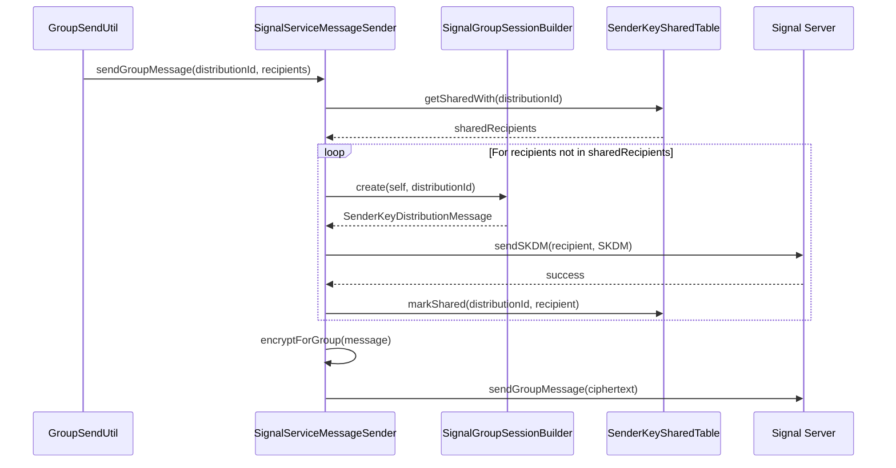

# C4 Component Diagram

> **Level 3**: Shows the major components within the Signal Android application container and how they interact.

## App Module Components

## Major Components by Domain

### Messaging Domain

| Component | Package | Responsibility |
|-----------|---------|----------------|
| **ConversationActivity** | `conversation.v2` | Main chat screen UI |
| **ConversationViewModel** | `conversation.v2` | Chat state and business logic |
| **ConversationItem** | `conversation` | Individual message rendering |
| **MessageSender** | `messages` | Outgoing message pipeline |
| **IncomingMessageProcessor** | `messages` | Incoming message handling |
| **MessageTable** | `database` | Message persistence |
| **ThreadTable** | `database` | Conversation thread persistence |

### Groups Domain

| Component | Package | Responsibility |
|-----------|---------|----------------|
| **GroupManagerV2** | `groups` | Group V2 creation and management |
| **LiveGroup** | `groups` | Real-time group state observer |
| **GroupTable** | `database` | Group persistence |
| **GroupCall** | `calls.links` | Group call management |

### Recipients/Contacts Domain

| Component | Package | Responsibility |
|-----------|---------|----------------|
| **RecipientRepository** | `recipients` | Recipient data access |
| **RecipientTable** | `database` | Recipient persistence |
| **ContactSelection** | `contacts` | Contact selection UI |
| **ContactSync** | `contacts` | System contact sync |

### Calls Domain

| Component | Package | Responsibility |
|-----------|---------|----------------|
| **WebRtcCallActivity** | `components.webrtc.v2` | Call screen UI |
| **CallManager** | `ringrtc` | Call state management |
| **CallTable** | `database` | Call history persistence |
| **CallLinkTable** | `database` | Call link persistence |

### Payments Domain

| Component | Package | Responsibility |
|-----------|---------|----------------|
| **Wallet** | `payments` | Wallet management |
| **PaymentTable** | `database` | Transaction persistence |
| **MobileCoinIntegration** | `payments` | MobileCoin SDK integration |

### Registration Domain

| Component | Package | Responsibility |
|-----------|---------|----------------|
| **RegistrationActivity** | `registration` | Registration UI (in feature module) |
| **RegistrationViewModel** | `registration` | Registration state |
| **SignalServiceAccountManager** | `service` | Account management API |

### Crypto Domain

| Component | Package | Responsibility |
|-----------|---------|----------------|
| **SignalProtocol** | `libsignal` | Core Signal Protocol implementation |
| **SessionCipher** | `libsignal` | Message encryption/decryption |
| **IdentityKeyUtil** | `crypto` | Identity key management |
| **PreKeyUtil** | `crypto` | PreKey generation and management |
| **SenderKeyUtil** | `crypto` | Group encryption keys |

### Protocol Layer (libsignal-service)

| Component | File | Responsibility |
|-----------|------|----------------|
| **SignalServiceMessageSender** | `libsignal-service/.../SignalServiceMessageSender.java` | Outgoing messages, session establishment, sender key distribution |
| **SignalServiceMessageReceiver** | `libsignal-service/.../SignalServiceMessageReceiver.java` | Incoming messages, envelope fetching |
| **SignalServiceCipher** | `libsignal-service/.../SignalServiceCipher.java` | Envelope encryption/decryption |
| **SignalSessionBuilder** | `libsignal-service/.../SignalSessionBuilder.java` | X3DH session establishment wrapper |
| **SignalGroupSessionBuilder** | `libsignal-service/.../SignalGroupSessionBuilder.java` | Sender key session creation |
| **SignalGroupCipher** | `libsignal-service/.../SignalGroupCipher.java` | Group message encryption/decryption |
| **SignalSealedSessionCipher** | `libsignal-service/.../SignalSealedSessionCipher.java` | Sealed sender encryption |

### Protocol Storage Layer

| Component | File | Responsibility |
|-----------|------|----------------|
| **SessionTable** | `app/.../database/SessionTable.kt` | Session records per (address, device) |
| **SenderKeyTable** | `app/.../database/SenderKeyTable.kt` | Sender key sessions per distribution ID |
| **SenderKeySharedTable** | `app/.../database/SenderKeySharedTable.kt` | Tracks which recipients have sender key |
| **IdentityTable** | `app/.../database/IdentityTable.kt` | Identity keys with verification status |
| **TextSecureSessionStore** | `app/.../crypto/storage/TextSecureSessionStore.java` | Session store implementation |
| **SignalSenderKeyStore** | `app/.../crypto/storage/SignalSenderKeyStore.java` | Sender key store implementation |
| **SignalBaseIdentityKeyStore** | `app/.../crypto/storage/SignalBaseIdentityKeyStore.java` | Identity store implementation |

### Multi-Device Layer

| Component | File | Responsibility |
|-----------|------|----------------|
| **LinkDeviceRepository** | `app/.../linkdevice/LinkDeviceRepository.kt` | Device linking via QR code |
| **PrimaryProvisioningCipher** | `lib/.../crypto/PrimaryProvisioningCipher.java` | Encrypt provisioning data for new device |
| **SecondaryProvisioningCipher** | `lib/.../crypto/SecondaryProvisioningCipher.kt` | Decrypt provisioning data on new device |
| **MultiDevice*Jobs** | `app/.../jobs/MultiDevice*.java` | Sync jobs for linked devices |

### Protocol Jobs

| Job | File | Purpose |
|-----|------|---------|
| **SenderKeyDistributionSendJob** | `app/.../jobs/SenderKeyDistributionSendJob.java` | Send SKDM to new group members |
| **RefreshPreKeysJob** | `app/.../jobs/RefreshPreKeysJob.java` | Refresh prekey supply from server |
| **RotateSignedPreKeyJob** | `app/.../jobs/RotateSignedPreKeyJob.java` | Rotate signed prekey periodically |

### Network Domain

| Component | Package | Responsibility |
|-----------|---------|----------------|
| **SignalServiceMessageSender** | `libsignal-service` | Outgoing message API |
| **SignalServiceMessageReceiver** | `libsignal-service` | Incoming message API |
| **PushServiceClient** | `push` | FCM handling |
| **WebSocketConnection** | `libsignal-service` | Real-time connection |

## Component Interactions

### Sending a Direct Message

### Receiving a Message

### Group Message Flow

### Session Establishment Flow

### Sender Key Distribution Flow

## Database Tables

### Core Tables

| Table | Purpose | Key Columns |
|-------|---------|-------------|
| **ThreadTable** | Conversations | `_id`, `recipient_id`, `snippet`, `date` |
| **MessageTable** | Messages | `_id`, `thread_id`, `body`, `type`, `date_received` |
| **RecipientTable** | Contacts/users | `_id`, `phone`, `username`, `profile_name` |
| **GroupTable** | Groups | `_id`, `group_id`, `title`, `members` |

### Encryption Tables

| Table | Purpose |
|-------|---------|
| **IdentityTable** | Identity keys for users |
| **SessionTable** | Signal Protocol sessions |
| **OneTimePreKeyTable** | One-time prekeys |
| **SignedPreKeyTable** | Signed prekeys |
| **KyberPreKeyTable** | Post-quantum prekeys |
| **SenderKeyTable** | Group sender keys |

### Feature Tables

| Table | Purpose |
|-------|---------|
| **CallTable** | Call history |
| **CallLinkTable** | Call links for group calls |
| **PaymentTable** | Payment transactions |
| **AttachmentTable** | Message attachments |
| **StickerTable** | Sticker packs |
| **StorySendTable** | Stories |

## Job System Components

| Job Type | Purpose |
|----------|---------|
| **PushProcessJob** | Process incoming push notifications |
| **MessageSendJob** | Send outgoing messages |
| **AttachmentUploadJob** | Upload attachments to CDN |
| **AttachmentDownloadJob** | Download attachments from CDN |
| **GroupUpdateJob** | Sync group state with server |
| **ProfileUploadJob** | Upload user profile |

## Related Documentation

- [Container Diagram](C4-Container-Diagram.md) - High-level containers
- [Database](Database.md) - Complete database schema
- [Module Structure](Module-Structure.md) - Module organization
- [Session & Sender Key Distribution](Session-And-SenderKey-Distribution-Flow.md) - Technical deep dive with code references
- [E2EE Session Initialization](E2EE-Session-Initialization-Flow.md) - X3DH and prekey exchange details