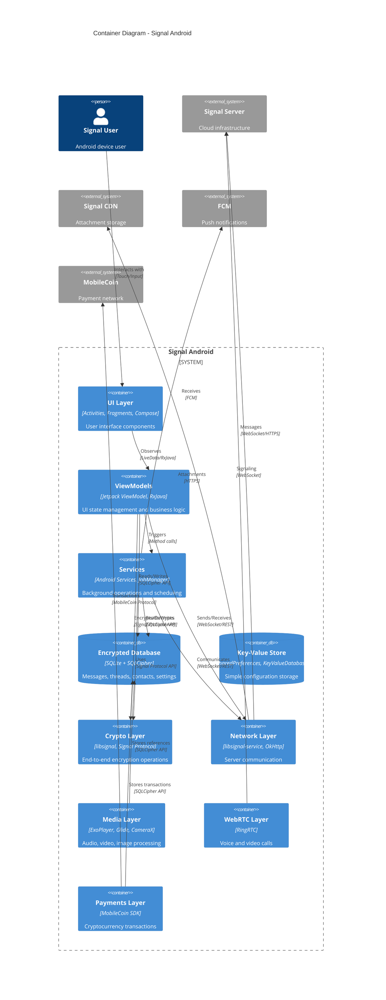

# C4 Container Diagram

> **Level 2**: Shows the containers (applications, databases, services) that make up Signal Android and how they interact.

## Diagram



## Container Descriptions

### UI Layer
**Technology**: Activities, Fragments, Jetpack Compose

The UI layer handles all user interactions and renders the visual interface. It follows MVVM architecture with ViewModels managing state.

| Component | Purpose |
|-----------|---------|
| Activities | Main entry points for screens |
| Fragments | Reusable UI components within activities |
| Compose | Modern declarative UI for new features |
| Adapters | RecyclerView data binding |

### ViewModels
**Technology**: Jetpack ViewModel, RxJava 3, LiveData

ViewModels manage UI state and coordinate business logic. They survive configuration changes and communicate with services and repositories.

| Pattern | Usage |
|---------|-------|
| MVVM | All screens follow Model-View-ViewModel |
| Reactive | RxJava for complex async operations |
| StateFlow | Kotlin Flow for Compose integration |

### Services
**Technology**: Android Services, JobManager, WorkManager

Background services handle long-running operations and scheduled tasks.

| Service | Responsibility |
|---------|----------------|
| MessageReceiveService | WebSocket message reception |
| IncomingMessageProcessor | Process and decrypt incoming messages |
| JobManager | Reliable job queue with retry logic |
| PeriodicJobRunner | Scheduled background tasks |

### Encrypted Database
**Technology**: SQLite + SQLCipher

The primary data store using SQLCipher for encryption at rest. Contains all user data including messages, threads, and contacts.

| Table Group | Contents |
|-------------|----------|
| Message Tables | ThreadTable, MessageTable, AttachmentTable |
| Identity Tables | RecipientTable, IdentityTable, SessionTable |
| Group Tables | GroupTable, DistributionListTables |
| Call Tables | CallTable, CallLinkTable |
| Payment Tables | PaymentTable |

### Crypto Layer
**Technology**: libsignal, Signal Protocol

Handles all cryptographic operations including the Signal Protocol for end-to-end encryption.

| Responsibility | Implementation |
|----------------|----------------|
| Key Generation | X25519, Ed25519, Kyber |
| Message Encryption | Signal Protocol (Double Ratchet) |
| Group Encryption | Sender Keys |
| Key Storage | Encrypted keystore with biometric protection |

### Network Layer
**Technology**: libsignal-service, OkHttp, WebSocket

Manages all network communication with Signal's infrastructure.

| Component | Purpose |
|-----------|---------|
| SignalService | Main API client |
| WebSocket | Real-time message delivery |
| REST API | User registration, contact discovery |
| CDN Client | Attachment upload/download |

### Media Layer
**Technology**: ExoPlayer, Glide, CameraX, Media3

Handles all media processing including audio, video, and images.

| Capability | Technology |
|------------|------------|
| Image Loading | Glide with custom transformations |
| Video Playback | ExoPlayer, Media3 |
| Audio Recording | MediaRecorder, AudioRecord |
| Camera | CameraX |
| Image Editing | Custom editing library |

### WebRTC Layer
**Technology**: RingRTC (Signal's WebRTC fork)

Manages voice and video calls using WebRTC with end-to-end encryption.

| Feature | Implementation |
|---------|----------------|
| Signaling | Via Signal Server WebSocket |
| Media | Encrypted SRTP |
| Group Calls | SFU-based routing |
| TURN/STUN | Signal-provided servers |

### Payments Layer
**Technology**: MobileCoin SDK

Implements cryptocurrency payments using MobileCoin.

| Feature | Details |
|---------|---------|
| Wallet | Local wallet with mnemonic recovery |
| Transactions | Send/receive MobileCoin |
| Balance | Real-time balance tracking |
| Ledger | Transaction history |

## Data Flow

### Sending a Message

```
User Input → UI Layer → ViewModel
    → Crypto Layer (encrypt)
    → Network Layer (send via WebSocket)
    → Encrypted Database (store)
```

### Receiving a Message

```
FCM Notification → Service Layer (wake)
    → Network Layer (fetch via WebSocket)
    → Crypto Layer (decrypt)
    → Encrypted Database (store)
    → UI Layer (notify observers)
```

### Making a Call

```
User Initiates → UI Layer → WebRTC Layer
    → Crypto Layer (derive keys)
    → Network Layer (signaling via WebSocket)
    → WebRTC Layer (establish connection)
    → UI Layer (render video)
```

## Container Decisions

### Why SQLCipher?
All local data is encrypted at rest using SQLCipher. The database key is derived from the user's PIN/biometric and stored in the Android Keystore.

### Why WebSocket?
WebSocket provides real-time bidirectional communication for instant message delivery without polling overhead. FCM is used only as a wake-up mechanism.

### Why libsignal-service?
This shared library provides the network protocol implementation used across all Signal clients, ensuring consistent behavior and cryptographic operations.

### Why RingRTC?
RingRTC is Signal's fork of WebRTC with additional privacy features and tight integration with Signal's infrastructure.

## Related Documentation

- [System Context](C4-System-Context.md) - External systems and users
- [Component Diagram](C4-Component-Diagram.md) - Detailed component breakdown
- [Database](Database.md) - Database schema details
- [Security & Cryptography](Security-Cryptography.md) - Cryptographic implementation