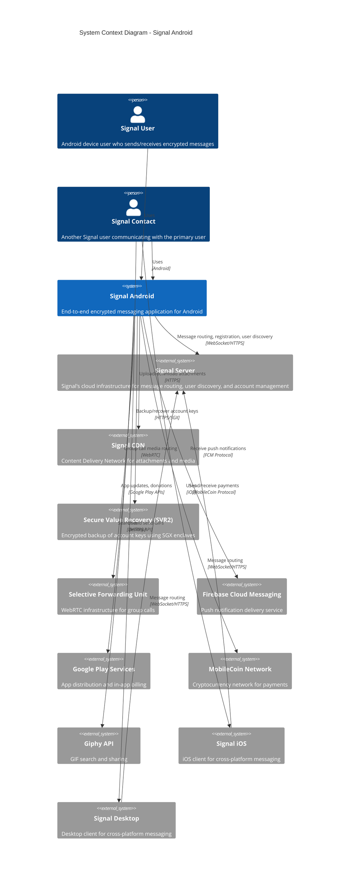

# C4 System Context Diagram

> **Level 1**: Shows the Signal Android system in its environment, with users and external systems it interacts with.

## Diagram



## System Description

### Signal Android (This System)

The Signal Android application is the official Android client for Signal Messenger. It provides:

- **End-to-end encrypted messaging** using the Signal Protocol
- **Voice and video calls** via WebRTC
- **Group messaging** with support for varying membership permissions
- **Media sharing** with automatic encryption
- **Stories** - ephemeral content sharing
- **Payments** - MobileCoin cryptocurrency transfers
- **Multi-device support** - link desktop/iOS devices

### External Systems

| System | Purpose | Protocol | Data Flow |
|--------|---------|----------|-----------|
| **Signal Server** | Message routing, user registration, account management, contact discovery | WebSocket, HTTPS REST API | Bidirectional encrypted messages, user presence |
| **Signal CDN** | Storage and delivery of encrypted attachments | HTTPS | Upload/download encrypted blobs |
| **SVR2** | Secure backup of account keys using Intel SGX enclaves | HTTPS with SGX attestation | Encrypted key storage/retrieval |
| **Signal SFU** | Media routing for group video calls | WebRTC | Encrypted media streams |
| **Firebase Cloud Messaging** | Push notification delivery when app is backgrounded | FCM Protocol | Wake-up notifications only (no message content) |
| **Google Play Services** | App distribution, in-app billing for donations | Google Play APIs | App updates, donation processing |
| **MobileCoin Network** | Cryptocurrency transactions for payments | MobileCoin Protocol | Payment transactions |
| **Giphy API** | GIF search and sharing | HTTPS REST API | GIF metadata and thumbnails |
| **Signal iOS/Desktop** | Cross-platform communication | Via Signal Server | End-to-end encrypted messages |

### Users

| Actor | Description | Key Interactions |
|-------|-------------|------------------|
| **Signal User** | Primary Android device user | Register account, send messages, make calls, manage settings |
| **Signal Contact** | Other Signal users (on any platform) | Exchange messages and calls with the primary user |

## Trust Boundaries

```
┌─────────────────────────────────────────────────────────────────┐
│                      TRUST BOUNDARY                             │
│  ┌─────────────────────────────────────────────────────────┐    │
│  │                  Signal Android App                      │    │
│  │  - All cryptographic operations                          │    │
│  │  - Message encryption/decryption                         │    │
│  │  - Key management                                        │    │
│  │  - Local database (SQLCipher encrypted)                  │    │
│  └─────────────────────────────────────────────────────────┘    │
└─────────────────────────────────────────────────────────────────┘
                              │
                    Untrusted Network
                              │
┌─────────────────────────────────────────────────────────────────┐
│                    EXTERNAL SYSTEMS                             │
│  - Signal Server (never sees plaintext)                         │
│  - CDN (stores encrypted blobs only)                            │
│  - FCM (notification triggers only)                             │
│  - MobileCoin (public blockchain)                               │
└─────────────────────────────────────────────────────────────────┘
```

## Key Architectural Decisions

### End-to-End Encryption
All messages are encrypted on the sender's device and can only be decrypted by the intended recipients. Signal servers never have access to plaintext content.

### Minimal Server Trust
The architecture is designed to minimize trust in Signal's infrastructure:
- Servers cannot read message content
- Push notifications contain no message data
- Attachments are encrypted before upload

### Cross-Platform Synchronization
Users can link multiple devices (Android, iOS, Desktop) to a single account. Each device has its own cryptographic keys, and messages are encrypted separately for each device.

## Related Documentation

- [Container Diagram](C4-Container-Diagram.md) - Detailed view of Signal Android's internal containers
- [Business Domain](Business-Domain.md) - Core domain concepts
- [Security & Cryptography](Security-Cryptography.md) - Cryptographic implementation details