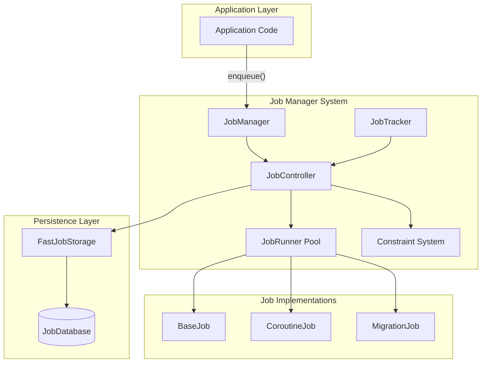
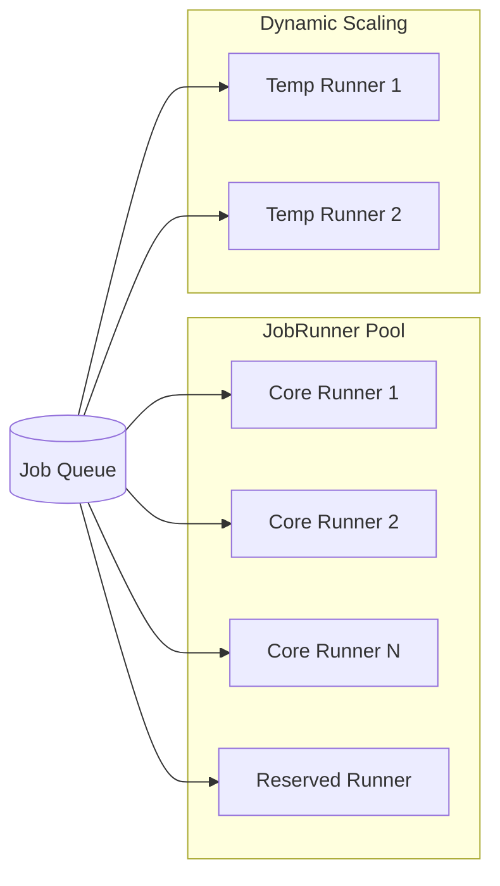
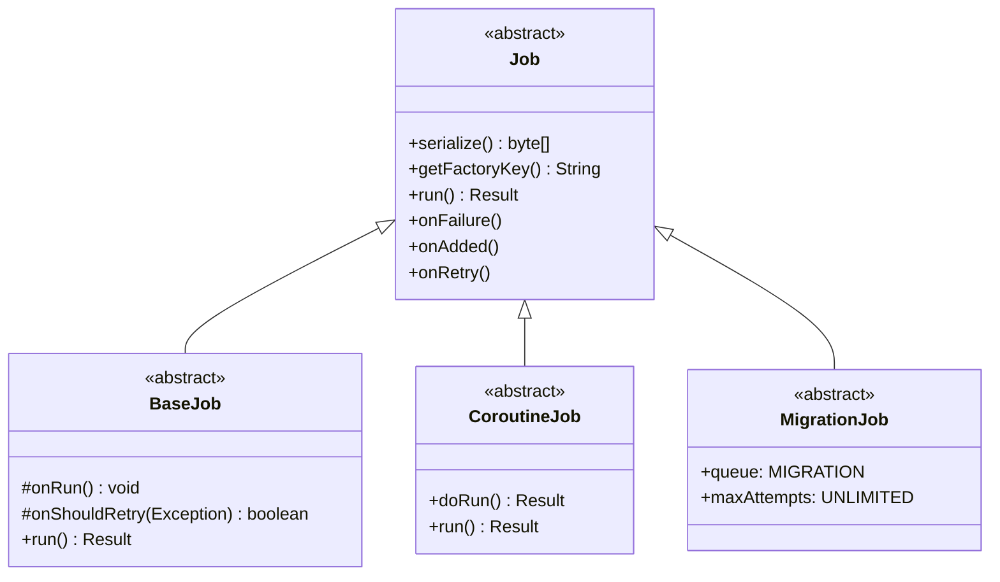
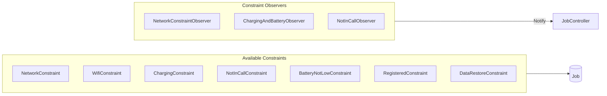
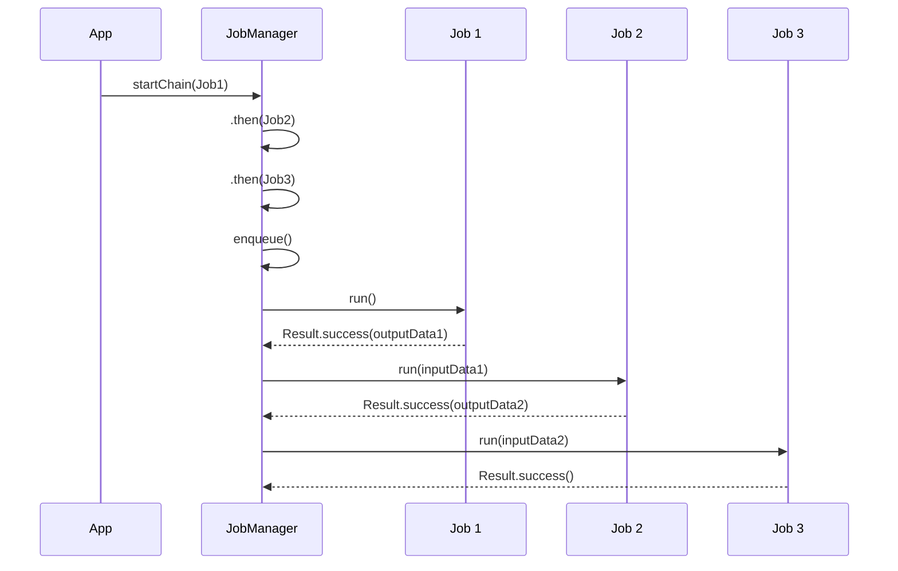

# Job System

**Audience:** Developers, Architects

This document describes Signal-Android's job management system, which handles background tasks, retries, and scheduled operations.

## System Overview



---

## 1. Architecture

### 1.1 Core Components

| Component | File | Responsibility |
|-----------|------|---------------|
| `JobManager` | `jobmanager/JobManager.java` | Entry point for job operations |
| `JobController` | `jobmanager/JobController.java` | Queue management and job dispatch |
| `JobRunner` | `jobmanager/JobRunner.java` | Thread that executes jobs |
| `JobTracker` | `jobmanager/JobTracker.java` | Track job state and completion |
| `FastJobStorage` | `jobs/FastJobStorage.kt` | In-memory cache over database |

**Source:** `app/src/main/java/org/thoughtcrime/securesms/jobmanager/`

### 1.2 Thread Pool Architecture



| Runner Type | Count | Purpose |
|-------------|-------|---------|
| Core Runners | 4-16 | Permanent workers for general jobs |
| Reserved Runners | Per-config | Dedicated runners for specific job types |
| Temp Runners | Dynamic | Created on demand, terminated when idle |

**Configuration:**
```java
// JobManager.java Configuration
minGeneralRunners = 4          // Minimum worker threads
maxGeneralRunners = 16         // Maximum worker threads
generalRunnerIdleTimeout = 60s // Idle timeout before thread termination
```

---

## 2. Job Class Hierarchy

### 2.1 Base Classes



**Source:** `app/src/main/java/org/thoughtcrime/securesms/jobmanager/Job.java`

### 2.2 Job.Result Types

| Result | Description | Next Action |
|--------|-------------|-------------|
| `Result.success()` | Job completed | Remove from queue, trigger dependents |
| `Result.success(byte[] output)` | Success with output data | Pass output to next job in chain |
| `Result.retry(long backoff)` | Transient failure | Re-queue with exponential backoff |
| `Result.failure()` | Permanent failure | Call `onFailure()`, remove from queue |
| `Result.fatalFailure(Exception)` | Fatal error | Crash app (used for migrations) |

**Source:** `app/src/main/java/org/thoughtcrime/securesms/jobmanager/Job.java:182-273`

### 2.3 Required Method Implementations

#### Job (Base Class)
```kotlin
abstract class Job {
    abstract fun serialize(): ByteArray?       // Persist job state
    abstract fun getFactoryKey(): String       // Factory lookup key
    
    open fun run(): Result                     // Execute work
    open fun onAdded() {}                      // Called when enqueued
    open fun onRetry() {}                      // Called before retry
    open fun onFailure() {}                    // Called on permanent failure
}
```

#### BaseJob (Simplified API)
```kotlin
abstract class BaseJob : Job {
    protected abstract fun onRun()                          // Main work
    protected abstract fun onShouldRetry(e: Exception): Boolean  // Retry decision
}
```

**Source:** `app/src/main/java/org/thoughtcrime/securesms/jobs/BaseJob.java`

---

## 3. Job Constraints

### 3.1 Constraint System



### 3.2 Available Constraints

| Constraint | Key | Description |
|------------|-----|-------------|
| `NetworkConstraint` | `NetworkConstraint` | Network connectivity required |
| `NetworkOrCellServiceConstraint` | `NetworkOrCellServiceConstraint` | Network or cell service |
| `WifiConstraint` | `WifiConstraint` | WiFi required |
| `ChargingConstraint` | `ChargingConstraint` | Device charging |
| `BatteryNotLowConstraint` | `BatteryNotLowConstraint` | Battery not low |
| `NotInCallConstraint` | `NotInCallConstraint` | Not in active call |
| `DecryptionsDrainedConstraint` | `WebsocketDrainedConstraint` | All messages decrypted |
| `DataRestoreConstraint` | `DataRestoreConstraint` | Not during restore |
| `RestoreAttachmentConstraint` | `RestoreAttachmentConstraint` | Not during attachment restore |
| `BackupMessagesConstraint` | `BackupMessagesConstraint` | Not during backup |
| `ChangeNumberConstraint` | `ChangeNumberConstraint` | Not during number change |
| `RegisteredConstraint` | `RegisteredConstraint` | User registered |
| `SealedSenderConstraint` | `SealedSenderConstraint` | Sealed sender available |
| `DiskSpaceNotLowConstraint` | `DiskSpaceNotLowConstraint` | Disk space available |

**Source:** `app/src/main/java/org/thoughtcrime/securesms/jobmanager/impl/`

### 3.3 Constraint Observer Pattern

```kotlin
interface ConstraintObserver {
    fun register(directCheckCallback: Callback)  // Register for changes
    fun unregister()                             // Unregister
}
```

Observers monitor system state and notify JobController when constraints change, enabling immediate job execution when conditions are met.

---

## 4. Job Queues and Priority

### 4.1 Queue System

Jobs in the same queue execute **serially** (one at a time). This ensures:
- No race conditions for related operations
- Ordered execution when required
- Resource isolation between job types

### 4.2 Built-in Queues

| Queue Key | Purpose |
|-----------|---------|
| `MIGRATION` | App migration jobs |
| `StorageSyncingJobs` | Storage sync operations |
| `__PUSH_PROCESS_JOB__` | Push message processing |
| `__ROTATE_SENDER_CERTIFICATE__` | Certificate rotation |
| `__ROTATE_PROFILE_KEY__` | Profile key rotation |
| `__LOCAL_BACKUP__` | Local backup operations |
| `__GroupCallPeekJob__` | Group call peek |
| `EmojiDownloadJobs` | Emoji downloads |
| `ArchiveAttachmentQueue` | Archive operations |

### 4.3 Priority System

```kotlin
const val PRIORITY_LOWER = -2
const val PRIORITY_LOW = -1
const val PRIORITY_DEFAULT = 0
const val PRIORITY_HIGH = 1
```

**Selection Order:**
1. Sort by `globalPriority` DESC (highest first)
2. Then by `createTime` ASC (oldest first)
3. Within queue: `queuePriority` breaks ties

**Source:** `app/src/main/java/org/thoughtcrime/securesms/jobmanager/Job.java:275-289`

---

## 5. Job Persistence

### 5.1 Database Schema

**Database:** `signal-jobmanager.db` (encrypted with SQLCipher)

#### job_spec Table

| Column | Type | Description |
|--------|------|-------------|
| `_id` | INTEGER PRIMARY KEY | Auto-increment ID |
| `job_spec_id` | TEXT UNIQUE | Job UUID |
| `factory_key` | TEXT | Factory key for recreation |
| `queue_key` | TEXT | Queue name |
| `create_time` | INTEGER | Creation timestamp |
| `last_run_attempt_time` | INTEGER | Last run attempt |
| `run_attempt` | INTEGER | Number of attempts |
| `max_attempts` | INTEGER | Max retry attempts |
| `lifespan` | INTEGER | Job lifetime in ms |
| `serialized_data` | TEXT | Job serialized state |
| `serialized_input_data` | TEXT | Input data from chain |
| `is_running` | INTEGER | Running flag |
| `next_backoff_interval` | INTEGER | Backoff time |
| `global_priority` | INTEGER | Global priority |
| `queue_priority` | INTEGER | Queue priority |
| `initial_delay` | INTEGER | Initial delay in ms |

**Source:** `app/src/main/java/org/thoughtcrime/securesms/database/JobDatabase.kt:51-91`

### 5.2 FastJobStorage (In-Memory Layer)

```
┌─────────────────────────────────────────────────────┐
│                    FastJobStorage                    │
├─────────────────────────────────────────────────────┤
│  minimalJobs: List<MinimalJobSpec>                  │
│  jobSpecCache: LruCache<JobSpec> (1000 limit)       │
│  constraintsByJobId: Map<String, List<Constraint>>  │
│  dependenciesByJobId: Map<String, List<String>>     │
│  eligibleJobs: TreeSet<MinimalJobSpec>              │
│  mostEligibleJobForQueue: Map<String, MinimalJobSpec>│
└─────────────────────────────────────────────────────┘
                          │
                          ▼
              ┌─────────────────────┐
              │    JobDatabase      │
              │   (SQLCipher)       │
              └─────────────────────┘
```

**Source:** `app/src/main/java/org/thoughtcrime/securesms/jobs/FastJobStorage.kt`

---

## 6. Job Chains

### 6.1 Chain Execution

Job chains allow sequential execution with data passing between jobs:



### 6.2 Chain API

```kotlin
// Create a chain
AppDependencies.jobManager.startChain(CompressionJob(attachment))
    .then(UploadJob(attachment))
    .then(SendMessageJob(message))
    .enqueue()

// With output data
class CompressionJob : BaseJob() {
    override fun onRun() {
        val compressedData = compress(inputData)
        setOutputData(compressedData)  // Pass to next job
    }
}
```

---

## 7. Job Categories

### 7.1 Messaging Jobs

| Job | Purpose |
|-----|---------|
| `IndividualSendJob` | Send message to individual |
| `PushGroupSendJob` | Send message to group |
| `ReactionSendJob` | Send message reaction |
| `RemoteDeleteSendJob` | Delete for everyone |
| `TypingSendJob` | Send typing indicator |
| `SendDeliveryReceiptJob` | Send delivery receipt |
| `SendReadReceiptJob` | Send read receipt |

### 7.2 Attachment/Media Jobs

| Job | Purpose |
|-----|---------|
| `AttachmentUploadJob` | Upload to CDN |
| `AttachmentDownloadJob` | Download from CDN |
| `AttachmentCompressionJob` | Compress media |
| `RestoreAttachmentJob` | Restore from backup |
| `OptimizeMediaJob` | Offload old media |

### 7.3 Sync Jobs

| Job | Purpose |
|-----|---------|
| `MultiDeviceContactSyncJob` | Sync contacts to linked devices |
| `MultiDeviceReadUpdateJob` | Sync read status |
| `StorageSyncJob` | Sync with storage service |
| `BackupMessagesJob` | Backup messages |

### 7.4 Profile Jobs

| Job | Purpose |
|-----|---------|
| `RetrieveProfileJob` | Fetch user profile |
| `ProfileUploadJob` | Upload profile |
| `RotateProfileKeyJob` | Rotate profile key |

### 7.5 Payment Jobs

| Job | Purpose |
|-----|---------|
| `PaymentSendJob` | Send payment |
| `PaymentLedgerUpdateJob` | Update payment ledger |
| `InAppPaymentRedemptionJob` | Redeem payment |

**Source:** `app/src/main/java/org/thoughtcrime/securesms/jobs/JobManagerFactories.java`

---

## 8. Creating Custom Jobs

### 8.1 Using BaseJob

```kotlin
class MyCustomJob(
    private val dataId: Long,
    parameters: Parameters = Parameters.Builder()
        .addConstraint(NetworkConstraint.KEY)
        .setQueue("MyCustomQueue")
        .build()
) : BaseJob(parameters) {
    
    override fun serialize(): ByteArray? {
        return dataId.toString().toByteArray()
    }
    
    override fun getFactoryKey(): String = "MyCustomJob"
    
    override fun onRun() {
        // Main work here
        val data = SignalDatabase.data.getById(dataId)
        process(data)
    }
    
    override fun onShouldRetry(e: Exception): Boolean {
        return e is IOException  // Retry on network errors
    }
    
    class Factory : Job.Factory<MyCustomJob> {
        override fun create(parameters: Parameters, serializedData: ByteArray?): MyCustomJob {
            val dataId = String(serializedData!!).toLong()
            return MyCustomJob(dataId, parameters)
        }
    }
}
```

### 8.2 Registering Job Factory

```kotlin
// In JobManagerFactories.java
.put("MyCustomJob", MyCustomJob.Factory())
```

### 8.3 Using CoroutineJob (Kotlin)

```kotlin
class MyCoroutineJob(parameters: Parameters) : CoroutineJob(parameters) {
    override suspend fun doRun(): Result {
        return withContext(Dispatchers.IO) {
            try {
                // Suspendable work
                val result = apiService.fetchData()
                Result.success()
            } catch (e: Exception) {
                Result.retry(5000)
            }
        }
    }
}
```

---

## 9. Best Practices

### 9.1 Job Design

| Practice | Reason |
|----------|--------|
| Keep jobs small | Faster execution, less chance of interruption |
| Use constraints | Avoid wasted work when conditions not met |
| Use queues | Serialize related operations |
| Handle serialization | Jobs must persist across app restart |
| Set max attempts | Prevent infinite retry loops |

### 9.2 Error Handling

```kotlin
override fun onShouldRetry(e: Exception): Boolean {
    return when (e) {
        is IOException -> true           // Network errors: retry
        is RateLimitException -> true    // Rate limited: retry
        is NotFoundException -> false    // Not found: don't retry
        else -> false                    // Unknown: don't retry
    }
}
```

### 9.3 Priority Guidelines

| Priority | Use Case |
|----------|----------|
| `PRIORITY_HIGH` | User-initiated, time-sensitive |
| `PRIORITY_DEFAULT` | Normal operations |
| `PRIORITY_LOW` | Background maintenance |
| `PRIORITY_LOWER` | Cleanup, non-essential |

---

## 10. Monitoring and Debugging

### 10.1 JobTracker

```kotlin
// Track job completion
val listener = object : JobTracker.Listener {
    override fun onStateChanged(job: Job, state: JobTracker.State) {
        when (state) {
            JobTracker.State.SUCCESS -> // Handle success
            JobTracker.State.FAILURE -> // Handle failure
            JobTracker.State.RUNNING -> // Job running
        }
    }
}

JobManager.trackJob(jobId, listener)
```

### 10.2 Debug Logging

```kotlin
// Enable job logging
Log.setEnabled(true)
Log.setTag("JobManager")
```

### 10.3 Common Issues

| Issue | Cause | Solution |
|-------|-------|----------|
| Job not executing | Constraint not met | Check constraint observers |
| Job stuck in queue | Queue blocked | Check for stuck job in same queue |
| Job lost on restart | Serialization failed | Verify `serialize()` returns valid data |
| Infinite retries | `onShouldRetry` always true | Add max attempts or circuit breaker |

---

## See Also

- [Media Lifecycle](Media-Lifecycle.md) - Attachment job details
- [Database](Database.md) - JobDatabase schema
- [Architecture](Architecture.md) - System overview
- [Testing](Testing.md) - Job testing guidelines