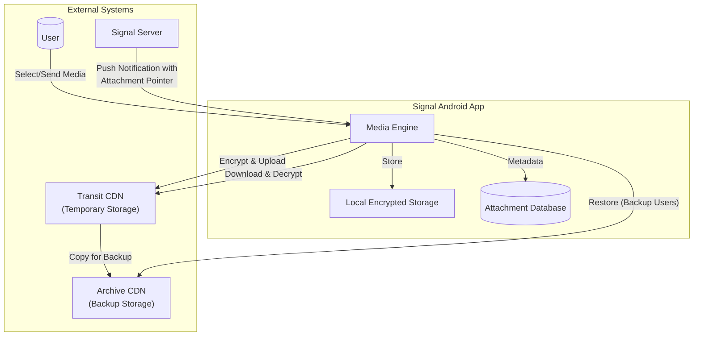
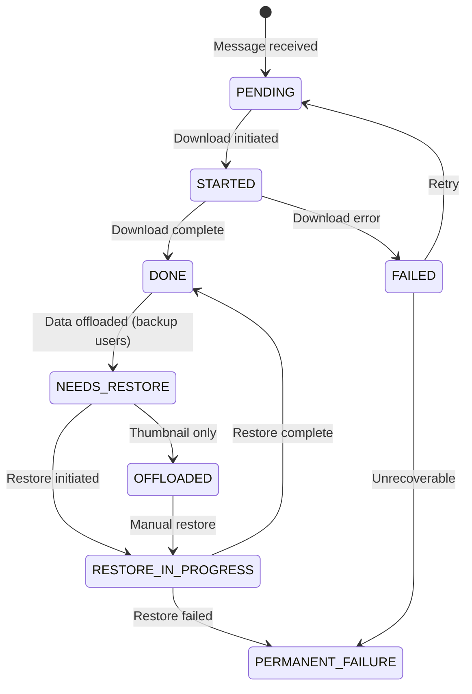
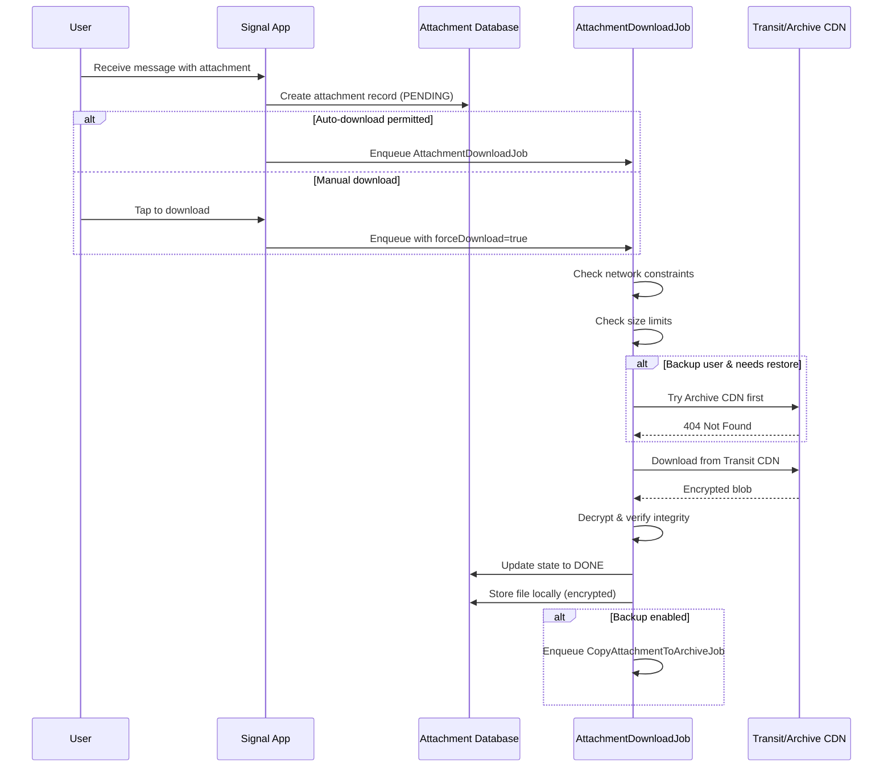
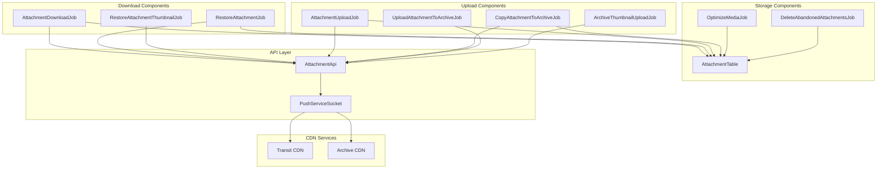
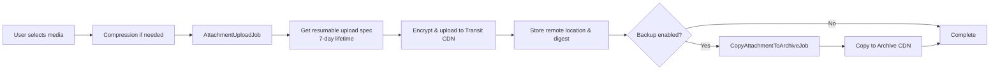
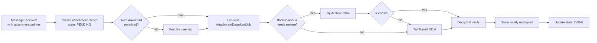
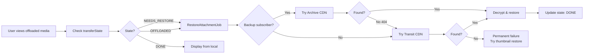

# Media Lifecycle

**Audience:** Developers, Architects, Operations

This document describes the complete lifecycle of media attachments in Signal-Android, from download triggers to server retention policies.

## System Context



---

## 1. Media Download Flow

### 1.1 Download Triggers

The app starts downloading full-size (origin) media files based on these conditions:

#### Automatic Download Conditions

| Condition | Requirement |
|-----------|-------------|
| Auto-download permitted | `AttachmentUtil.isAutoDownloadPermitted()` returns true |
| Transfer state | `TRANSFER_PROGRESS_PENDING` or `TRANSFER_PROGRESS_FAILED` |
| Not in call | `NotInCallConstraint` must be satisfied |
| Trusted source | System contact, profile sharing enabled, outgoing message, or self |

**Source:** `app/src/main/java/org/thoughtcrime/securesms/jobs/AttachmentDownloadJob.kt:175-215`

#### Media Types Auto-Downloaded by Network

| Network Type | Auto-Downloaded Types |
|--------------|----------------------|
| **Mobile Data** | `image`, `audio` |
| **WiFi** | `image`, `audio`, `video`, `documents` |
| **Roaming** | None |

**Source:** `app/src/main/res/values/arrays.xml:268-286`

#### Always Auto-Download (Network Independent)

- Voice notes (audio with no filename)
- Long text attachments
- Stickers

**Source:** `app/src/main/java/org/thoughtcrime/securesms/util/AttachmentUtil.java:46-85`

### 1.2 Transfer States



| State | Value | Description |
|-------|-------|-------------|
| `TRANSFER_PROGRESS_DONE` | 0 | Download complete |
| `TRANSFER_PROGRESS_STARTED` | 1 | Download in progress |
| `TRANSFER_PROGRESS_PENDING` | 2 | Waiting to download |
| `TRANSFER_PROGRESS_FAILED` | 3 | Download failed (retryable) |
| `TRANSFER_PROGRESS_PERMANENT_FAILURE` | 4 | Cannot recover |
| `TRANSFER_NEEDS_RESTORE` | 5 | Needs restore from archive |
| `TRANSFER_RESTORE_IN_PROGRESS` | 6 | Restoring from archive |
| `TRANSFER_RESTORE_OFFLOADED` | 7 | Data offloaded, needs restore |

**Source:** `app/src/main/java/org/thoughtcrime/securesms/database/AttachmentTable.kt:195-202`

### 1.3 Download Flow Sequence



---

## 2. Critical Configurations

### 2.1 Size Limits

| Configuration | Remote Config Key | Default | Source |
|--------------|-------------------|---------|--------|
| Max attachments per message | `android.attachments.maxCount` | 32 | `RemoteConfig.kt:928` |
| Max send size | `global.attachments.maxBytes` | 100 MB | `RemoteConfig.kt:936` |
| Max receive size | `global.attachments.maxReceiveBytes` | ~125 MB | `RemoteConfig.kt:943` |

**Source:** `app/src/main/java/org/thoughtcrime/securesms/util/RemoteConfig.kt:928-949`

### 2.2 Download Behavior

| Configuration | Remote Config Key | Default | Purpose |
|--------------|-------------------|---------|---------|
| `storiesAutoDownloadMaximum` | `android.stories.autoDownloadMaximum` | 2 | Number of stories to prefetch |

**Source:** `app/src/main/java/org/thoughtcrime/securesms/util/RemoteConfig.kt:844-849`

### 2.3 Thumbnail Settings

```kotlin
// Quote thumbnail dimensions
private const val QUOTE_THUMBNAIL_DIMEN = 200
private const val QUOTE_THUMBNAIL_QUALITY = 50
```

**Source:** `app/src/main/java/org/thoughtcrime/securesms/database/AttachmentTable.kt:319-320`

### 2.4 Upload Reuse

```kotlin
// Uploaded attachments can be reused for 3 days
val UPLOAD_REUSE_THRESHOLD = 3.days.inWholeMilliseconds
```

**Source:** `app/src/main/java/org/thoughtcrime/securesms/jobs/AttachmentUploadJob.kt:71`

### 2.5 Auto-Download Permission Logic

```kotlin
fun isAutoDownloadPermitted(context: Context, attachment: DatabaseAttachment): Boolean {
    // Voice notes always auto-download
    // Audio without filename (voice) always auto-download
    // Long text always auto-download
    // Stickers always auto-download
    
    // For other types, check:
    // 1. Not in active call
    // 2. Network type permits download type
    // 3. Trusted conversation (contact, profile sharing, outgoing, or self)
}
```

**Source:** `app/src/main/java/org/thoughtcrime/securesms/util/AttachmentUtil.java:46-85`

---

## 3. Server Retention Policies

### 3.1 Transit CDN Retention

| Policy | Duration | Source |
|--------|----------|--------|
| Upload link lifetime | **7 days** | `PushServiceSocket.java:198` |
| Message queue time | **~45 days** (configurable) | `RemoteConfig.kt:1179-1185` |
| Free tier attachment | **~45 days** | `RestoreAttachmentJob.kt:461` |

```java
// CDN2 resumable upload link expires after 7 days
public static final long CDN2_RESUMABLE_LINK_LIFETIME_MILLIS = TimeUnit.DAYS.toMillis(7);
```

**Source:** `lib/libsignal-service/src/main/java/org/whispersystems/signalservice/internal/push/PushServiceSocket.java:198`

### 3.2 Message Queue Time (Server-Side)

```kotlin
val messageQueueTime: Long by remoteValue(
    key = "global.messageQueueTimeInSeconds",
    // Default: 45 days
)
```

**Source:** `app/src/main/java/org/thoughtcrime/securesms/util/RemoteConfig.kt:1179-1185`

### 3.3 Archive CDN (Paid Backup Users)

For users with Signal backup subscription, media is copied to Archive CDN for long-term storage.

#### Archive Transfer States

| State | Value | Description |
|-------|-------|-------------|
| `NONE` | 0 | Not backed up |
| `UPLOAD_IN_PROGRESS` | 1 | Uploading to archive |
| `COPY_PENDING` | 2 | Needs copy from transit to archive |
| `FINISHED` | 3 | Backup complete |
| `PERMANENT_FAILURE` | 4 | Cannot upload (unrecoverable) |
| `TEMPORARY_FAILURE` | 5 | May retry later |

**Source:** `app/src/main/java/org/thoughtcrime/securesms/database/AttachmentTable.kt:3865-3903`

#### Archive Sync Interval

```kotlin
val archiveReconciliationSyncInterval: Long by remoteValue(
    key = "global.archive.attachmentReconciliationSyncIntervalDays",
    // Default: 7 days
)
```

**Source:** `app/src/main/java/org/thoughtcrime/securesms/util/RemoteConfig.kt`

### 3.4 Exclusions from Archive Backup

The following attachment types are **NOT** backed up to Archive CDN:

| Exclusion Type | Reason |
|---------------|--------|
| Preuploaded attachments | Already stored elsewhere |
| Stories | Ephemeral by design |
| View-once messages | Self-destructing |
| Messages expiring < 24 hours | Will be deleted soon |
| Long text attachments | Can be regenerated |
| Linked device attachments | Synced from primary device |

**Source:** `app/src/main/java/org/thoughtcrime/securesms/jobs/AttachmentUploadJob.kt:191-217`

---

## 4. Component Architecture

### 4.1 C4 Component Diagram



### 4.2 Key Classes

#### Download Components

| Class | File | Responsibility |
|-------|------|---------------|
| `AttachmentDownloadJob` | `app/src/main/java/org/thoughtcrime/securesms/jobs/AttachmentDownloadJob.kt` | Downloads attachments from transit CDN |
| `RestoreAttachmentJob` | `app/src/main/java/org/thoughtcrime/securesms/jobs/RestoreAttachmentJob.kt` | Restores attachments from archive CDN |
| `RestoreAttachmentThumbnailJob` | `app/src/main/java/org/thoughtcrime/securesms/jobs/RestoreAttachmentThumbnailJob.kt` | Restores thumbnails from archive |

#### Upload Components

| Class | File | Responsibility |
|-------|------|---------------|
| `AttachmentUploadJob` | `app/src/main/java/org/thoughtcrime/securesms/jobs/AttachmentUploadJob.kt` | Uploads to transit CDN |
| `CopyAttachmentToArchiveJob` | `app/src/main/java/org/thoughtcrime/securesms/jobs/CopyAttachmentToArchiveJob.kt` | Copies from transit to archive CDN |
| `UploadAttachmentToArchiveJob` | `app/src/main/java/org/thoughtcrime/securesms/jobs/UploadAttachmentToArchiveJob.kt` | Direct upload to archive CDN |
| `AttachmentApi` | `lib/libsignal-service/src/main/java/org/whispersystems/signalservice/api/attachment/AttachmentApi.kt` | Low-level API for upload operations |

#### Storage Components

| Class | File | Responsibility |
|-------|------|---------------|
| `AttachmentTable` | `app/src/main/java/org/thoughtcrime/securesms/database/AttachmentTable.kt` | Database operations for attachments |
| `DeleteAbandonedAttachmentsJob` | `app/src/main/java/org/thoughtcrime/securesms/jobs/DeleteAbandonedAttachmentsJob.kt` | Deletes orphaned attachment files |
| `OptimizeMediaJob` | `app/src/main/java/org/thoughtcrime/securesms/jobs/OptimizeMediaJob.kt` | Offloads old media, keeps thumbnails locally |

---

## 5. Local Storage & Cleanup

### 5.1 Media Optimization

The `OptimizeMediaJob` offloads old media to free up local storage while preserving thumbnails:

```kotlin
val available = DiskUtil.getAvailableSpace(context).bytes.toFloat()
val total = DiskUtil.getTotalDiskSize(context).bytes.toFloat()
val remaining = (total - available) / total * 100

// Age threshold for optimization
val minimumAge = if (remaining > 5f) 30.days else 15.days
```

**Source:** `app/src/main/java/org/thoughtcrime/securesms/jobs/OptimizeMediaJob.kt:66-72`

### 5.2 Local Retention Logic

| Storage State | Description |
|--------------|-------------|
| Full media | Complete attachment stored locally |
| Thumbnail only | Full media offloaded, thumbnail preserved |
| Metadata only | Attachment record in database, no local files |

---

## 6. Complete Media Flow Summary

### 6.1 Send Flow



### 6.2 Receive Flow



### 6.3 Restore Flow (Backup Users)



---

## 7. Configuration Reference

### 7.1 Remote Config Keys

| Key | Default | Description |
|-----|---------|-------------|
| `android.attachments.maxCount` | 32 | Maximum attachments per message |
| `global.attachments.maxBytes` | 100 MB | Maximum send size |
| `global.attachments.maxReceiveBytes` | ~125 MB | Maximum receive size |
| `android.stories.autoDownloadMaximum` | 2 | Stories to auto-prefetch |
| `global.messageQueueTimeInSeconds` | 45 days | Server-side message retention |
| `global.archive.attachmentReconciliationSyncIntervalDays` | 7 days | Archive sync frequency |

### 7.2 Code Constants

| Constant | Value | Location |
|----------|-------|----------|
| `CDN2_RESUMABLE_LINK_LIFETIME_MILLIS` | 7 days | `PushServiceSocket.java:198` |
| `UPLOAD_REUSE_THRESHOLD` | 3 days | `AttachmentUploadJob.kt:71` |
| `QUOTE_THUMBNAIL_DIMEN` | 200 px | `AttachmentTable.kt:319` |
| `QUOTE_THUMBNAIL_QUALITY` | 50 | `AttachmentTable.kt:320` |

---

## 8. Troubleshooting

### 8.1 Common Issues

| Issue | Possible Cause | Solution |
|-------|---------------|----------|
| Attachment stuck in PENDING | Network constraint not met | Check auto-download settings, network type |
| Download fails permanently | File expired on CDN | Beyond 45-day retention for free users |
| Restore fails for backup user | Archive CDN unavailable | Falls back to transit CDN |
| Large files not downloading | Size exceeds limit | Check `maxAttachmentReceiveSizeBytes` |

### 8.2 Debugging Commands

Check attachment state in database:
```kotlin
// Query attachment transfer_state from AttachmentTable
// 0 = DONE, 1 = STARTED, 2 = PENDING, 3 = FAILED, etc.
```

Check auto-download settings:
```kotlin
// TextSecurePreferences.getMobileMediaDownloadAllowed(context)
// TextSecurePreferences.getWifiMediaDownloadAllowed(context)
// TextSecurePreferences.getRoamingMediaDownloadAllowed(context)
```

---

## See Also

- [Database](Database.md) - Attachment table schema
- [Security & Cryptography](Security-Cryptography.md) - Encryption details
- [Architecture](Architecture.md) - Overall system architecture