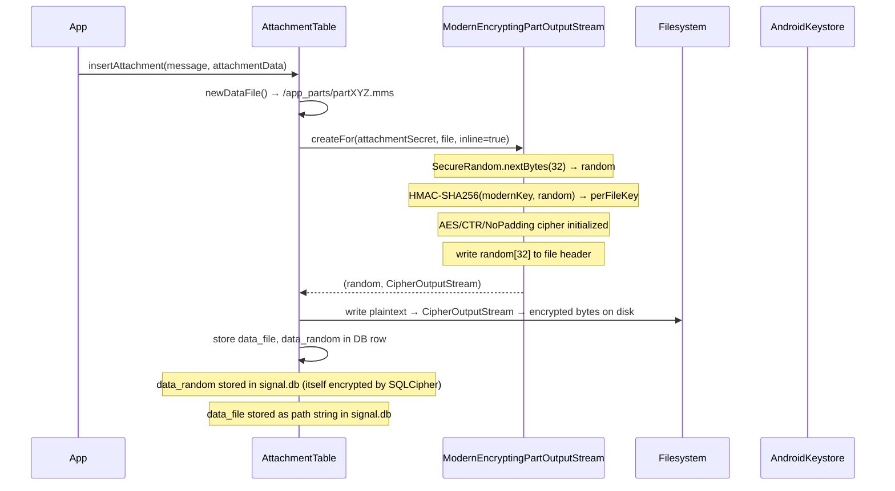
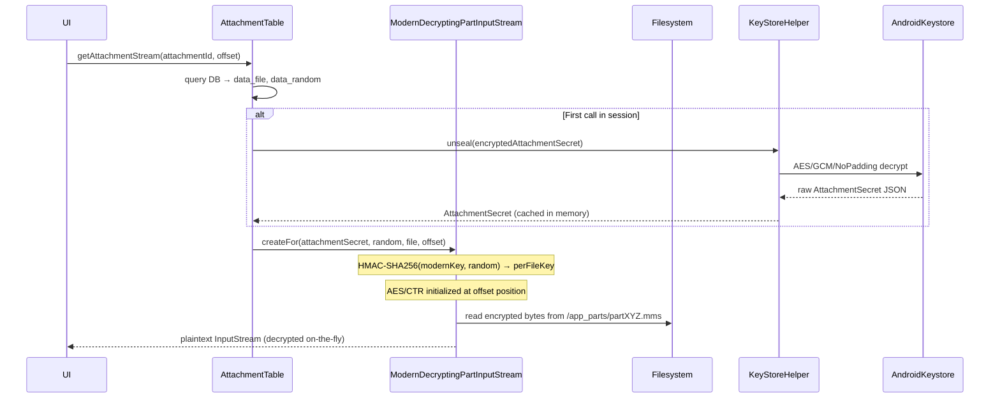
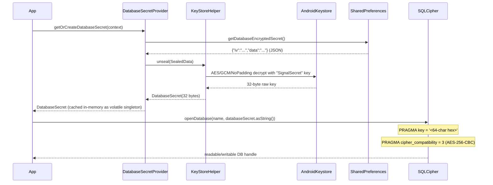

# Signal Android: Message At-Rest Storage Encryption

> **Quick Answer**
> - **Message bodies** — stored as **plaintext** `TEXT` rows, but inside a SQLCipher-encrypted database file (`signal.db`).  
> - **Attachments** — stored as **AES-CTR-encrypted binary blobs** on the filesystem (`/app_parts/`).  
> - **Profile avatars** — same AES-CTR encryption as attachments, stored in `/app_avatars/`.  
> - **All encryption keys** are ultimately sealed by a hardware-backed **Android Keystore** AES/GCM key.

---

## Table of Contents

1. [High-Level Architecture](#1-high-level-architecture)
2. [Layer 1 — Database Encryption (SQLCipher)](#2-layer-1--database-encryption-sqlcipher)
3. [Layer 2 — Message Body Storage](#3-layer-2--message-body-storage)
4. [Layer 3 — Attachment File Encryption](#4-layer-3--attachment-file-encryption)
   - [Modern AES-CTR (current)](#41-modern-aes-ctr-current)
   - [Legacy AES-CBC (old installs)](#42-legacy-aes-cbc-old-installs)
5. [Layer 4 — Key Hierarchy and Management](#5-layer-4--key-hierarchy-and-management)
   - [Android Keystore Sealing](#51-android-keystore-sealing)
   - [DatabaseSecret Lifecycle](#52-databasesecret-lifecycle)
   - [AttachmentSecret Lifecycle](#53-attachmentsecret-lifecycle)
6. [Layer 5 — Profile Avatar Encryption](#6-layer-5--profile-avatar-encryption)
7. [Attachment Table DB Columns](#7-attachment-table-db-columns)
8. [Sequence Diagrams](#8-sequence-diagrams)
9. [Security Properties Summary](#9-security-properties-summary)

---

## 1. High-Level Architecture

```
┌─────────────────────────────────────────────────────────────────────┐
│                       Android Keystore (TEE)                        │
│              AES/GCM key alias "SignalSecret" (KeyStoreHelper)      │
└──────────────────────────┬──────────────────────────────────────────┘
                           │ seals / unseals
            ┌──────────────┴────────────────────┐
            │                                   │
    DatabaseSecret (32 bytes)         AttachmentSecret (JSON)
    stored in SharedPreferences       stored in SharedPreferences
    "pref_database_encrypted_secret"  "pref_attachment_encrypted_secret"
            │                                   │
            │                    ┌──────────────┴──────────────────┐
            │                    │              │                   │
            │              classicCipherKey  classicMacKey     modernKey
            │              (legacy CBC)      (HMAC-SHA1)      (HMAC-SHA256)
            │
            ↓
    SQLCipher opens signal.db
    AES-256-CBC full-file encryption
            │
            ├─── message_table.body   TEXT (plaintext inside encrypted DB)
            ├─── attachment_table.data_file  → /app_parts/part*.mms (AES-CTR blob)
            └─── attachment_table.data_random → 32-byte random for key derivation
```

---

## 2. Layer 1 — Database Encryption (SQLCipher)

### 2.1 Library and Initialization

Signal uses [SQLCipher for Android](https://www.zetetic.net/sqlcipher/sqlcipher-for-android/) (`net.zetetic:sqlcipher-android:4.13.0`).

**`SignalDatabase.kt:28-39`** — the database is opened by passing the hex-encoded `DatabaseSecret` directly to SQLCipher:

```kotlin
// SignalDatabase.kt:28
open class SignalDatabase(
  private val context: Application,
  databaseSecret: DatabaseSecret,
  attachmentSecret: AttachmentSecret,
  name: String = DATABASE_NAME
) : SQLiteOpenHelper(
    context,
    name,
    databaseSecret.asString(),   // ← hex-encoded 32-byte key becomes SQLCipher passphrase
    null,
    SignalDatabaseMigrations.DATABASE_VERSION,
    0,
    SqlCipherErrorHandler(context, name),
    SqlCipherDatabaseHook(),     // ← PRAGMAs applied before/after keying
    true
  )
```

The database file is `signal.db` (constant `DATABASE_NAME` at line 243 in `SignalDatabase.kt`).

### 2.2 SQLCipher PRAGMAs

**`SqlCipherDatabaseHook.java`** applies these PRAGMAs around the `PRAGMA key` step:

```java
// SqlCipherDatabaseHook.java:12-23
@Override
public void preKey(SQLiteConnection connection) {
  connection.execute("PRAGMA cipher_default_kdf_iter = 1;", null, null);
  connection.execute("PRAGMA cipher_default_page_size = 4096;", null, null);
}

@Override
public void postKey(SQLiteConnection connection) {
  connection.execute("PRAGMA cipher_compatibility = 3;", null, null);
  connection.execute("PRAGMA kdf_iter = '1';", null, null);
  connection.execute("PRAGMA cipher_page_size = 4096;", null, null);
}
```

| PRAGMA | Value | Effect |
|--------|-------|--------|
| `cipher_default_kdf_iter` | 1 | KDF rounds = 1 (fast; key is already high-entropy) |
| `cipher_default_page_size` | 4096 | Page size before keying |
| `cipher_compatibility` | 3 | SQLCipher v3 compatibility mode (AES-256-CBC) |
| `kdf_iter` | 1 | Confirms KDF rounds after key |
| `cipher_page_size` | 4096 | Page size after keying |

> **Note on cipher_compatibility = 3**: This selects **AES-256-CBC** as the page-level cipher. SQLCipher v4 normally defaults to AES-256-CBC as well, but `cipher_compatibility = 3` also sets PBKDF2-HMAC-SHA1 for the KDF derivation in compatibility mode. Because `kdf_iter = 1`, the passphrase (32-byte hex key) is essentially passed directly through PBKDF2 in a single round — the 32-byte `DatabaseSecret` is effectively the raw encryption key.

---

## 3. Layer 2 — Message Body Storage

### 3.1 Schema

**`MessageTable.kt:177`**:
```kotlin
const val BODY = "body"
```

**`MessageTable.kt:255`** (CREATE TABLE):
```sql
$BODY TEXT,
```

The `body` column type is `TEXT` — **no application-level encryption**. When Signal writes a decrypted message body to the database, it stores it as a raw UTF-8 string in this column.

### 3.2 Insertion Path

**`MessageTable.kt:3671`** (approximate, within `insertMessageInbox`):
```kotlin
contentValues.put(BODY, body)  // plaintext string inserted directly
```

### 3.3 Why Plaintext Body is Still Safe

The plaintext body is **protected by SQLCipher at the file layer**. The on-disk `signal.db` file is an opaque encrypted blob to any process or user that does not hold the `DatabaseSecret`. Without the key, reading the raw bytes from the file yields unreadable ciphertext.

```
signal.db on disk = AES-256-CBC encrypted pages
                   (no readable content without DatabaseSecret)

signal.db in RAM  = decrypted SQLite pages
                   (readable only within the app process with unlocked keystore)
```

There is no second layer of application-level body encryption — the database-level encryption is considered sufficient.

---

## 4. Layer 3 — Attachment File Encryption

Attachments (images, videos, audio, files) are **not stored inside `signal.db`**. They are written as separate encrypted binary files in a private app directory.

### 4.1 Modern AES-CTR (Current)

All attachments written on current Signal builds use **`ModernEncryptingPartOutputStream`**.

**`ModernEncryptingPartOutputStream.java:31-56`**:
```java
public static Pair<byte[], OutputStream> createFor(
    @NonNull AttachmentSecret attachmentSecret,
    @NonNull File file,
    boolean inline)
    throws IOException
{
  byte[] random = new byte[32];
  new SecureRandom().nextBytes(random);           // ① 32-byte random nonce

  Mac mac = Mac.getInstance("HmacSHA256");
  mac.init(new SecretKeySpec(
      attachmentSecret.getModernKey(), "HmacSHA256"));

  FileOutputStream fileOutputStream = new FileOutputStream(file);
  byte[] iv  = new byte[16];                     // ② IV = 16 zero bytes
  byte[] key = mac.doFinal(random);              // ③ key = HMAC-SHA256(modernKey, random)

  Cipher cipher = Cipher.getInstance("AES/CTR/NoPadding");
  cipher.init(Cipher.ENCRYPT_MODE,
      new SecretKeySpec(key, "AES"),
      new IvParameterSpec(iv));

  if (inline) {
    fileOutputStream.write(random);              // ④ prepend 32-byte random to file
  }

  return new Pair<>(random,
      new CipherOutputStream(fileOutputStream, cipher));
}
```

#### Key Derivation

```
AttachmentSecret.modernKey  (32-byte master key, never changes per install)
         │
         └── HMAC-SHA256(modernKey, random_32_bytes)
                  │
                  └──▶ 32-byte per-file AES key
```

Each file gets its own unique 32-byte AES key derived from the per-file random nonce. The `random` value is stored in `attachment_table.data_random` (BLOB column) so decryption can reproduce the key.

#### On-Disk File Format

```
┌───────────────────────────────────────────────────────┐
│  [32 bytes]  random nonce (inline when inline=true)   │
│  [N bytes]   AES/CTR/NoPadding ciphertext             │
└───────────────────────────────────────────────────────┘

Plaintext length = file_length - 32
```

**`ModernEncryptingPartOutputStream.java:58-60`**:
```java
public static long getPlaintextLength(long cipherTextLength) {
  return cipherTextLength - 32;
}
```

#### Decryption Path

**`ModernDecryptingPartInputStream.java:27-72`**:

```java
// Read 32-byte random from file (or from DB column)
readFully(inputStream, random);

// Reproduce HMAC-SHA256(modernKey, random) → per-file AES key
Mac mac = Mac.getInstance("HmacSHA256");
mac.init(new SecretKeySpec(attachmentSecret.getModernKey(), "HmacSHA256"));
byte[] key = mac.doFinal(random);

// CTR mode supports random-access seek via IV counter
byte[] iv = new byte[16];
Conversions.longTo4ByteArray(iv, 12, offset / 16);  // offset into block counter

Cipher cipher = Cipher.getInstance("AES/CTR/NoPadding");
cipher.init(Cipher.DECRYPT_MODE,
    new SecretKeySpec(key, "AES"),
    new IvParameterSpec(iv));
```

> **CTR-mode benefit**: The use of AES/CTR (counter mode) means Signal can seek to any position in the ciphertext without decrypting from the beginning. This is essential for large video files — the player can seek to any timestamp.

### 4.2 Legacy AES-CBC (Old Installs)

Older attachments (from before modern encryption was introduced) use **`ClassicDecryptingPartInputStream`**.

**`ClassicDecryptingPartInputStream.java:41-70`**:
```java
// File format: [16-byte IV] + [AES/CBC/PKCS5 ciphertext] + [20-byte HMAC-SHA1 MAC]

FileInputStream fileStream = new FileInputStream(file);
byte[] ivBytes = new byte[IV_LENGTH];           // read 16-byte IV
readFully(fileStream, ivBytes);

Cipher cipher = Cipher.getInstance("AES/CBC/PKCS5Padding");
IvParameterSpec iv = new IvParameterSpec(ivBytes);
cipher.init(Cipher.DECRYPT_MODE,
    new SecretKeySpec(attachmentSecret.getClassicCipherKey(), "AES"),
    iv);
```

MAC verification uses HMAC-SHA1:
```java
// ClassicDecryptingPartInputStream.java:72-99 (verifyMac)
Mac hmac = Mac.getInstance("HmacSHA1");
hmac.init(new SecretKeySpec(attachmentSecret.getClassicMacKey(), "HmacSHA1"));
// reads all bytes except last 20 → computes MAC → constant-time compare
```

#### Legacy On-Disk File Format

```
┌───────────────────────────────────────────────────────┐
│  [16 bytes]  IV (random, stored at file start)        │
│  [N bytes]   AES/CBC/PKCS5Padding ciphertext          │
│  [20 bytes]  HMAC-SHA1 MAC (of IV + ciphertext)       │
└───────────────────────────────────────────────────────┘
```

| Aspect | Modern (AES-CTR) | Legacy (AES-CBC) |
|--------|------------------|------------------|
| Cipher | AES/CTR/NoPadding | AES/CBC/PKCS5Padding |
| IV | 16 zero bytes | 16 random bytes prepended |
| Key derivation | HMAC-SHA256(modernKey, random_32) | classicCipherKey directly |
| MAC | None (dropped for simplicity; key per-file is sufficient) | HMAC-SHA1 at file end |
| Random seek | Yes (CTR counter) | No (must decrypt from start) |
| Key size | 256-bit (32 bytes, derived) | 256-bit (classicCipherKey) |

### 4.3 File Location

**`AttachmentTable.kt:181`**:
```kotlin
private const val DIRECTORY = "parts"
```

**`AttachmentTable.kt:321-323`**:
```kotlin
fun newDataFile(context: Context): File {
  val partsDirectory = context.getDir(DIRECTORY, Context.MODE_PRIVATE)
  return PartFileProtector.protect {
    File.createTempFile("part", ".mms", partsDirectory)
  }
}
```

Files are written to: `/data/data/org.thoughtcrime.securesms/app_parts/part*.mms`

`Context.MODE_PRIVATE` ensures this directory is readable only by the Signal app process (Unix permission `700`).

---

## 5. Layer 4 — Key Hierarchy and Management

### 5.1 Android Keystore Sealing

**`KeyStoreHelper.java`** is the single point responsible for wrapping and unwrapping all secrets using the Android Keystore.

```java
// KeyStoreHelper.java:50-51
private static final String ANDROID_KEY_STORE = "AndroidKeyStore";
private static final String KEY_ALIAS         = "SignalSecret";
```

#### Key Generation

**`KeyStoreHelper.java:120-134`**:
```java
KeyGenerator keyGenerator = KeyGenerator.getInstance(
    KeyProperties.KEY_ALGORITHM_AES, ANDROID_KEY_STORE);

KeyGenParameterSpec keyGenParameterSpec = new KeyGenParameterSpec.Builder(
    KEY_ALIAS,
    KeyProperties.PURPOSE_ENCRYPT | KeyProperties.PURPOSE_DECRYPT)
  .setBlockModes(KeyProperties.BLOCK_MODE_GCM)
  .setEncryptionPaddings(KeyProperties.ENCRYPTION_PADDING_NONE)
  .build();

keyGenerator.init(keyGenParameterSpec);
return keyGenerator.generateKey();
```

| Property | Value |
|----------|-------|
| Algorithm | AES |
| Mode | GCM |
| Padding | None |
| Purpose | ENCRYPT \| DECRYPT |
| Stored in | Android Keystore (TEE or SE if hardware-backed) |
| Alias | `"SignalSecret"` |

#### Seal / Unseal

**`KeyStoreHelper.java:54-83`** (seal):
```java
SecretKey secretKey = getOrCreateKeyStoreEntry();
Cipher cipher = Cipher.getInstance("AES/GCM/NoPadding");
cipher.init(Cipher.ENCRYPT_MODE, secretKey);

byte[] iv   = cipher.getIV();           // random GCM nonce
byte[] data = cipher.doFinal(input);    // GCM-encrypted input

return new SealedData(iv, data);        // serialized as {"iv":"...", "data":"..."} in Base64
```

**`KeyStoreHelper.java:85-111`** (unseal):
```java
cipher.init(Cipher.DECRYPT_MODE, secretKey, new GCMParameterSpec(128, sealedData.iv));
return cipher.doFinal(sealedData.data);
```

The `SealedData` is serialized to a JSON string with Base64-encoded `iv` and `data` fields, then stored in `SharedPreferences`.

### 5.2 DatabaseSecret Lifecycle

**`DatabaseSecret.java`**: wraps a 32-byte key, exposes `asString()` (hex encoding for SQLCipher) and `asBytes()` (raw bytes for Keystore sealing).

**`DatabaseSecretProvider.java:36-77`** — full lifecycle:

```java
private static DatabaseSecret getOrCreate(Context context) {
  String unencryptedSecret = TextSecurePreferences.getDatabaseUnencryptedSecret(context);
  String encryptedSecret   = TextSecurePreferences.getDatabaseEncryptedSecret(context);

  if      (unencryptedSecret != null) return getUnencryptedDatabaseSecret(context, unencryptedSecret);
  else if (encryptedSecret != null)   return getEncryptedDatabaseSecret(encryptedSecret);
  else                                return createAndStoreDatabaseSecret(context);
}
```

**First install** (`createAndStoreDatabaseSecret`, line 66):
```java
SecureRandom random = new SecureRandom();
byte[] secret = new byte[32];
random.nextBytes(secret);                         // ① generate 32 random bytes

DatabaseSecret databaseSecret = new DatabaseSecret(secret);
KeyStoreHelper.SealedData encryptedSecret =
    KeyStoreHelper.seal(databaseSecret.asBytes());  // ② seal with Keystore AES/GCM

TextSecurePreferences.setDatabaseEncryptedSecret(  // ③ persist as JSON in SharedPreferences
    context, encryptedSecret.serialize());
```

**Subsequent starts** (`getEncryptedDatabaseSecret`, line 61):
```java
KeyStoreHelper.SealedData encryptedSecret =
    KeyStoreHelper.SealedData.fromString(serializedEncryptedSecret);
return new DatabaseSecret(KeyStoreHelper.unseal(encryptedSecret));  // ④ unseal from Keystore
```

**SharedPreference key** (`TextSecurePreferences.java:96-97`):
- Encrypted: `"pref_database_encrypted_secret"` — base64 JSON `{"iv":"...", "data":"..."}`
- Unencrypted (legacy migration): `"pref_database_unencrypted_secret"` (cleared after upgrade)

**In-memory caching** (`DatabaseSecretProvider.java:19`):
```java
private static volatile DatabaseSecret instance;
// double-checked locking — Keystore read is expensive, cached after first unlock
```

### 5.3 AttachmentSecret Lifecycle

**`AttachmentSecret.java`**: holds three 32-byte byte arrays serialized as JSON:
```json
{
  "classicCipherKey": "<base64>",
  "classicMacKey":    "<base64>",
  "modernKey":        "<base64>"
}
```

`classicCipherKey` and `classicMacKey` are `null` on new installs — only `modernKey` is generated.

**`AttachmentSecretProvider.java:75-84`** (first install):
```java
SecureRandom random = new SecureRandom();
byte[] secret = new byte[32];
random.nextBytes(secret);

AttachmentSecret attachmentSecret =
    new AttachmentSecret(null, null, secret);   // only modernKey populated

storeAttachmentSecret(context, attachmentSecret);
```

**`AttachmentSecretProvider.java:86-89`** (store):
```java
KeyStoreHelper.SealedData encryptedSecret =
    KeyStoreHelper.seal(attachmentSecret.serialize().getBytes());   // seal JSON bytes
TextSecurePreferences.setAttachmentEncryptedSecret(
    context, encryptedSecret.serialize());
```

**SharedPreference key**: `"pref_attachment_encrypted_secret"` (in `TextSecurePreferences.java`).

---

## 6. Layer 5 — Profile Avatar Encryption

Profile avatars use the **same AES-CTR encryption** as attachments, via the same `ModernEncryptingPartOutputStream`.

**`AvatarHelper.java:43`**:
```java
context.getDir("avatars", Context.MODE_PRIVATE)
// → /data/data/org.thoughtcrime.securesms/app_avatars/
```

**`AvatarHelper.java:142-157`** (write path):
```java
Pair<byte[], OutputStream> output = ModernEncryptingPartOutputStream.createFor(
    attachmentSecret, avatarFile, true);
// same key derivation: HMAC-SHA256(modernKey, random_32)
// same file format: [32-byte random] + [AES-CTR ciphertext]
```

Avatars share the same `AttachmentSecret` as attachments, so compromising either one compromises both.

---

## 7. Attachment Table DB Columns

Relevant columns in `attachment_table` (`AttachmentTable.kt:140-179`) that support encryption:

| Column | Type | Purpose |
|--------|------|---------|
| `data_file` | TEXT | Filesystem path to the encrypted blob (e.g., `/app_parts/part1234.mms`) |
| `data_random` | BLOB | 32-byte random nonce used to derive the per-file AES key via HMAC-SHA256 |
| `data_hash_start` | TEXT | Base64 hash of plaintext at upload time (integrity) |
| `data_hash_end` | TEXT | Base64 hash at end of download (deduplication / integrity) |
| `thumbnail_file` | TEXT | Path to the thumbnail encrypted blob |
| `thumbnail_random` | BLOB | 32-byte random for thumbnail key derivation |
| `remote_key` | TEXT | Key embedded in the Signal attachment pointer (used to decrypt CDN download) |
| `remote_digest` | BLOB | SHA-256 digest of the remote (CDN) encrypted attachment |
| `transfer_state` | INTEGER | `0` = done, `1` = started, `2` = pending, `3` = failed |

When `data_file` is non-null and `data_random` is set, Signal calls:
```java
ModernDecryptingPartInputStream.createFor(
    attachmentSecret,
    random,    // from data_random column
    file,      // from data_file column
    offset);
```

When `data_random` is null (legacy attachment), it falls back to:
```java
ClassicDecryptingPartInputStream.createFor(attachmentSecret, file);
```

---

## 8. Sequence Diagrams

### 8.1 Writing an Attachment to Disk



### 8.2 Reading an Attachment from Disk



### 8.3 Database Unlock on App Start



---

## 9. Security Properties Summary

### What Is Protected

| Data | Storage | Encryption |
|------|---------|-----------|
| Message bodies | `signal.db` → `message_table.body` | SQLCipher AES-256-CBC (file-level) |
| Session keys, sender keys, identities | `signal.db` → protocol tables | SQLCipher AES-256-CBC (file-level) |
| Attachment blobs | `/app_parts/*.mms` | AES-CTR per-file key (HMAC-SHA256 derived) |
| Attachment thumbnails | `/app_parts/*.mms` | Same AES-CTR |
| Profile avatars | `/app_avatars/` | Same AES-CTR |
| DatabaseSecret | SharedPreferences | Android Keystore AES/GCM |
| AttachmentSecret | SharedPreferences | Android Keystore AES/GCM |

### The Root of Trust: Android Keystore

All security ultimately depends on the Android Keystore TEE (Trusted Execution Environment) key with alias `"SignalSecret"`. If an attacker can access this key, they can unseal both `DatabaseSecret` and `AttachmentSecret`, and decrypt all stored data.

On modern Android devices with a hardware-backed TEE or StrongBox, the Keystore key never leaves the secure hardware element and cannot be extracted even with root access. The protection degrades on older devices without hardware-backed Keystore.

### What Is NOT Protected at the App Layer

- **Message body plaintext**: Only protected by SQLCipher's file-level encryption, not by additional per-row application encryption. Someone with the `DatabaseSecret` can read all message bodies.
- **In-memory decrypted data**: While the app is running and the database is unlocked, plaintext data is in process memory and accessible to OS-level tools (e.g., on rooted devices).
- **Lock screen bypass**: The Keystore key has no `setUserAuthenticationRequired(true)` by default, meaning the key is accessible regardless of whether the screen lock is engaged (subject to app-level screen lock logic handled separately).

### Key Isolation: Per-File Encryption

The modern AES-CTR scheme provides **per-file key isolation**. Each attachment is encrypted with a unique 32-byte key derived from `HMAC-SHA256(modernKey, random_per_file)`. If an attacker obtains a specific per-file random nonce (e.g., from `data_random` in the DB), they can only decrypt that single attachment — not all attachments — unless they also know `modernKey`.

### Comparison: Body vs. Attachment Encryption Model

```
Message Body          Attachment Blob
─────────────         ────────────────────────────────────────
Plaintext TEXT        Encrypted binary file
Inside signal.db      Separate file in /app_parts/
Protected by:         Protected by:
  SQLCipher AES-CBC     Per-file AES-CTR key
  (file-level)          (application-level)
  DatabaseSecret        AttachmentSecret.modernKey
  (Keystore sealed)     (Keystore sealed)
```

The fundamental difference is that message bodies are stored as plaintext SQL rows inside a SQLCipher-encrypted database file, while attachment blobs have their own application-level AES encryption independent of SQLCipher.

---

## Key Source Files Reference

| File | Purpose |
|------|---------|
| `app/src/main/java/org/thoughtcrime/securesms/database/SignalDatabase.kt` | Opens signal.db with SQLCipher, passes DatabaseSecret |
| `app/src/main/java/org/thoughtcrime/securesms/database/SqlCipherDatabaseHook.java` | PRAGMA configuration for SQLCipher |
| `app/src/main/java/org/thoughtcrime/securesms/crypto/DatabaseSecret.java` | 32-byte SQLCipher key wrapper |
| `app/src/main/java/org/thoughtcrime/securesms/crypto/DatabaseSecretProvider.java` | Generates/loads DatabaseSecret from Keystore |
| `app/src/main/java/org/thoughtcrime/securesms/crypto/AttachmentSecret.java` | Three-part attachment key material |
| `app/src/main/java/org/thoughtcrime/securesms/crypto/AttachmentSecretProvider.java` | Generates/loads AttachmentSecret from Keystore |
| `app/src/main/java/org/thoughtcrime/securesms/crypto/KeyStoreHelper.java` | Android Keystore AES/GCM seal/unseal |
| `app/src/main/java/org/thoughtcrime/securesms/crypto/ModernEncryptingPartOutputStream.java` | AES-CTR write path for attachments |
| `app/src/main/java/org/thoughtcrime/securesms/crypto/ModernDecryptingPartInputStream.java` | AES-CTR read path for attachments |
| `app/src/main/java/org/thoughtcrime/securesms/crypto/ClassicDecryptingPartInputStream.java` | Legacy AES-CBC read path for old attachments |
| `app/src/main/java/org/thoughtcrime/securesms/database/AttachmentTable.kt` | Attachment metadata schema + file I/O |
| `app/src/main/java/org/thoughtcrime/securesms/database/MessageTable.kt` | Message schema; `body TEXT` column definition |
| `app/src/main/java/org/thoughtcrime/securesms/profiles/AvatarHelper.java` | Profile avatar encryption (same as attachments) |
| `app/src/main/java/org/thoughtcrime/securesms/util/TextSecurePreferences.java` | SharedPreferences keys for sealed secrets |
