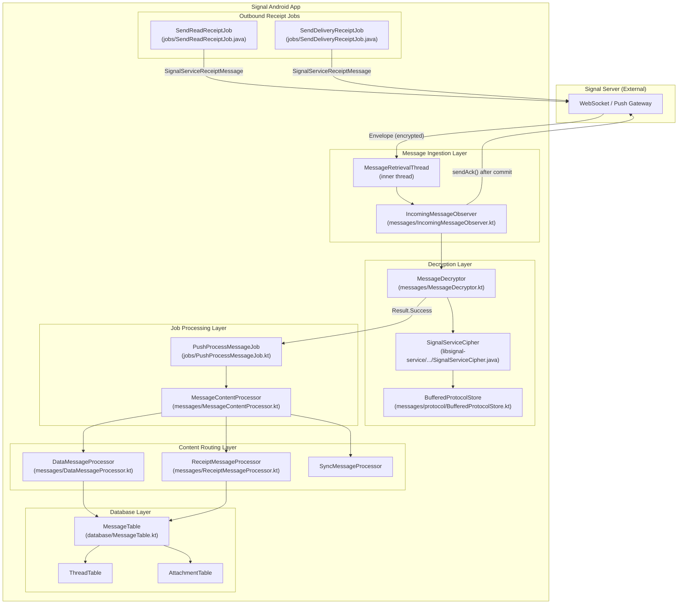
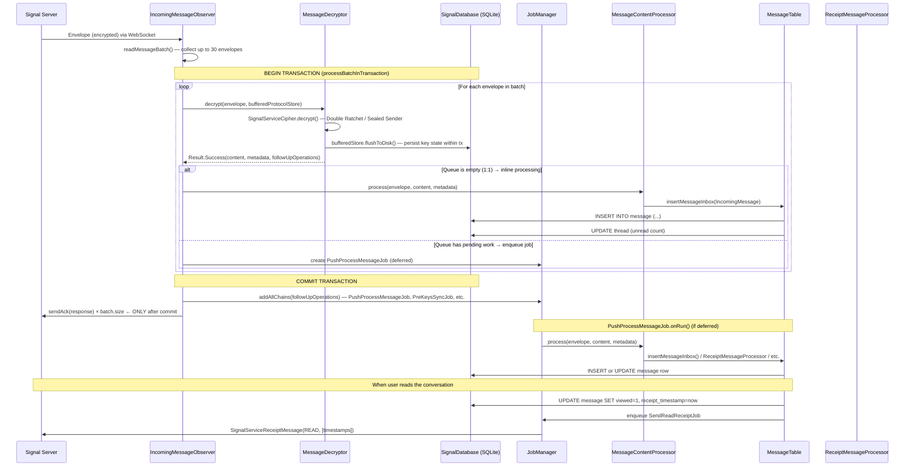

# Message Handling: Decryption, ACK, Read Receipts & Database Flow

**Audience:** Android engineers working on message ingestion, cryptography, or database layers  
**Scope:** End-to-end flow from WebSocket envelope arrival to database persistence and receipt acknowledgement

---

## Table of Contents

1. [System Overview](#1-system-overview)
2. [C4 Component Diagram](#2-c4-component-diagram)
3. [Phase 1 — Envelope Reception (WebSocket Layer)](#3-phase-1--envelope-reception-websocket-layer)
4. [Phase 2 — Message Decryption](#4-phase-2--message-decryption)
5. [Phase 3 — Server ACK](#5-phase-3--server-ack)
6. [Phase 4 — Message Processing & Database Insertion](#6-phase-4--message-processing--database-insertion)
7. [Phase 5 — Read & Viewed Receipts](#7-phase-5--read--viewed-receipts)
8. [Database Schema Reference](#8-database-schema-reference)
9. [Sequence Diagram — Full End-to-End Flow](#9-sequence-diagram--full-end-to-end-flow)
10. [Error Handling & Retry Strategy](#10-error-handling--retry-strategy)
11. [Key Classes Quick Reference](#11-key-classes-quick-reference)

---

## 1. System Overview

Signal Android receives messages over a persistent authenticated WebSocket connection. Each incoming **Envelope** must be:

1. **Decrypted** using the Signal Protocol (Double Ratchet / Sender Keys)
2. **ACK'd** back to the Signal server so the server knows delivery succeeded
3. **Processed** — content routed to the correct handler (data message, receipt, sync, call, story, etc.)
4. **Stored** in `MessageTable` (SQLite via SignalDatabase)
5. **Read-receipt sent** back to the original sender when the user opens the conversation

The entire flow is designed around **atomicity**: decryption and database insertion happen inside a single SQLite transaction. The ACK to the server is sent only _after_ the transaction commits successfully, ensuring that a crash between receipt and storage cannot result in a silently-dropped message.

---

## 2. C4 Component Diagram



---

## 3. Phase 1 — Envelope Reception (WebSocket Layer)

### Entry Point

**File:** `app/src/main/java/org/thoughtcrime/securesms/messages/IncomingMessageObserver.kt`

The `IncomingMessageObserver` class (line 70) manages the authenticated WebSocket connection and orchestrates all incoming message processing.

```
IncomingMessageObserver(
  context: Application,
  authWebSocket: SignalWebSocket.AuthenticatedWebSocket,  // line 72
  unauthWebSocket: SignalWebSocket.UnauthenticatedWebSocket
)
```

### MessageRetrievalThread

The inner class `MessageRetrievalThread` (line 396) is a background thread that runs the WebSocket read loop:

```
authWebSocket.connect()  // line 438
while (!terminated && isConnectionNecessary()) {
    authWebSocket.readMessageBatch(websocketReadTimeout, 30) { batch ->
        // line 451 — reads up to 30 envelopes per batch
        GroupsV2ProcessingLock.acquireGroupProcessingLock().use {
            ReentrantSessionLock.INSTANCE.acquire().use {
                val batchCommitted = processBatchInTransaction(batch)  // line 457
                if (!batchCommitted) {
                    processMessagesIndividually(batch)  // line 461 — fallback
                }
            }
        }
    }
}
```

**Timeout values** (lines 82–87):
- Normal mode: `websocketReadTimeout = 1 minute`
- Censored regions: `websocketReadTimeout = 30 seconds`
- Max background time: `2 minutes` (normal) / `10 seconds` (censored)

### Envelope Type Routing

`processEnvelope()` (line 287) routes each envelope by its type:

```kotlin
fun processEnvelope(
  bufferedProtocolStore: BufferedProtocolStore,
  envelope: Envelope,
  serverDeliveredTimestamp: Long,
  batchCache: BatchCache
): List<FollowUpOperation>? {
    return when (envelope.type) {
        Envelope.Type.SERVER_DELIVERY_RECEIPT -> {  // line 289
            processReceipt(envelope)  // updates delivery receipt in DB directly
            null
        }
        Envelope.Type.PREKEY_BUNDLE,
        Envelope.Type.CIPHERTEXT,
        Envelope.Type.UNIDENTIFIED_SENDER,
        Envelope.Type.PLAINTEXT_CONTENT -> {  // lines 294–297
            processMessage(bufferedProtocolStore, envelope, serverDeliveredTimestamp, batchCache)
        }
        else -> null  // line 305 — unknown type dropped with warning
    }
}
```

**Envelope Types:**

| Type | Meaning |
|---|---|
| `PREKEY_BUNDLE` | Establishes a new Double Ratchet session using a pre-key |
| `CIPHERTEXT` | Normal Double Ratchet encrypted message |
| `UNIDENTIFIED_SENDER` | Sealed sender — sender identity hidden from server |
| `PLAINTEXT_CONTENT` | Unencrypted (rare, internal protocol use) |
| `SERVER_DELIVERY_RECEIPT` | Server acknowledging it delivered a message you sent |

---

## 4. Phase 2 — Message Decryption

### Orchestration: `processMessage()`

**File:** `IncomingMessageObserver.kt`, line 311

```kotlin
private fun processMessage(
  bufferedProtocolStore: BufferedProtocolStore,
  envelope: Envelope,
  serverDeliveredTimestamp: Long,
  batchCache: BatchCache
): List<FollowUpOperation> {
    val result = MessageDecryptor.decrypt(
        context, bufferedProtocolStore, envelope, serverDeliveredTimestamp
    )  // line 314

    when (result) {
        is MessageDecryptor.Result.Success -> {
            val job = PushProcessMessageJob.processOrDefer(
                messageContentProcessor, result, localReceiveMetric, batchCache
            )  // line 321
            if (job != null) {
                return result.followUpOperations + FollowUpOperation { job.asChain() }  // line 323
            }
        }
        is MessageDecryptor.Result.Error -> {
            return result.followUpOperations + FollowUpOperation {
                // Creates error placeholder in DB and enqueues PushProcessMessageErrorJob
                // lines 326–349
            }
        }
        is MessageDecryptor.Result.Ignore -> { /* no action */ }
    }
    return result.followUpOperations
}
```

### Core Decryption: `MessageDecryptor.decrypt()`

**File:** `app/src/main/java/org/thoughtcrime/securesms/messages/MessageDecryptor.kt`, line 98

```kotlin
fun decrypt(
    context: Context,
    bufferedProtocolStore: BufferedProtocolStore,
    envelope: Envelope,
    serverDeliveredTimestamp: Long
): Result {
    // 1. Validate destination (lines 107–116)
    val destination = ServiceId.parseOrNull(envelope.destinationServiceId, ...)
    if (destination != selfAci && destination != selfPni) return Result.Ignore(...)

    // 2. PreKey bundle → schedule PreKeysSyncJob as follow-up (lines 145–150)
    if (envelope.type == PREKEY_BUNDLE) {
        followUpOperations += FollowUpOperation { PreKeysSyncJob.create().asChain() }
    }

    // 3. Construct SignalServiceCipher with buffered key stores (line 154)
    val cipher = SignalServiceCipher(
        localAddress, deviceId, bufferedStore,
        ReentrantSessionLock.INSTANCE,
        SealedSenderAccessUtil.getCertificateValidator()
    )

    // 4. Low-level decryption (line 159)
    val cipherResult: SignalServiceCipherResult? = cipher.decrypt(envelope, serverDeliveredTimestamp)

    // 5. Validate envelope content structure (line 185)
    val validationResult = EnvelopeContentValidator.validate(
        envelope, cipherResult.content, selfAci, cipherResult.metadata.ciphertextMessageType
    )

    // 6. Handle Sender Key Distribution Message immediately (lines 203–211)
    if (cipherResult.content.senderKeyDistributionMessage != null) {
        handleSenderKeyDistributionMessage(...)
    }

    // 7. Handle PNI Signature linking (lines 213–228)
    if (cipherResult.content.pniSignatureMessage != null) {
        handlePniSignatureMessage(...)
    }

    // 8. Return success (line 236)
    return Result.Success(envelope, serverDeliveredTimestamp, cipherResult.content, cipherResult.metadata, followUpOperations)
}
```

### `Result` Sealed Interface

**File:** `MessageDecryptor.kt`, lines 583–641

```kotlin
sealed interface Result {
    data class Success(        // line 589 — decrypted content available
        val content: Content,
        val metadata: EnvelopeMetadata,
        val followUpOperations: List<FollowUpOperation>
    ) : Result

    class DecryptionError(     // line 598 — error message inserted into chat history
        val errorMetadata: ErrorMetadata,
        ...
    ) : Result, Error

    class InvalidVersion(      // line 606 — old protocol version
        ...
    ) : Result, Error

    class LegacyMessage(       // line 614 — pre-2015 format
        ...
    ) : Result, Error

    class UnsupportedDataMessage(  // line 625 — requires newer app version
        ...
    ) : Result, Error

    class Ignore(              // line 633 — silent drop, no DB write needed
        ...
    ) : Result
}
```

### Low-Level Crypto: `SignalServiceCipher`

**File:** `lib/libsignal-service/src/main/java/org/whispersystems/signalservice/api/crypto/SignalServiceCipher.java`

- Delegates to `libsignal-android` for the Double Ratchet (`SessionCipher`) and Sealed Sender (`SealedSessionCipher`)
- Returns `SignalServiceCipherResult` containing:
  - `content`: decrypted `Content` protobuf
  - `metadata.sourceServiceId`: sender's service ID (revealed for sealed sender after decryption)
  - `metadata.sourceDeviceId`: sender device number
  - `metadata.sealedSender`: whether the message used Unidentified Sender

### BufferedProtocolStore

**Files:** `app/src/main/java/org/thoughtcrime/securesms/messages/protocol/Buffered*.kt`

The `BufferedProtocolStore` wraps all cryptographic key stores (sessions, identity keys, sender keys, pre-keys, Kyber pre-keys) in an in-memory buffer during batch processing:

```
BufferedProtocolStore.create()     // called per batch (line 525)
    ↓ decryption uses buffered stores
bufferedStore.flushToDisk()        // line 532 — persisted after each envelope within transaction
```

This allows the entire batch to be processed transactionally. If the DB transaction rolls back, the in-memory key state is also discarded (not yet flushed to SQLite).

---

## 5. Phase 3 — Server ACK

The ACK tells the Signal server: "I have received and processed this envelope — you may remove it from your queue."

**Critical guarantee:** ACKs are only sent _after_ the database transaction commits successfully.

### Batch Processing Path

**File:** `IncomingMessageObserver.kt`, `processBatchInTransaction()`, lines 523–556

```kotlin
private fun processBatchInTransaction(batch: List<EnvelopeResponse>): Boolean {
    val allFollowUpOperations = mutableListOf<FollowUpOperation>()
    val bufferedStore = BufferedProtocolStore.create()
    val batchCache = ReusedBatchCache()

    // 1. Entire batch in one transaction (line 528)
    val committed = SignalDatabase.tryRunInTransaction {
        batch.forEach { response ->
            val followUps = processEnvelope(bufferedStore, response.envelope, ...)  // line 531
            bufferedStore.flushToDisk()  // line 532 — key state persisted within tx
            if (followUps?.isNotEmpty() == true) allFollowUpOperations += followUps
        }
    }

    if (committed) {
        batchCache.flushAndClear()  // line 542

        // 2. Enqueue jobs (PushProcessMessageJob, etc.) AFTER commit (lines 544–548)
        if (allFollowUpOperations.isNotEmpty()) {
            val jobs = allFollowUpOperations.mapNotNull { it.run() }
            AppDependencies.jobManager.addAllChains(jobs)
        }

        // 3. ACK every envelope in the batch AFTER successful commit (lines 550–552)
        batch.forEach { response ->
            authWebSocket.sendAck(response)
        }
    }

    return committed  // false → caller falls back to processMessagesIndividually()
}
```

### Individual Processing Fallback

**File:** `IncomingMessageObserver.kt`, `processMessagesIndividually()`, lines 561–583

If the batch transaction rolls back (e.g., due to a duplicate or constraint violation), each envelope is retried in its own transaction:

```kotlin
private fun processMessagesIndividually(batch: List<EnvelopeResponse>) {
    batch.forEach { response ->
        val followUpOperations = SignalDatabase.runInTransaction {  // line 567
            val followUps = processEnvelope(bufferedStore, response.envelope, ...)
            bufferedStore.flushToDisk()
            followUps
        }

        if (followUpOperations?.isNotEmpty() == true) {
            AppDependencies.jobManager.addAllChains(followUpOperations.mapNotNull { it.run() })
        }

        authWebSocket.sendAck(response)  // line 579 — ACK per-message after commit
    }
}
```

### WebSocket ACK Implementation

**File:** `lib/libsignal-service/src/main/java/.../SignalWebSocket.kt`

```kotlin
fun sendAck(response: EnvelopeResponse) {
    getWebSocket().sendResponse(response.websocketRequest.getWebSocketResponse())
}
```

---

## 6. Phase 4 — Message Processing & Database Insertion

### `PushProcessMessageJob` — The Processing Job

**File:** `app/src/main/java/org/thoughtcrime/securesms/jobs/PushProcessMessageJob.kt`

```kotlin
class PushProcessMessageJob(
    parameters: Parameters,
    private val envelope: Envelope,
    private val content: Content,      // already decrypted
    private val metadata: EnvelopeMetadata,
    private val serverDeliveredTimestamp: Long
) : BaseJob(parameters) {

    public override fun onRun() {           // line 63
        val processor = MessageContentProcessor.create(context)
        processor.process(envelope, content, metadata, serverDeliveredTimestamp)  // line 65
    }
}
```

#### `processOrDefer()` — Queue Decision Logic

**File:** `PushProcessMessageJob.kt`, lines 120–162

```kotlin
fun processOrDefer(
    messageProcessor: MessageContentProcessor,
    result: MessageDecryptor.Result.Success,
    localReceiveMetric: SignalLocalMetrics.MessageReceive,
    batchCache: BatchCache
): PushProcessMessageJob? {

    val queueName: String = when {
        groupId != null -> getQueueName(RecipientId.from(groupId))         // group queue
        content.syncMessage?.sent != null -> getQueueName(destination)     // sync queue
        else -> getQueueName(RecipientId.from(result.metadata.sourceServiceId))  // 1:1 queue
    }

    return if (requireNetwork || !isQueueEmpty(queueName, cache)) {
        // Queue has pending work → enqueue job for ordered processing (line 153)
        PushProcessMessageJob(parameters, envelope, content, metadata, serverDeliveredTimestamp)
    } else {
        // Queue is empty → process inline without creating a Job (line 156)
        messageProcessor.process(result.envelope, result.content, result.metadata, ...)
        null  // no job returned → no FollowUpOperation wrapping needed
    }
}
```

**Queue naming** (line 117): `"__PUSH_PROCESS_JOB__" + recipientId.toQueueKey()`

This ensures that messages from the same sender/group are always processed in order, even if they arrive in separate WebSocket batches.

### `MessageContentProcessor` — Content Routing

**File:** `app/src/main/java/org/thoughtcrime/securesms/messages/MessageContentProcessor.kt`

Routes the decrypted `Content` to the appropriate sub-processor based on which field is populated in the protobuf:

| Content Field | Processor | Notes |
|---|---|---|
| `dataMessage` | `DataMessageProcessor.process()` | Text, attachments, reactions, edits |
| `receiptMessage` | `ReceiptMessageProcessor.process()` | Delivery, read, viewed receipts |
| `syncMessage` | `SyncMessageProcessor.process()` | Multi-device sync |
| `typingMessage` | Typing indicator inline | No DB write |
| `callMessage` | `CallMessageProcessor.process()` | WebRTC signalling |
| `storyMessage` | `StoryMessageProcessor.process()` | Story posts |

### `DataMessageProcessor` → `MessageTable.insertMessageInbox()`

**File:** `app/src/main/java/org/thoughtcrime/securesms/database/MessageTable.kt`, line 2923

```kotlin
fun insertMessageInbox(
    retrieved: IncomingMessage,
    candidateThreadId: Long = -1,
    editedMessage: MmsMessageRecord? = null,
    notifyObservers: Boolean = true,
    skipThreadUpdate: Boolean = false
): Optional<InsertResult> {

    // 1. Compute message type flags (line 2930)
    val type = retrieved.toMessageType()

    // 2. Get or create thread (lines 2932–2937)
    val threadIdResult = if (candidateThreadId == -1L || retrieved.isGroupMessage) {
        getThreadIdFor(retrieved)
    } else {
        ThreadTable.ThreadIdResult(threadId = candidateThreadId, newlyCreated = false)
    }

    // 3. Build ContentValues for the message row (lines 2954–2975)
    val contentValues = contentValuesOf(
        DATE_SENT        to retrieved.sentTimeMillis,
        DATE_SERVER      to retrieved.serverTimeMillis,
        FROM_RECIPIENT_ID to retrieved.from.serialize(),
        TO_RECIPIENT_ID  to Recipient.self().id.serialize(),
        TYPE             to type,
        THREAD_ID        to threadId,
        DATE_RECEIVED    to retrieved.receivedTimeMillis,
        READ             to read.toInt(),
        UNIDENTIFIED     to retrieved.isUnidentified,
        SERVER_GUID      to retrieved.serverGuid,
        ...
    )

    // 4. Insert the row + attachments in one call (line 3018)
    val (messageId, insertedAttachments) = insertMediaMessage(
        threadId, body, attachments, sharedContacts, linkPreviews,
        mentions, messageRanges, contentValues, ...
    )

    // 5. Duplicate detection (line 3042)
    maybeCollapseMessage(db, messageId, threadId, dateReceived, messageExtras, type)

    // 6. Increment thread unread count (line 3084)
    threads.incrementUnread(threadId, 1, if (incrementUnreadMentions) 1 else 0)
    ThreadUpdateJob.enqueue(threadId, true)  // line 3085

    // 7. Notify conversation UI listeners (line 3089)
    notifyConversationListeners(threadId)

    return Optional.of(InsertResult(messageId, threadId, ...))
}
```

---

## 7. Phase 5 — Read & Viewed Receipts

### Marking Messages as Viewed (UI → DB)

When a user opens a conversation, the UI calls:

**File:** `app/src/main/java/org/thoughtcrime/securesms/database/MessageTable.kt`, line 789

```kotlin
fun setIncomingMessagesViewed(messageIds: List<Long>): List<MarkedMessageInfo> {
    // 1. Query messages that have not yet been viewed (line 797)
    val results = readableDatabase
        .select(ID, FROM_RECIPIENT_ID, DATE_SENT, THREAD_ID, ...)
        .from(TABLE_NAME)
        .where("$ID IN (...) AND $VIEWED_COLUMN = 0")
        .run()
        .readToList { cursor -> ... }

    // 2. Update VIEWED_COLUMN = 1 and set RECEIPT_TIMESTAMP (lines 810–822)
    writableDatabase
        .update(TABLE_NAME)
        .values(VIEWED_COLUMN to 1, RECEIPT_TIMESTAMP to System.currentTimeMillis())
        .where(query.where, query.whereArgs)
        .run()

    // 3. Notify observers (lines 833–835)
    notifyConversationListeners(threadsUpdated)
    notifyConversationListListeners()

    return results  // MarkedMessageInfo list used to enqueue SendReadReceiptJob
}
```

The caller then enqueues `SendReadReceiptJob.enqueue(threadId, recipientId, markedMessageInfos)`.

### Sending Read Receipts: `SendReadReceiptJob`

**File:** `app/src/main/java/org/thoughtcrime/securesms/jobs/SendReadReceiptJob.java`

```java
// Constructor — constraints (lines 66–72)
new Job.Parameters.Builder()
    .addConstraint(NetworkConstraint.KEY)         // requires network
    .addConstraint(SealedSenderConstraint.KEY)    // sent via sealed sender for privacy
    .setLifespan(TimeUnit.DAYS.toMillis(1))       // expires after 1 day
    .setMaxAttempts(Parameters.UNLIMITED)
    .setQueue(recipientId.toQueueKey())           // serialized per-recipient
    .build()

// enqueue() — static factory (lines 100–122)
public static void enqueue(long threadId, RecipientId recipientId,
                            List<MarkedMessageInfo> markedMessageInfos) {
    if (!TextSecurePreferences.isReadReceiptsEnabled(context)) return;  // line 101
    if (recipientId.equals(Recipient.self().getId())) return;           // line 105

    // Chunk large receipts into batches of ≤500 (line 110)
    List<List<MarkedMessageInfo>> messageIdChunks = ListUtil.chunk(markedMessageInfos, MAX_TIMESTAMPS);
    for (List<MarkedMessageInfo> chunk : messageIdChunks) {
        jobManager.add(new SendReadReceiptJob(threadId, recipientId, sentTimestamps, messageIds));
    }
}

// onRun() — actual network send (lines 147–203)
public void onRun() {
    // Guard clauses: skip if self, blocked, group, unregistered (lines 148–188)

    SignalServiceReceiptMessage receiptMessage =
        new SignalServiceReceiptMessage(
            SignalServiceReceiptMessage.Type.READ,
            messageSentTimestamps,
            timestamp
        );  // line 192

    SendMessageResult result = messageSender.sendReceipt(
        remoteAddress,
        SealedSenderAccessUtil.getSealedSenderAccessFor(recipient, ...),
        receiptMessage,
        recipient.getNeedsPniSignature()
    );  // lines 194–198
}
```

### Receiving Read Receipts: `ReceiptMessageProcessor`

**File:** `app/src/main/java/org/thoughtcrime/securesms/messages/ReceiptMessageProcessor.kt`

```kotlin
object ReceiptMessageProcessor {
    fun process(context, senderRecipient, envelope, content, metadata, earlyMessageCacheEntry, batchCache) {
        when (receiptMessage.type) {
            ReceiptMessage.Type.DELIVERY -> handleDeliveryReceipt(...)  // line 31
            ReceiptMessage.Type.READ     -> handleReadReceipt(...)      // line 32
            ReceiptMessage.Type.VIEWED   -> handleViewedReceipt(...)    // line 33
        }
    }
}
```

#### Delivery Receipt Handler (lines 39–69)

```kotlin
private fun handleDeliveryReceipt(...) {
    // Update HAS_DELIVERY_RECEIPT column for matching sent messages (line 50)
    val missing = SignalDatabase.messages.incrementDeliveryReceiptCounts(
        deliveryReceipt.timestamp, senderRecipientId, envelope.timestamp!!, stopwatch, batchCache.deliveryReceiptLookupCache
    )

    if (missing.isNotEmpty()) PushProcessEarlyMessagesJob.enqueue()  // line 59

    // Acknowledge any pending PNI signature for this sender (line 62)
    SignalDatabase.pendingPniSignatureMessages.acknowledgeReceipts(
        senderRecipientId, deliveryReceipt.timestamp, metadata.sourceDeviceId
    )
}
```

#### Read Receipt Handler (lines 72–106)

```kotlin
private fun handleReadReceipt(...) {
    if (!TextSecurePreferences.isReadReceiptsEnabled(context)) return  // line 81

    // Update HAS_READ_RECEIPT column (line 89)
    val missing = SignalDatabase.messages.incrementReadReceiptCounts(
        readReceipt.timestamp, senderRecipientId, envelope.timestamp!!, batchCache.readReceiptLookupCache
    )

    // Cache early receipts for messages not yet arrived (lines 97–104)
    if (missing.isNotEmpty() && earlyMessageCacheEntry != null) {
        missing.forEach { targetTimestamp ->
            AppDependencies.earlyMessageCache.store(selfId, targetTimestamp, earlyMessageCacheEntry)
        }
        PushProcessEarlyMessagesJob.enqueue()  // line 104
    }
}
```

#### Viewed Receipt Handler (lines 108–151)

```kotlin
private fun handleViewedReceipt(...) {
    val missing: Set<Long> = when {
        readReceipts && storyViewedReceipts -> SignalDatabase.messages.incrementViewedReceiptCounts(...)     // line 127
        readReceipts -> SignalDatabase.messages.incrementViewedNonStoryReceiptCounts(...)                    // line 129
        else -> SignalDatabase.messages.incrementViewedStoryReceiptCounts(...)                               // line 131
    }

    // Update story "viewed" status for found messages (line 135)
    SignalDatabase.messages.updateViewedStories(foundTargetTimestamps)
}
```

---

## 8. Database Schema Reference

**File:** `app/src/main/java/org/thoughtcrime/securesms/database/MessageTable.kt`, lines 165–254

### Core Message Columns

| Column | Type | Line | Purpose |
|---|---|---|---|
| `_id` | INTEGER PK | 246 | Auto-increment primary key |
| `date_sent` | INTEGER | 171 | Sender's device clock timestamp (ms) |
| `date_received` | INTEGER | 172 | Local receipt timestamp (ms) |
| `date_server` | INTEGER | 174 | Signal server timestamp (ms) |
| `thread_id` | INTEGER FK | 175 | References `thread._id` (ON DELETE CASCADE) |
| `from_recipient_id` | INTEGER FK | 178 | Sender's RecipientId |
| `to_recipient_id` | INTEGER FK | 180 | Self RecipientId for incoming messages |
| `type` | INTEGER | 173 | Bitmask of MessageTypes flags |
| `read` | INTEGER | 176 | 0 = unread, 1 = read |
| `body` | TEXT | 177 | Plaintext message body |
| `has_delivery_receipt` | INTEGER | 181 | 1 if delivery receipt received |
| `has_read_receipt` | INTEGER | 182 | 1 if read receipt received |
| `viewed` | INTEGER | 183 | 1 if message has been viewed |
| `unidentified` | INTEGER | 191 | 1 if received via Sealed Sender |
| `server_guid` | TEXT | 195 | UUID from Signal server |
| `receipt_timestamp` | INTEGER | 196 | When the message was marked viewed |
| `expires_in` | INTEGER | — | Disappearing message timer (ms) |
| `expire_started` | INTEGER | — | When the timer started (ms) |
| `story_type` | INTEGER | 217 | 0 = normal message, >0 = story type |
| `parent_story_id` | INTEGER | 218 | Story reply parent reference |
| `quote_id` | INTEGER | — | Quoted message's `date_sent` |
| `message_extras` | BLOB | 223 | Encoded MessageExtras proto (polls, pins, etc.) |

### Receipt Status Flow

```
Outgoing message sent
    ↓ server delivers to recipient's device
has_delivery_receipt = 1  ← SERVER_DELIVERY_RECEIPT or ReceiptMessage.DELIVERY
    ↓ recipient reads the conversation
has_read_receipt = 1      ← ReceiptMessage.READ
    ↓ recipient views a story/media
viewed = 1                ← ReceiptMessage.VIEWED  (also set locally by setIncomingMessagesViewed())
```

---

## 9. Sequence Diagram — Full End-to-End Flow



---

## 10. Error Handling & Retry Strategy

### Decryption Errors

**File:** `MessageDecryptor.kt`, lines 237–275

When decryption fails, the error type determines the response:

| Exception | Result Type | Behavior |
|---|---|---|
| `ProtocolNoSessionException` | `DecryptionError` | Insert error bubble in chat; schedule `AutomaticSessionResetJob` if `retryReceipts` disabled |
| `ProtocolInvalidKeyException` | `DecryptionError` | Same as above |
| `ProtocolUntrustedIdentityException` | `DecryptionError` | Identity changed warning inserted |
| `ProtocolInvalidVersionException` | `InvalidVersion` | Version mismatch error message |
| `ProtocolLegacyMessageException` | `LegacyMessage` | Pre-2015 format, show error |
| `SelfSendException` | `Ignore` | Silently drop (echo from own device) |

When `RemoteConfig.retryReceipts` is enabled, a `DecryptionError` triggers:

```kotlin
AppDependencies.pendingRetryReceiptCache.insert(
    sender.id, senderDevice, envelope.timestamp!!, receivedTimestamp, threadId
)
AppDependencies.pendingRetryReceiptManager.scheduleIfNecessary()
```

This sends a retry receipt asking the sender to re-send the message under a new ratchet state.

### Job Retry Constraints

`PushProcessMessageJob` (lines 145–151):

| Constraint | Effect |
|---|---|
| `ChangeNumberConstraint` | Paused while a phone number change is in progress |
| `NetworkConstraint` | Added only when group state fetch is needed |
| `setMaxAttempts(UNLIMITED)` | Retries indefinitely until lifespan expires |
| `setLifespan(30 days)` | Job discarded after 30 days if never processed |

`SendReadReceiptJob` (lines 66–69):

| Constraint | Effect |
|---|---|
| `NetworkConstraint` | Requires network |
| `SealedSenderConstraint` | Requires sealed sender cert to be available |
| `setLifespan(1 day)` | Read receipts expire after 1 day |

### Early Message Cache

When a receipt arrives before the message it refers to (out-of-order delivery), the receipt is stored in `EarlyMessageCache` keyed by `(selfId, sentTimestamp)`. After the message arrives and is processed, `PushProcessEarlyMessagesJob` replays the cached receipt against the now-present message.

---

## 11. Key Classes Quick Reference

| Class | File | Role |
|---|---|---|
| `IncomingMessageObserver` | `messages/IncomingMessageObserver.kt:70` | WebSocket lifecycle, batch/individual processing orchestration, ACK sending |
| `MessageDecryptor` | `messages/MessageDecryptor.kt:86` | Envelope decryption, Signal Protocol cipher invocation, PNI/SKDM side-effects |
| `SignalServiceCipher` | `lib/libsignal-service/.../crypto/SignalServiceCipher.java` | Double Ratchet / Sealed Sender low-level crypto |
| `BufferedProtocolStore` | `messages/protocol/BufferedProtocolStore.kt` | Transactional in-memory key store buffer |
| `PushProcessMessageJob` | `jobs/PushProcessMessageJob.kt:32` | Serializable job for deferred/queued message processing |
| `MessageContentProcessor` | `messages/MessageContentProcessor.kt` | Routes decrypted `Content` to sub-processors |
| `DataMessageProcessor` | `messages/DataMessageProcessor.kt` | Handles `DataMessage` → calls `insertMessageInbox()` |
| `ReceiptMessageProcessor` | `messages/ReceiptMessageProcessor.kt:22` | Handles delivery/read/viewed receipt updates in MessageTable |
| `MessageTable` | `database/MessageTable.kt:165` | All SQLite operations on the `message` table |
| `SendReadReceiptJob` | `jobs/SendReadReceiptJob.java:43` | Sends `SignalServiceReceiptMessage(READ)` to a contact |
| `SendDeliveryReceiptJob` | `jobs/SendDeliveryReceiptJob.java` | Sends delivery confirmation receipts |

---

*Generated from codebase analysis — Signal Android main branch*  
*Cross-reference with: [Session-And-SenderKey-Distribution-Flow.md](Session-And-SenderKey-Distribution-Flow.md) | [Signal-Protocol-Code-Level.md](Signal-Protocol-Code-Level.md) | [Job-System.md](Job-System.md)*
