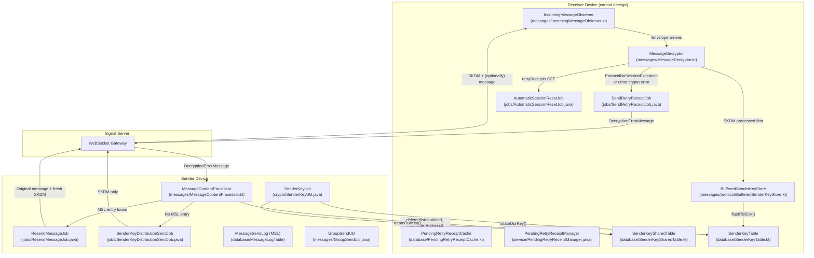
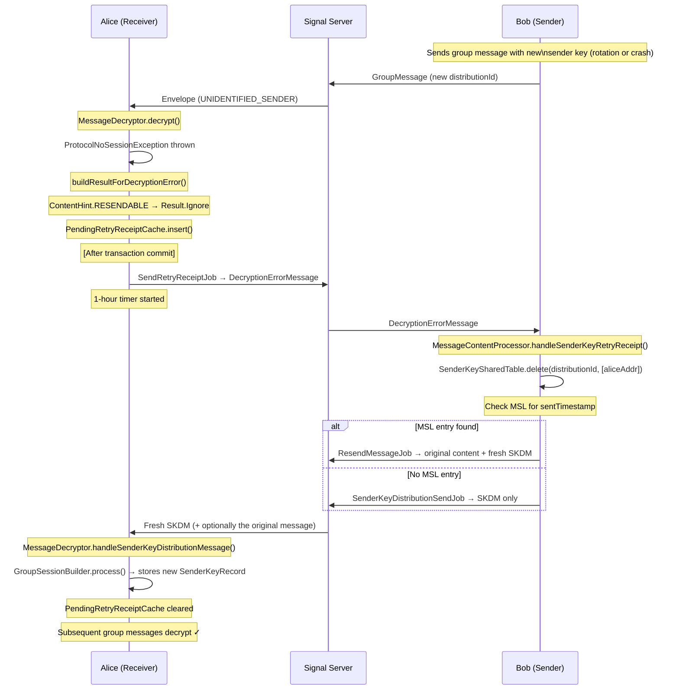
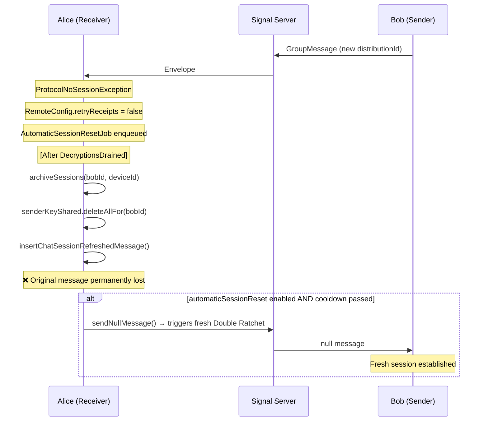
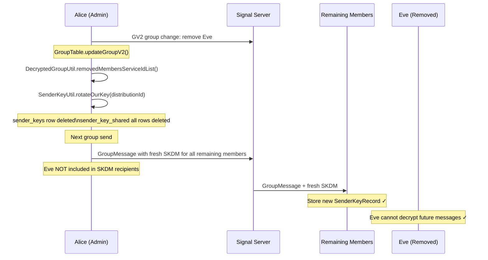

# Sender Key Decryption Failure & Recovery

**Audience:** Android engineers working on group messaging, cryptography, or Signal Protocol integration  
**Scope:** Every scenario where a client cannot decrypt a group message — from the initial failure through full recovery — with exact code paths and line numbers

---

## Table of Contents

1. [Primer: What Is a Sender Key?](#1-primer-what-is-a-sender-key)
2. [C4 Component Diagram — Sender Key System](#2-c4-component-diagram--sender-key-system)
3. [The Core Question: App Crash Mid-Rotation](#3-the-core-question-app-crash-mid-rotation)
4. [Decryption Failure Entry Point](#4-decryption-failure-entry-point)
5. [ContentHint: How Signal Classifies Decryption Failures](#5-contenthint-how-signal-classifies-decryption-failures)
6. [Retry Receipt System (Happy Path Recovery)](#6-retry-receipt-system-happy-path-recovery)
7. [Fallback: AutomaticSessionResetJob (retryReceipts OFF)](#7-fallback-automaticsessionresetjob-retryreceipts-off)
8. [All Sender Key Rotation Scenarios](#8-all-sender-key-rotation-scenarios)
9. [Database Layer: What Gets Deleted When](#9-database-layer-what-gets-deleted-when)
10. [Rate Limiting and Error Thresholds](#10-rate-limiting-and-error-thresholds)
11. [Scenario Sequence Diagrams](#11-scenario-sequence-diagrams)
12. [Key Classes Quick Reference](#12-key-classes-quick-reference)

---

## 1. Primer: What Is a Sender Key?

Signal group messages use the **Sender Key Protocol** (also called Group Messaging or Sender Keys) for efficiency. Instead of encrypting a message N times (once per recipient), the sender:

1. Generates a **Sender Key** — a symmetric key tied to a `(senderACI, deviceId, distributionId)` triple
2. Sends a **SenderKeyDistributionMessage (SKDM)** to every group member once, establishing the shared session
3. Encrypts subsequent group messages once using that Sender Key, and all members decrypt with their copy

Two SQLite tables track this:

| Table | Purpose |
|---|---|
| `sender_keys` | Stores the actual `SenderKeyRecord` blob — the cryptographic session state |
| `sender_key_shared` | Tracks which `(distributionId, address, device)` tuples have received an SKDM |

If a recipient's entry in `sender_key_shared` is deleted, the next group send will include a fresh SKDM for them. If the `SenderKeyRecord` itself is deleted from `sender_keys`, it is re-created lazily on the next send, rotating the key material entirely.

---

## 2. C4 Component Diagram — Sender Key System



---

## 3. The Core Question: App Crash Mid-Rotation

**The scenario:** Alice is in a group with Bob. Bob's app crashes mid-send while rotating his sender key. Bob's app restarts, generates a new sender key, and sends a new SKDM + message. Alice receives the new message but fails to decrypt it because she never received the SKDM (it was in-flight when the crash happened), or she received the SKDM in a transaction that rolled back.

### Why Does This Happen?

Signal processes envelopes inside a **database transaction** (`processBatchInTransaction`, `IncomingMessageObserver.kt:523`). The `BufferedSenderKeyStore` buffers all key state changes in memory:

```kotlin
// BufferedSenderKeyStore.kt:58-69
fun flushToDisk(persistentStore: SignalServiceAccountDataStore) {
    for ((key, record) in updatedKeys) {
        persistentStore.storeSenderKey(key.address, key.distributionId, record)
    }
    for (address in clearSharedWith) {
        persistentStore.clearSenderKeySharedWith(listOf(address))
    }
}
```

`flushToDisk()` is called at line 532 of `IncomingMessageObserver.kt` _inside_ the transaction:

```kotlin
// IncomingMessageObserver.kt:528-538
val committed = SignalDatabase.tryRunInTransaction {
    batch.forEach { response ->
        val followUps = processEnvelope(bufferedStore, response.envelope, ...)
        bufferedStore.flushToDisk()   // line 532 — key state written within TX
        ...
    }
}
```

**If the transaction rolls back** (duplicate detection, constraint violation, or crash before commit): the `SenderKeyRecord` written by `flushToDisk()` is also rolled back. The SKDM is lost. Alice's `sender_keys` table has no record of Bob's new distribution ID. The next message from Bob using that distribution ID will throw `ProtocolNoSessionException`.

### The Recovery Path

```
Bob's new SKDM lost in rolled-back transaction
    ↓
Bob sends group message with new sender key
    ↓
Alice: ProtocolNoSessionException thrown in SignalServiceCipher.decrypt()
    ↓
MessageDecryptor.buildResultForDecryptionError()         [line 301]
    ↓
ContentHint.RESENDABLE → Result.Ignore
    ↓ (follow-up after commit)
SendRetryReceiptJob enqueued                              [line 353]
PendingRetryReceiptCache.insert()                         [line 395]
    ↓
Bob receives DecryptionErrorMessage
    ↓
MessageContentProcessor.handleSenderKeyRetryReceipt()    [line 618]
    ↓
SenderKeySharedTable.delete(distributionId, [aliceAddr]) [line 661]
    ↓ (MSL check)
ResendMessageJob (if MSL entry exists)                   [line 665]
  OR
SenderKeyDistributionSendJob (if no MSL)                 [line 678]
    ↓
Fresh SKDM + message (or SKDM alone) sent to Alice
    ↓
MessageDecryptor.handleSenderKeyDistributionMessage()    [line 202]
  → GroupSessionBuilder.process() stores new sender key  [line 414]
    ↓
Alice successfully decrypts subsequent messages
```

---

## 4. Decryption Failure Entry Point

**File:** `app/src/main/java/org/thoughtcrime/securesms/messages/MessageDecryptor.kt`

All decryption errors are caught at line 237. The relevant exception types for sender key failures:

```kotlin
// MessageDecryptor.kt:237-264
} catch (e: Exception) {
    when (e) {
        is ProtocolInvalidKeyIdException,    // line 239 — PreKey ID not found
        is ProtocolInvalidKeyException,      // line 240 — Key material is invalid
        is ProtocolUntrustedIdentityException, // line 241 — Identity key mismatch
        is ProtocolNoSessionException,       // line 242 — NO SENDER KEY SESSION (core group failure)
        is ProtocolInvalidMessageException   // line 243 — Corrupted/wrong ciphertext
        -> {
            check(e is ProtocolException)

            if (RemoteConfig.retryReceipts) {
                buildResultForDecryptionError(...)    // line 252 — retry path
            } else {
                // line 254-262 — fallback: AutomaticSessionResetJob
                followUpOperations += FollowUpOperation {
                    AutomaticSessionResetJob(it.id, e.senderDevice, envelope.timestamp!!).asChain()
                }
                Result.Ignore(envelope, serverDeliveredTimestamp, ...)
            }
        }

        is ProtocolDuplicateMessageException -> Result.Ignore(...)   // line 266 — silently drop
        is InvalidMetadataVersionException   -> Result.Ignore(...)   // line 271
        is SelfSendException                 -> Result.Ignore(...)   // line 278
        is ProtocolInvalidVersionException   -> Result.InvalidVersion(...)  // line 283
        is ProtocolLegacyMessageException    -> Result.LegacyMessage(...)  // line 288
    }
}
```

**`ProtocolNoSessionException` is the primary error for sender key failures.** It is thrown by `libsignal-android`'s `GroupCipher.decrypt()` when the receiver has no `SenderKeyRecord` for the `(senderAddress, distributionId)` tuple.

---

## 5. ContentHint: How Signal Classifies Decryption Failures

**File:** `MessageDecryptor.kt`, `buildResultForDecryptionError()`, line 301

The `ContentHint` embedded in the envelope tells the receiver _how visible_ the failure should be and whether the content can be recovered:

```kotlin
// MessageDecryptor.kt:313
val contentHint: ContentHint = ContentHint.fromType(protocolException.contentHint)
```

### ContentHint Decision Tree

```kotlin
// MessageDecryptor.kt:366-407
return when (contentHint) {

    ContentHint.DEFAULT -> {
        // line 367 — show error immediately in chat
        // Used for: most regular group messages
        Result.DecryptionError(envelope, serverDeliveredTimestamp, ...)
    }

    ContentHint.RESENDABLE -> {
        // line 372 — content CAN be resent; wait up to 1 hour before showing error
        // Used for: group text messages, media messages (most common for sender key)
        followUpOperations += FollowUpOperation {
            AppDependencies.pendingRetryReceiptCache.insert(
                sender.id, senderDevice, envelope.timestamp!!, receivedTimestamp, threadId
            )  // line 395
            AppDependencies.pendingRetryReceiptManager.scheduleIfNecessary()  // line 396
            null
        }
        Result.Ignore(envelope, serverDeliveredTimestamp, ...)
    }

    ContentHint.IMPLICIT -> {
        // line 403 — silent failure; never show any error to user
        // Used for: typing indicators, reactions, delivery receipts
        Result.Ignore(envelope, serverDeliveredTimestamp, ...)
    }
}
```

| ContentHint | User Sees | Error After Timeout | Retry Receipt Sent |
|---|---|---|---|
| `DEFAULT` | Immediate error bubble | N/A | Yes |
| `RESENDABLE` | Nothing initially | Error after 1 hour | Yes |
| `IMPLICIT` | Nothing ever | Never | Yes (silent) |

Group text and media messages use `RESENDABLE`, so a user never sees a "failed to decrypt" error unless the 1-hour timeout elapses without recovery.

---

## 6. Retry Receipt System (Happy Path Recovery)

This is the primary recovery mechanism when `RemoteConfig.retryReceipts` is `true`.

### Step 1 — Receiver: Enqueue SendRetryReceiptJob

**File:** `MessageDecryptor.kt:353–364`

```kotlin
followUpOperations += FollowUpOperation {
    val retryJob = buildSendRetryReceiptJob(envelope, protocolException, sender)

    // Prekey-related errors: force pre-key rotation before retry
    if (envelope.type == Envelope.Type.PREKEY_BUNDLE ||
        protocolException.message?.lowercase()?.contains("prekey") == true) {  // line 358
        PreKeysSyncJob.create(forceRotationRequested = true).asChain().then(retryJob)
    } else {
        retryJob.asChain()
    }
}
```

### Step 2 — Receiver: Build DecryptionErrorMessage

**File:** `MessageDecryptor.kt:522–537`

```kotlin
private fun buildSendRetryReceiptJob(...): SendRetryReceiptJob {
    // Extract original ciphertext bytes (sealed sender vs regular)
    val originalContent: ByteArray =
        if (protocolException.unidentifiedSenderMessageContent.isPresent) {
            protocolException.unidentifiedSenderMessageContent.get().content  // line 527
        } else {
            envelope.content!!.toByteArray()  // line 530
        }

    val envelopeType: Int = ...  // line 531

    // Build the DecryptionErrorMessage that tells the sender exactly what failed
    val decryptionErrorMessage = DecryptionErrorMessage.forOriginalMessage(
        originalContent,
        envelopeType,
        envelope.timestamp!!,       // timestamp of the failed message
        protocolException.senderDevice   // which of sender's devices
    )  // line 534

    val groupId: GroupId? = protocolException.parseGroupId(envelope)
    return SendRetryReceiptJob(sender.id, Optional.ofNullable(groupId), decryptionErrorMessage)
}
```

`DecryptionErrorMessage` contains:
- The original encrypted bytes — so the sender can re-encrypt correctly
- The original message timestamp — used to look up the MSL entry
- The receiver's `ratchetKey` (for 1:1 messages only) — tells sender whether to archive session
- The sender device ID

### Step 3 — Receiver: PendingRetryReceiptCache (RESENDABLE only)

**File:** `app/src/main/java/org/thoughtcrime/securesms/database/PendingRetryReceiptCache.kt`  
**File:** `app/src/main/java/org/thoughtcrime/securesms/service/PendingRetryReceiptManager.java`

For `ContentHint.RESENDABLE` messages, before showing an error the receiver waits up to **1 hour**:

```kotlin
// MessageDecryptor.kt:395-396
AppDependencies.pendingRetryReceiptCache.insert(
    sender.id, senderDevice, envelope.timestamp!!, receivedTimestamp, threadId
)
AppDependencies.pendingRetryReceiptManager.scheduleIfNecessary()
```

`PendingRetryReceiptManager` fires after the lifespan expires. If the message still hasn't arrived, it inserts a `BAD_DECRYPT_TYPE` error record in the conversation.

### Step 4 — Sender: Receives DecryptionErrorMessage

**File:** `app/src/main/java/org/thoughtcrime/securesms/messages/MessageContentProcessor.kt:523–524`

When the sender receives the retry receipt:

```kotlin
// MessageContentProcessor.kt:523-524
content.decryptionErrorMessage != null -> {
    handleRetryReceipt(envelope, metadata,
        content.decryptionErrorMessage!!.toDecryptionErrorMessage(metadata), senderRecipient)
}
```

### Step 5 — Sender: Route to Sender Key vs Individual Handler

**File:** `MessageContentProcessor.kt:592–616`

```kotlin
private fun handleRetryReceipt(
    envelope: Envelope, metadata: EnvelopeMetadata,
    decryptionErrorMessage: DecryptionErrorMessage,
    senderRecipient: Recipient
) {
    if (!RemoteConfig.retryReceipts) {  // line 593 — feature flag gate
        warn(...)
        return
    }

    if (decryptionErrorMessage.deviceId != SignalStore.account.deviceId) {  // line 598
        log("Received a retry receipt targeting a linked device. Ignoring.")
        return
    }

    val sentTimestamp = decryptionErrorMessage.timestamp  // line 603

    // Look up original message in Message Send Log
    val messageLogEntry = SignalDatabase.messageLog.getLogEntry(
        senderRecipient.id, metadata.sourceDeviceId, sentTimestamp
    )  // line 610

    // Route based on whether this is a sender key message (no ratchetKey) or 1:1 (has ratchetKey)
    if (decryptionErrorMessage.ratchetKey.isPresent) {
        handleIndividualRetryReceipt(...)  // line 612 — 1:1 Double Ratchet path
    } else {
        handleSenderKeyRetryReceipt(...)   // line 614 — GROUP / Sender Key path
    }
}
```

**The key discriminator:** `ratchetKey.isPresent` distinguishes sender key failures (group) from Double Ratchet failures (1:1). Sender key `DecryptionErrorMessage`s have no ratchet key.

### Step 6 — Sender: Handle Sender Key Retry Receipt

**File:** `MessageContentProcessor.kt:618–680`

```kotlin
private fun handleSenderKeyRetryReceipt(
    requester: Recipient,
    messageLogEntry: MessageLogEntry?,
    envelope: Envelope,
    metadata: EnvelopeMetadata,
    decryptionErrorMessage: DecryptionErrorMessage
) {
    val sentTimestamp = decryptionErrorMessage.timestamp  // line 625
    val relatedMessage = findRetryReceiptRelatedMessage(messageLogEntry, sentTimestamp)  // line 626

    // Validate: must have a related message (the one that failed)
    if (relatedMessage == null) {  // line 628
        warn("Related message not found! Skipping.")
        return
    }

    // Determine distributionId (from group or distribution list)
    val threadRecipient = SignalDatabase.threads.getRecipientForThreadId(relatedMessage.threadId)
    ...
    val distributionId = SignalDatabase.groups.getOrCreateDistributionId(groupId)  // line 649
    ...

    val requesterAddress = SignalProtocolAddress(requester.requireServiceId().toString(), metadata.sourceDeviceId)

    // CRITICAL: Delete the requester from sender_key_shared table
    // This forces the next send to include a fresh SKDM for this recipient
    SignalDatabase.senderKeyShared.delete(distributionId, setOf(requesterAddress))  // line 661

    if (messageLogEntry != null) {  // line 663
        // MSL entry found → resend the original message WITH a fresh SKDM
        warn("[RetryReceipt-SK] Found MSL entry. Scheduling a resend.")  // line 664
        AppDependencies.jobManager.add(
            ResendMessageJob(
                messageLogEntry.recipientId,
                messageLogEntry.dateSent,
                messageLogEntry.content,
                messageLogEntry.contentHint,
                messageLogEntry.urgent,
                groupId,
                distributionId
            )
        )  // lines 665-675
    } else {
        // No MSL entry → can't resend content, but can re-share the sender key
        warn("[RetryReceipt-SK] No MSL entry. Scheduling SenderKeyDistributionSendJob.")  // line 677
        AppDependencies.jobManager.add(
            SenderKeyDistributionSendJob(requester.id, threadRecipient.id)
        )  // line 678
    }
}
```

**The pivotal line is 661:** `SenderKeySharedTable.delete(distributionId, [requesterAddress])`. By removing the receiver from the shared-with table, Signal guarantees that the next send to this group will automatically prepend a fresh `SenderKeyDistributionMessage` for them.

### Step 7 — Receiver: Processes New SKDM

**File:** `MessageDecryptor.kt:202–211`

When the fresh SKDM arrives (either attached to the resent message or standalone), it is processed **immediately before any other decryption**:

```kotlin
// MessageDecryptor.kt:202-211
// Must handle SKDM's immediately, because subsequent decryptions could rely on it
if (cipherResult.content.senderKeyDistributionMessage != null) {
    handleSenderKeyDistributionMessage(
        envelope,
        cipherResult.metadata.sourceServiceId,
        cipherResult.metadata.sourceDeviceId,
        SenderKeyDistributionMessage(cipherResult.content.senderKeyDistributionMessage!!.toByteArray()),
        bufferedProtocolStore.getAciStore()
    )
}
```

```kotlin
// MessageDecryptor.kt:410-415
private fun handleSenderKeyDistributionMessage(
    envelope: Envelope, serviceId: ServiceId, deviceId: Int,
    message: SenderKeyDistributionMessage, senderKeyStore: SenderKeyStore
) {
    val sender = SignalProtocolAddress(serviceId.toString(), deviceId)
    // Stores the new SenderKeyRecord in sender_keys table via BufferedSenderKeyStore
    SignalGroupSessionBuilder(ReentrantSessionLock.INSTANCE, GroupSessionBuilder(senderKeyStore))
        .process(sender, message)  // line 414
}
```

After this, subsequent group messages from that sender decrypt successfully.

---

## 7. Fallback: AutomaticSessionResetJob (retryReceipts OFF)

When `RemoteConfig.retryReceipts` is `false`, Signal falls back to a simpler (but lossy) recovery:

**File:** `app/src/main/java/org/thoughtcrime/securesms/jobs/AutomaticSessionResetJob.java`

```kotlin
// MessageDecryptor.kt:253-262
} else {
    Log.w(TAG, "Retry receipts disabled! Enqueuing a session reset job.")
    followUpOperations += FollowUpOperation {
        Recipient.external(e.sender)?.let {
            AutomaticSessionResetJob(it.id, e.senderDevice, envelope.timestamp!!).asChain()
        }
    }
    Result.Ignore(...)
}
```

### What AutomaticSessionResetJob Does

```java
// AutomaticSessionResetJob.java:89-114
@Override
protected void onRun() throws Exception {
    // 1. Archive the 1:1 session with this device (line 90)
    AppDependencies.getProtocolStore().aci().sessions().archiveSessions(recipientId, deviceId);

    // 2. Delete ALL sender key shared-with records for this recipient (line 91)
    // Forces re-distribution of ALL group sender keys to this recipient
    SignalDatabase.senderKeyShared().deleteAllFor(recipientId);

    // 3. Insert "Chat session refreshed" system message (line 92)
    insertLocalMessage();

    // 4. Optionally send a null message to establish a fresh 1:1 session (lines 94-114)
    if (RemoteConfig.automaticSessionReset()) {
        long timeSinceLastReset = System.currentTimeMillis() - getLastResetTime(resetTimes, deviceId);

        if (timeSinceLastReset > resetInterval) {  // line 101 — rate-limited
            SignalDatabase.recipients().setLastSessionResetTime(...);
            sendNullMessage();  // line 107 — empty message triggers fresh Double Ratchet
        }
    }
}
```

**Job constraints** (lines 53–61):
- Queue: `PushProcessMessageJob.getQueueName(recipientId)` — serialized with message processing
- `DecryptionsDrainedConstraint` — only runs after all in-flight decryptions finish
- `SealedSenderConstraint` — requires sealed sender cert availability
- `setMaxInstancesForQueue(1)` — at most one reset per recipient per drain cycle

**Key difference from retry receipt path:** The message that triggered the error is **permanently lost**. There is no resend. The user will see a "Chat session refreshed" bubble but the original message content is gone.

---

## 8. All Sender Key Rotation Scenarios

### Scenario A: Age-Based Automatic Rotation

**Trigger:** Sender key is older than `RemoteConfig.senderKeyMaxAge()`  
**File:** `app/src/main/java/org/thoughtcrime/securesms/messages/GroupSendUtil.java:358–365`

```java
// GroupSendUtil.java:359-364
long keyCreateTime = SenderKeyUtil.getCreateTimeForOurKey(distributionId);
long keyAge = System.currentTimeMillis() - keyCreateTime;

if (keyCreateTime != -1 && keyAge > RemoteConfig.senderKeyMaxAge()) {
    Log.w(TAG, "DistributionId " + distributionId + " is " + TimeUnit.MILLISECONDS.toDays(keyAge) + " days old. Rotating.");
    SenderKeyUtil.rotateOurKey(distributionId);  // line 364
}
```

**`SenderKeyUtil.rotateOurKey()`** (`crypto/SenderKeyUtil.java:18–23`):
```java
public static void rotateOurKey(@NonNull DistributionId distributionId) {
    try (SignalSessionLock.Lock unused = ReentrantSessionLock.INSTANCE.acquire()) {
        // Delete our sender key record from sender_keys
        AppDependencies.getProtocolStore().aci().senderKeys()
            .deleteAllFor(SignalStore.account().requireAci().toString(), distributionId);  // line 20
        // Clear all "shared with" records for this distribution
        SignalDatabase.senderKeyShared().deleteAllFor(distributionId);  // line 21
    }
}
```

**Effect:** On the next group send, a brand-new `SenderKeyRecord` is generated, and all group members receive fresh SKDMs. No decryption failure — the new SKDM arrives with the first message using the new key.

---

### Scenario B: Group Member Removed

**Trigger:** A member is kicked out of a GV2 group  
**File:** `app/src/main/java/org/thoughtcrime/securesms/database/GroupTable.kt:833–841`

```kotlin
// GroupTable.kt:833-841
val change = GroupChangeReconstruct.reconstructGroupChange(existingGroup.get()
    .requireV2GroupProperties().decryptedGroup, decryptedGroup)
val removed: List<ServiceId> = DecryptedGroupUtil.removedMembersServiceIdList(change)

if (removed.isNotEmpty()) {
    val distributionId = existingGroup.get().distributionId!!
    Log.i(TAG, removed.size.toString() + " members were removed. Rotating DistributionId " + distributionId)
    SenderKeyUtil.rotateOurKey(distributionId)  // line 840
}
```

**Effect:** The removed member can no longer decrypt future group messages because all remaining members have rotated their sender keys. The removed member still has their old `SenderKeyRecord` locally — but it matches the _old_ distribution ID, not the new one. All remaining group members receive fresh SKDMs on the next send.

---

### Scenario C: App Reinstall / Re-Registration (Complete State Wipe)

**Trigger:** User reinstalls Signal or registers on a new device  
**File:** `app/src/main/java/org/thoughtcrime/securesms/registration/data/RegistrationRepository.kt`

```kotlin
// RegistrationRepository.kt (approximate location ~195)
AppDependencies.resetProtocolStores()
AppDependencies.protocolStore.aci().sessions().archiveAllSessions()
AppDependencies.protocolStore.pni().sessions().archiveAllSessions()
SenderKeyUtil.clearAllState()   // complete wipe
```

**`SenderKeyUtil.clearAllState()`** (`crypto/SenderKeyUtil.java:36–41`):
```java
public static void clearAllState() {
    try (SignalSessionLock.Lock unused = ReentrantSessionLock.INSTANCE.acquire()) {
        AppDependencies.getProtocolStore().aci().senderKeys().deleteAll();  // line 38 — all sender_keys rows
        SignalDatabase.senderKeyShared().deleteAll();                       // line 39 — all sender_key_shared rows
    }
}
```

**Effect:** 
- User's device has **no sender key records** — can't decrypt any group messages until SKDMs arrive
- User's device has **no shared-with records** — the first group message they send will auto-distribute SKDMs to all members
- Incoming group messages that arrive before new SKDMs will fail with `ProtocolNoSessionException`
- Recovery: each incoming group message triggers a retry receipt → sender re-distributes SKDM → user can then decrypt

---

### Scenario D: Identity Key Change / Safety Number Change

**Trigger:** Another user registers a new device or their identity key changes  
**File:** `app/src/main/java/org/thoughtcrime/securesms/crypto/storage/SignalBaseIdentityKeyStore.java:74–116`

```java
// SignalBaseIdentityKeyStore.java:85-104
boolean identityKeyChanged = !identityRecord.getIdentityKey().equals(identityKey);

if (identityKeyChanged) {
    Log.i(TAG, "Replacing existing identity for " + address);
    cache.save(address.getName(), recipientId, identityKey, ...);
    IdentityUtil.markIdentityUpdate(context, recipientId);

    // Archive the 1:1 session
    AppDependencies.getProtocolStore().aci().sessions().archiveSiblingSessions(address);  // line 103

    // Clear sender key shared-with state for this recipient (ALL groups)
    SignalDatabase.senderKeyShared().deleteAllFor(recipientId);   // line 104

    return SaveResult.UPDATE;
}
```

**Effect (important nuance):**
- **Only `sender_key_shared` is cleared** — not `sender_keys`
- The `SenderKeyRecord` itself remains in the database
- The identity change means the next group send treats this recipient as "not having received the SKDM"
- A fresh SKDM (using the _existing_ sender key) is sent on the next group message
- User sees a "Safety number changed" notification

---

### Scenario E: Decryption Error Recovery (The Core Crash Scenario)

**Trigger:** Receiver has no sender key for the incoming message's distribution ID  
**Files:** `MessageDecryptor.kt`, `MessageContentProcessor.kt`, `SendRetryReceiptJob.java`

This is the full recovery path documented in Section 6 above. Key states:

| State | `sender_keys` | `sender_key_shared` |
|---|---|---|
| After crash/rollback | Missing entry for new distributionId | N/A |
| After retry receipt arrives at sender | Unchanged | Requester's row deleted (line 661) |
| After ResendMessageJob/SKDMSendJob | Unchanged | Re-added after successful send |
| After receiver processes new SKDM | New SenderKeyRecord stored | N/A |

---

### Scenario F: Manual Session Reset (AutomaticSessionResetJob)

**Trigger:** `retryReceipts` feature flag is `false`, or it fires as a secondary fallback  
**File:** `AutomaticSessionResetJob.java:89–115`

```java
// Line 90 — archive 1:1 session
AppDependencies.getProtocolStore().aci().sessions().archiveSessions(recipientId, deviceId);

// Line 91 — delete ALL sender key shared-with records for recipient (across all groups)
SignalDatabase.senderKeyShared().deleteAllFor(recipientId);

// Line 92 — insert local error message
insertLocalMessage();  // "Chat session refreshed" bubble

// Lines 94-114 — conditionally send null message (rate-limited)
if (timeSinceLastReset > resetInterval) {
    messageSender.sendNullMessage(address, sealedSenderAccess);  // triggers fresh Double Ratchet
}
```

**Effect:** The original message is permanently lost. No resend attempt. The session is reset for _all_ groups this recipient is in (because `deleteAllFor(recipientId)` clears all distributions).

---

### Scenario G: Max Error Threshold Exceeded

**Trigger:** More than `RemoteConfig.retryReceiptMaxCount` decryption errors from the same sender  
**File:** `MessageDecryptor.kt:329–351`

```kotlin
// MessageDecryptor.kt:329-351
val errorCount = decryptionErrorCounts.getOrPut(sender.id) { DecryptionErrorCount(count = 0, ...) }

// Reset error count if enough time has passed
val timeSinceLastError = receivedTimestamp - errorCount.lastReceivedTime
if (timeSinceLastError > RemoteConfig.retryReceiptMaxCountResetAge && errorCount.count > 0) {
    errorCount.count = 0  // line 333
}

errorCount.count++  // line 336

if (errorCount.count > RemoteConfig.retryReceiptMaxCount) {  // line 339
    if (contentHint == ContentHint.IMPLICIT) {
        Result.Ignore(...)  // line 344 — silent drop
    } else {
        // Show error immediately regardless of ContentHint
        Result.DecryptionError(...)  // line 347
    }
}
```

**Effect:** After too many consecutive failures, Signal stops trying to recover and shows an error bubble. The in-memory `DecryptionErrorCount` is stored per-sender in an LRU cache of 100 entries (`MessageDecryptor.kt:90`).

---

### Scenario H: Failed Batch Transaction (Transient SKDM Loss)

**Trigger:** The database transaction containing SKDM processing rolls back  
**File:** `IncomingMessageObserver.kt:523–556`

```kotlin
// IncomingMessageObserver.kt:528-539
val committed = SignalDatabase.tryRunInTransaction {
    batch.forEach { response ->
        val followUps = processEnvelope(bufferedStore, response.envelope, ...)
        bufferedStore.flushToDisk()  // line 532 — key state flushed within TX
        ...
    }
}

// If committed == false:
// → BufferedSenderKeyStore changes were rolled back too
// → The SKDM was processed in-memory but never persisted
// → Next message from that sender will throw ProtocolNoSessionException again
```

**Recovery:** Falls through to `processMessagesIndividually()` (line 561), which processes each envelope in its own transaction. If the SKDM re-arrives in the next batch or individual processing, it will persist correctly.

---

## 9. Database Layer: What Gets Deleted When

### `SenderKeyTable` (`database/SenderKeyTable.kt`)

Stores the actual cryptographic `SenderKeyRecord` blob. Deleted when:

| Operation | Method | Who Calls It |
|---|---|---|
| Key rotation (age/member removal) | `deleteAllFor(aciString, distributionId)` | `SenderKeyUtil.rotateOurKey()` |
| App reinstall | `deleteAll()` | `SenderKeyUtil.clearAllState()` |

### `SenderKeySharedTable` (`database/SenderKeySharedTable.kt`)

Tracks which `(distributionId, address, device)` tuples have received an SKDM. Deleted when:

| Trigger | Method | File & Line |
|---|---|---|
| Retry receipt received (per-recipient, per-distribution) | `delete(distributionId, Set<address>)` | `MessageContentProcessor.kt:661` |
| Identity key change | `deleteAllFor(recipientId)` | `SignalBaseIdentityKeyStore.java:104` |
| Session reset job | `deleteAllFor(recipientId)` | `AutomaticSessionResetJob.java:91` |
| Key rotation (all recipients for distribution) | `deleteAllFor(distributionId)` | `SenderKeyUtil.rotateOurKey():21` |
| Session archive (`archiveSession`) | `clearSenderKeySharedWith(address)` | `SignalServiceAccountDataStoreImpl` |
| App reinstall | `deleteAll()` | `SenderKeyUtil.clearAllState():39` |

### The Two-Table Asymmetry

The most important subtlety: **identity change** and **session reset** only delete `sender_key_shared` rows, not `sender_keys` rows. This means:

- The sender key _record_ (cryptographic material) is preserved
- Only the _tracking_ of who has been told about it is cleared
- The next send re-uses the same key but explicitly re-distributes it via SKDM
- **No rotation** of the actual key happens — recipients get the same key material again

Only `rotateOurKey()` and `clearAllState()` actually delete the `SenderKeyRecord` from `sender_keys`, forcing generation of entirely new key material.

---

## 10. Rate Limiting and Error Thresholds

### Per-Sender Error Count (`MessageDecryptor.kt:90`)

```kotlin
private val decryptionErrorCounts: MutableMap<RecipientId, DecryptionErrorCount> = LRUCache(100)
```

Caps at 100 unique senders. Oldest entries evicted when full.

### Error Count Reset Logic (`MessageDecryptor.kt:331–334`)

```kotlin
val timeSinceLastError = receivedTimestamp - errorCount.lastReceivedTime
if (timeSinceLastError > RemoteConfig.retryReceiptMaxCountResetAge && errorCount.count > 0) {
    errorCount.count = 0  // Reset if enough time passed between errors
}
```

### PendingRetryReceipt 1-Hour Timeout

`PendingRetryReceiptManager` fires for each pending receipt entry. If the message has not arrived after 1 hour, inserts a `BAD_DECRYPT_TYPE` message record in the conversation database.

### AutomaticSessionResetJob Rate Limiting (`AutomaticSessionResetJob.java:95–111`)

```java
long resetInterval = TimeUnit.SECONDS.toMillis(RemoteConfig.automaticSessionResetIntervalSeconds());
long timeSinceLastReset = System.currentTimeMillis() - getLastResetTime(resetTimes, deviceId);

if (timeSinceLastReset > resetInterval) {
    // OK to send null message
    sendNullMessage();
} else {
    Log.w(TAG, "Too soon! Time since last reset: " + timeSinceLastReset);
    // Skip the null message this cycle — session still archived and error still shown
}
```

---

## 11. Scenario Sequence Diagrams

### Happy Path: Sender Key Failure → Retry Receipt → Recovery



### Fallback Path: retryReceipts Disabled



### Member Removal Rotation



---

## 12. Key Classes Quick Reference

| Class | File | Key Lines | Role |
|---|---|---|---|
| `MessageDecryptor` | `messages/MessageDecryptor.kt:86` | 237–298 (catch), 301–408 (buildResultForDecryptionError), 410–415 (handleSKDM) | All decryption error detection and classification |
| `MessageContentProcessor` | `messages/MessageContentProcessor.kt` | 523–524 (route), 592–616 (handleRetryReceipt), 618–680 (handleSenderKeyRetryReceipt), 682–721 (handleIndividualRetryReceipt) | Processes incoming retry receipts, routes to resend jobs |
| `SendRetryReceiptJob` | `jobs/SendRetryReceiptJob.java:43` | Constructor (constraints), `onRun()` (sends DecryptionErrorMessage) | Sends retry receipt to the failed message's sender |
| `AutomaticSessionResetJob` | `jobs/AutomaticSessionResetJob.java:38` | 90–114 | Fallback when retryReceipts disabled; archives session, clears shared-with, inserts error |
| `ResendMessageJob` | `jobs/ResendMessageJob.java` | Full class | Resends original message + fresh SKDM when MSL entry exists |
| `SenderKeyDistributionSendJob` | `jobs/SenderKeyDistributionSendJob.java` | Full class | Sends SKDM-only when no MSL entry (original message unrecoverable) |
| `SenderKeyUtil` | `crypto/SenderKeyUtil.java:12` | 18–23 (rotateOurKey), 36–41 (clearAllState) | Rotation and wipe entry points |
| `SenderKeyTable` | `database/SenderKeyTable.kt` | 50–69 (store), 71–85 (load), 104–109 (deleteAllFor) | Stores `SenderKeyRecord` blobs |
| `SenderKeySharedTable` | `database/SenderKeySharedTable.kt:23` | 47–59 (markAsShared), 81–89 (delete), 94–99 (deleteAllFor/distribution), 104–135 (deleteAllFor/recipient) | Tracks SKDM distribution state |
| `BufferedSenderKeyStore` | `messages/protocol/BufferedSenderKeyStore.kt` | 24–28 (store), 58–69 (flushToDisk) | Transactional buffer; rollback discards in-flight key changes |
| `SignalBaseIdentityKeyStore` | `crypto/storage/SignalBaseIdentityKeyStore.java:74` | 103–104 (archive session + clear shared-with on identity change) | Clears shared-with state when safety number changes |
| `GroupTable` | `database/GroupTable.kt` | 835–840 (member removal → rotateOurKey) | Triggers sender key rotation on membership changes |
| `GroupSendUtil` | `messages/GroupSendUtil.java` | 359–364 (age check → rotateOurKey) | Triggers age-based key rotation before group sends |
| `PendingRetryReceiptCache` | `database/PendingRetryReceiptCache.kt` | Full class | Holds pending retry receipts awaiting 1-hour timeout |
| `PendingRetryReceiptManager` | `service/PendingRetryReceiptManager.java` | Full class | Fires after timeout to show `BAD_DECRYPT_TYPE` error bubble |
| `SenderKeyUtil.rotateOurKey()` | `crypto/SenderKeyUtil.java:18` | 18–23 | Deletes sender key + clears all shared-with for a distribution |
| `SenderKeyUtil.clearAllState()` | `crypto/SenderKeyUtil.java:36` | 36–41 | Wipes all sender key state (reinstall/re-registration) |

---

*Generated from codebase analysis — Signal Android main branch*  
*Cross-reference with: [Message-Handling-Decryption-ACK-Read-Receipt-Flow.md](Message-Handling-Decryption-ACK-Read-Receipt-Flow.md) | [Session-And-SenderKey-Distribution-Flow.md](Session-And-SenderKey-Distribution-Flow.md) | [Signal-Protocol-Code-Level.md](Signal-Protocol-Code-Level.md)*
