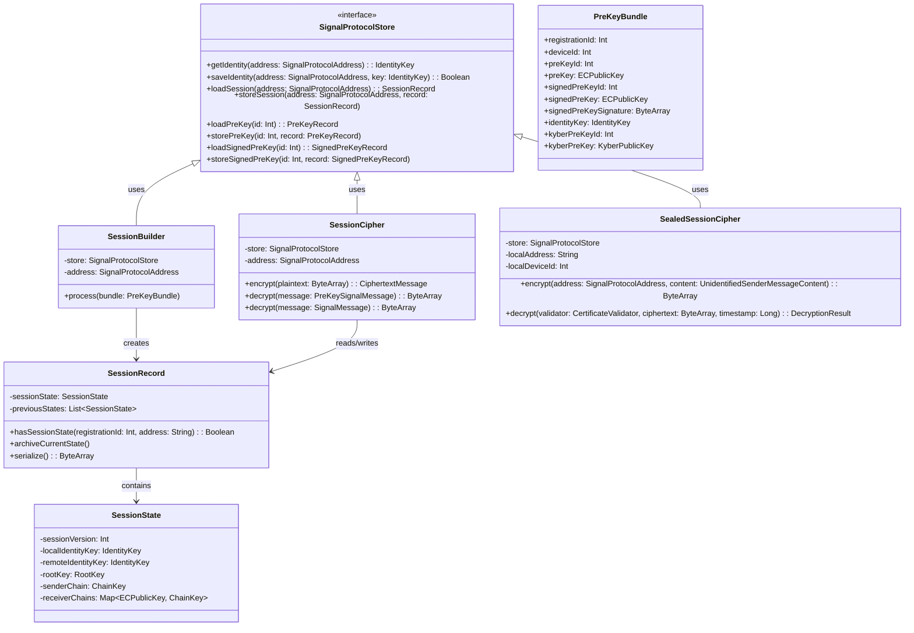
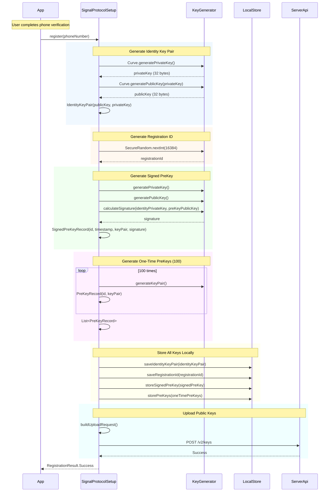
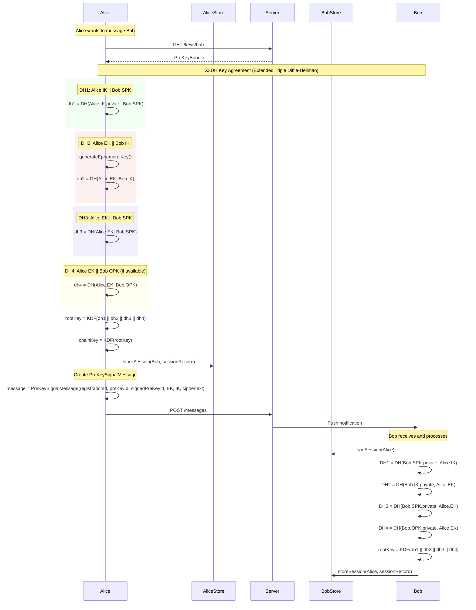
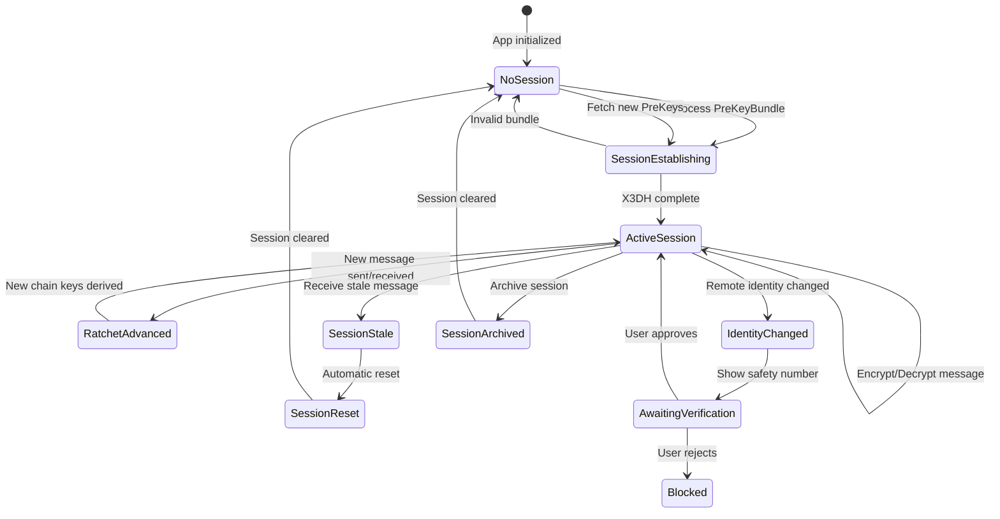
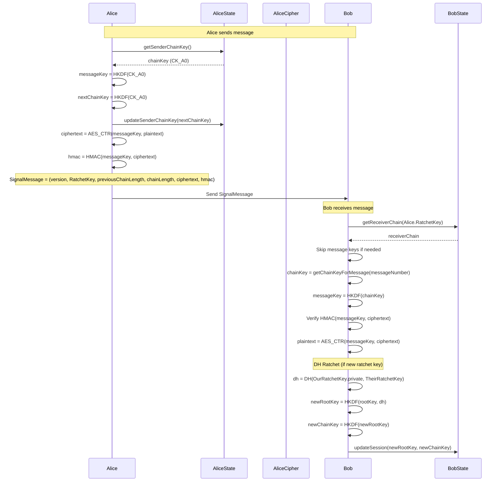

# C4 Level 4: Signal Protocol Messaging - Code Level Deep Dive

> **Level 4**: Code-level view showing classes, methods, and interactions for Signal Protocol messaging.

## Overview

This document provides a code-level deep dive into Signal's messaging implementation, showing every class, method, and data structure involved in the complete message flow.

---

## 1. Class Hierarchy



---

## 2. Registration Flow - Code Level

### 2.1 Complete Registration Sequence



### 2.2 Key Generation Code

```kotlin
// ============================================
// FILE: SignalProtocolSetup.kt
// ============================================

package org.signal.protocol

import org.signal.libsignal.protocol.*
import org.signal.libsignal.protocol.ecc.*
import org.signal.libsignal.protocol.kem.*
import org.signal.libsignal.protocol.state.*
import java.security.SecureRandom

class SignalProtocolSetup(
    private val secureRandom: SecureRandom = SecureRandom()
) {
    
    // ========================================
    // IDENTITY KEY PAIR
    // ========================================
    // The permanent identity of the user
    // NEVER lose this - used for all sessions
    
    fun generateIdentityKeyPair(): IdentityKeyPair {
        // Step 1: Generate 32-byte private key using Curve25519
        val privateKeyBytes = ByteArray(32)
        secureRandom.nextBytes(privateKeyBytes)
        
        // Step 2: Clamp private key (X25519 specific)
        privateKeyBytes[0] = (privateKeyBytes[0].toInt() and 248).toByte()
        privateKeyBytes[31] = (privateKeyBytes[31].toInt() and 127).toByte()
        privateKeyBytes[31] = (privateKeyBytes[31].toInt() or 64).toByte()
        
        // Step 3: Derive public key using Curve25519
        val publicKeyBytes = Curve25519.scalarBaseMult(privateKeyBytes)
        
        // Step 4: Create key pair
        val privateKey = ECPrivateKey(privateKeyBytes)
        val publicKey = ECPublicKey(publicKeyBytes)
        
        return IdentityKeyPair(
            publicKey = IdentityKey(publicKey),
            privateKey = privateKey
        )
    }
    
    // ========================================
    // REGISTRATION ID
    // ========================================
    // Random 14-bit identifier for this installation
    
    fun generateRegistrationId(): Int {
        // 14-bit number: 0 to 16383
        return secureRandom.nextInt(16384)
    }
    
    // ========================================
    // SIGNED PREKEY
    // ========================================
    // Medium-term key, rotated weekly
    // Signed by identity key for authenticity
    
    fun generateSignedPreKey(
        identityKeyPair: IdentityKeyPair,
        signedPreKeyId: Int
    ): SignedPreKeyRecord {
        
        // Step 1: Generate key pair
        val privateKeyBytes = ByteArray(32)
        secureRandom.nextBytes(privateKeyBytes)
        val privateKey = ECPrivateKey(privateKeyBytes)
        val publicKey = Curve25519.scalarBaseMult(privateKeyBytes)
        val keyPair = ECKeyPair(ECPublicKey(publicKey), privateKey)
        
        // Step 2: Sign the public key with identity key
        val signature = Curve.calculateSignature(
            identityKeyPair.privateKey.serialize(),
            publicKey
        )
        
        // Step 3: Create record
        return SignedPreKeyRecord(
            id = signedPreKeyId,
            timestamp = System.currentTimeMillis(),
            keyPair = keyPair,
            signature = signature
        )
    }
    
    // ========================================
    // ONE-TIME PREKEYS
    // ========================================
    // Consumed on first use
    // Must maintain supply (refill when < 20)
    
    fun generateOneTimePreKeys(
        startId: Int,
        count: Int = 100
    ): List<PreKeyRecord> {
        return (startId until startId + count).map { id ->
            val privateKeyBytes = ByteArray(32)
            secureRandom.nextBytes(privateKeyBytes)
            val publicKeyBytes = Curve25519.scalarBaseMult(privateKeyBytes)
            
            PreKeyRecord(
                id = id,
                keyPair = ECKeyPair(
                    ECPublicKey(publicKeyBytes),
                    ECPrivateKey(privateKeyBytes)
                )
            )
        }
    }
    
    // ========================================
    // KYBER PREKEYS (Post-Quantum)
    // ========================================
    // Provides quantum resistance
    // Used in X3DH with Kyber
    
    fun generateKyberPreKeys(
        startId: Int,
        count: Int = 100
    ): List<KyberPreKeyRecord> {
        return (startId until startId + count).map { id ->
            // Kyber-1024 key generation
            val keyPair = KemKeyPair.generate(KemKeyType.KYBER_1024)
            
            KyberPreKeyRecord(
                id = id,
                timestamp = System.currentTimeMillis(),
                keyPair = keyPair,
                signature = null // Optional: can sign with identity key
            )
        }
    }
}
```

### 2.3 Key Storage Implementation

```kotlin
// ============================================
// FILE: SQLiteSignalProtocolStore.kt
// ============================================

package org.signal.protocol.store

import org.signal.libsignal.protocol.*
import org.signal.libsignal.protocol.ecc.*
import org.signal.libsignal.protocol.state.*
import org.signal.libsignal.protocol.kem.*
import android.database.sqlite.SQLiteDatabase
import android.content.ContentValues

class SQLiteSignalProtocolStore(
    private val db: SQLiteDatabase,
    private val identityKeyPair: IdentityKeyPair,
    private val localRegistrationId: Int
) : SignalProtocolStore {
    
    // ========================================
    // IDENTITY KEY STORE
    // ========================================
    
    override fun getIdentity(address: SignalProtocolAddress): IdentityKey? {
        db.query(
            "identities",
            arrayOf("identity_key"),
            "address = ?",
            arrayOf(address.name),
            null, null, null
        ).use { cursor ->
            if (cursor.moveToFirst()) {
                val keyBytes = cursor.getBlob(0)
                return IdentityKey(keyBytes, 0)
            }
        }
        return null
    }
    
    override fun saveIdentity(
        address: SignalProtocolAddress,
        identityKey: IdentityKey
    ): Boolean {
        val existing = getIdentity(address)
        
        val values = ContentValues().apply {
            put("address", address.name)
            put("identity_key", identityKey.serialize())
            put("timestamp", System.currentTimeMillis())
            put("verified", 0) // Default: unverified
        }
        
        db.insertWithOnConflict(
            "identities",
            null,
            values,
            SQLiteDatabase.CONFLICT_REPLACE
        )
        
        // Return true if identity changed
        return existing != null && existing != identityKey
    }
    
    override fun isTrustedIdentity(
        address: SignalProtocolAddress,
        identityKey: IdentityKey,
        direction: IdentityKeyStore.Direction
    ): Boolean {
        val known = getIdentity(address)
        
        // Trust on First Use (TOFU)
        if (known == null) return true
        
        // Trust if keys match
        return known == identityKey
    }
    
    // ========================================
    // SESSION STORE
    // ========================================
    
    override fun loadSession(address: SignalProtocolAddress): SessionRecord {
        db.query(
            "sessions",
            arrayOf("record"),
            "address = ? AND device_id = ?",
            arrayOf(address.name, address.deviceId.toString()),
            null, null, null
        ).use { cursor ->
            if (cursor.moveToFirst()) {
                val recordBytes = cursor.getBlob(0)
                return SessionRecord(recordBytes)
            }
        }
        // Return fresh session if not found
        return SessionRecord()
    }
    
    override fun loadExistingSessions(
        addresses: List<SignalProtocolAddress>
    ): List<SessionRecord> {
        return addresses.map { address ->
            val session = loadSession(address)
            if (session.sessionState.hasSenderChain()) {
                session
            } else {
                throw NoSessionException("No session for ${address.name}")
            }
        }
    }
    
    override fun storeSession(
        address: SignalProtocolAddress,
        record: SessionRecord
    ) {
        val values = ContentValues().apply {
            put("address", address.name)
            put("device_id", address.deviceId)
            put("record", record.serialize())
        }
        
        db.insertWithOnConflict(
            "sessions",
            null,
            values,
            SQLiteDatabase.CONFLICT_REPLACE
        )
    }
    
    override fun containsSession(address: SignalProtocolAddress): Boolean {
        val session = loadSession(address)
        return session.hasSessionState(
            localRegistrationId,
            address.name
        )
    }
    
    override fun deleteSession(address: SignalProtocolAddress) {
        db.delete(
            "sessions",
            "address = ? AND device_id = ?",
            arrayOf(address.name, address.deviceId.toString())
        )
    }
    
    override fun deleteAllSessions(name: String) {
        db.delete("sessions", "address = ?", arrayOf(name))
    }
    
    override fun archiveSession(address: SignalProtocolAddress) {
        val session = loadSession(address)
        session.archiveCurrentState()
        storeSession(address, session)
    }
    
    // ========================================
    // PREKEY STORE
    // ========================================
    
    override fun loadPreKey(preKeyId: Int): PreKeyRecord {
        db.query(
            "prekeys",
            arrayOf("record"),
            "_id = ?",
            arrayOf(preKeyId.toString()),
            null, null, null
        ).use { cursor ->
            if (cursor.moveToFirst()) {
                return PreKeyRecord(cursor.getBlob(0))
            }
        }
        throw InvalidKeyIdException("PreKey not found: $preKeyId")
    }
    
    override fun storePreKey(preKeyId: Int, record: PreKeyRecord) {
        val values = ContentValues().apply {
            put("_id", preKeyId)
            put("record", record.serialize())
        }
        db.insertWithOnConflict(
            "prekeys", null, values,
            SQLiteDatabase.CONFLICT_REPLACE
        )
    }
    
    override fun containsPreKey(preKeyId: Int): Boolean {
        db.query(
            "prekeys", arrayOf("_id"),
            "_id = ?", arrayOf(preKeyId.toString()),
            null, null, null
        ).use { cursor ->
            return cursor.moveToFirst()
        }
    }
    
    override fun removePreKey(preKeyId: Int) {
        // Called after one-time prekey is used
        db.delete("prekeys", "_id = ?", arrayOf(preKeyId.toString()))
    }
    
    // ========================================
    // SIGNED PREKEY STORE
    // ========================================
    
    override fun loadSignedPreKey(signedPreKeyId: Int): SignedPreKeyRecord {
        db.query(
            "signed_prekeys",
            arrayOf("record"),
            "_id = ?",
            arrayOf(signedPreKeyId.toString()),
            null, null, null
        ).use { cursor ->
            if (cursor.moveToFirst()) {
                return SignedPreKeyRecord(cursor.getBlob(0))
            }
        }
        throw InvalidKeyIdException("SignedPreKey not found: $signedPreKeyId")
    }
    
    override fun loadSignedPreKeys(): List<SignedPreKeyRecord> {
        val records = mutableListOf<SignedPreKeyRecord>()
        db.query(
            "signed_prekeys",
            arrayOf("record"),
            null, null, null, null, null
        ).use { cursor ->
            while (cursor.moveToNext()) {
                records.add(SignedPreKeyRecord(cursor.getBlob(0)))
            }
        }
        return records
    }
    
    override fun storeSignedPreKey(
        signedPreKeyId: Int,
        record: SignedPreKeyRecord
    ) {
        val values = ContentValues().apply {
            put("_id", signedPreKeyId)
            put("record", record.serialize())
        }
        db.insertWithOnConflict(
            "signed_prekeys", null, values,
            SQLiteDatabase.CONFLICT_REPLACE
        )
    }
    
    override fun containsSignedPreKey(signedPreKeyId: Int): Boolean {
        db.query(
            "signed_prekeys", arrayOf("_id"),
            "_id = ?", arrayOf(signedPreKeyId.toString()),
            null, null, null
        ).use { cursor ->
            return cursor.moveToFirst()
        }
    }
    
    override fun removeSignedPreKey(signedPreKeyId: Int) {
        db.delete("signed_prekeys", "_id = ?", arrayOf(signedPreKeyId.toString()))
    }
    
    // ========================================
    // KYBER PREKEY STORE (Post-Quantum)
    // ========================================
    
    override fun loadKyberPreKey(kyberPreKeyId: Int): KyberPreKeyRecord {
        db.query(
            "kyber_prekeys",
            arrayOf("record"),
            "_id = ?",
            arrayOf(kyberPreKeyId.toString()),
            null, null, null
        ).use { cursor ->
            if (cursor.moveToFirst()) {
                return KyberPreKeyRecord(cursor.getBlob(0))
            }
        }
        throw InvalidKeyIdException("KyberPreKey not found: $kyberPreKeyId")
    }
    
    override fun loadKyberPreKeys(): List<KyberPreKeyRecord> {
        val records = mutableListOf<KyberPreKeyRecord>()
        db.query(
            "kyber_prekeys",
            arrayOf("record"),
            null, null, null, null, null
        ).use { cursor ->
            while (cursor.moveToNext()) {
                records.add(KyberPreKeyRecord(cursor.getBlob(0)))
            }
        }
        return records
    }
    
    override fun storeKyberPreKey(
        kyberPreKeyId: Int,
        record: KyberPreKeyRecord
    ) {
        val values = ContentValues().apply {
            put("_id", kyberPreKeyId)
            put("record", record.serialize())
        }
        db.insertWithOnConflict(
            "kyber_prekeys", null, values,
            SQLiteDatabase.CONFLICT_REPLACE
        )
    }
    
    override fun containsKyberPreKey(kyberPreKeyId: Int): Boolean {
        db.query(
            "kyber_prekeys", arrayOf("_id"),
            "_id = ?", arrayOf(kyberPreKeyId.toString()),
            null, null, null
        ).use { cursor ->
            return cursor.moveToFirst()
        }
    }
    
    override fun removeKyberPreKey(kyberPreKeyId: Int) {
        db.delete("kyber_prekeys", "_id = ?", arrayOf(kyberPreKeyId.toString()))
    }
    
    // ========================================
    // SENDER KEY STORE (Group Encryption)
    // ========================================
    
    override fun storeSenderKey(
        sender: SignalProtocolAddress,
        distributionId: UUID,
        record: SenderKeyRecord
    ) {
        val values = ContentValues().apply {
            put("address", sender.name)
            put("device_id", sender.deviceId)
            put("distribution_id", distributionId.toString())
            put("record", record.serialize())
        }
        db.insertWithOnConflict(
            "sender_keys", null, values,
            SQLiteDatabase.CONFLICT_REPLACE
        )
    }
    
    override fun loadSenderKey(
        sender: SignalProtocolAddress,
        distributionId: UUID
    ): SenderKeyRecord? {
        db.query(
            "sender_keys",
            arrayOf("record"),
            "address = ? AND device_id = ? AND distribution_id = ?",
            arrayOf(sender.name, sender.deviceId.toString(), distributionId.toString()),
            null, null, null
        ).use { cursor ->
            if (cursor.moveToFirst()) {
                return SenderKeyRecord(cursor.getBlob(0))
            }
        }
        return null
    }
}
```

---

## 3. Session Establishment - Code Level

### 3.1 X3DH Key Agreement Protocol



### 3.2 SessionBuilder Implementation

```kotlin
// ============================================
// FILE: SessionBuilder.kt
// ============================================

package org.signal.libsignal.protocol

import org.signal.libsignal.protocol.ecc.*
import org.signal.libsignal.protocol.kem.*
import org.signal.libsignal.protocol.ratchet.*
import org.signal.libsignal.protocol.state.*
import org.signal.libsignal.protocol.util.*
import java.security.SecureRandom

class SessionBuilder(
    private val store: SignalProtocolStore,
    private val remoteAddress: SignalProtocolAddress
) {
    
    /**
     * Process a PreKeyBundle to establish a new session
     * 
     * This implements the X3DH key agreement protocol:
     * 
     * Shared Secret = DH(IK_A, SPK_B) || DH(EK_A, IK_B) || 
     *                 DH(EK_A, SPK_B) || DH(EK_A, OPK_B)
     * 
     * Where:
     * - IK = Identity Key
     * - SPK = Signed PreKey
     * - EK = Ephemeral Key
     * - OPK = One-Time PreKey
     */
    fun process(bundle: PreKeyBundle) {
        
        // ====================================
        // STEP 1: Validate Signed PreKey
        // ====================================
        
        val signedPreKey = bundle.signedPreKey
        val signedPreKeySignature = bundle.signedPreKeySignature
        val identityKey = bundle.identityKey
        
        // Verify that the signed prekey is signed by the identity key
        try {
            val valid = Curve.verifySignature(
                identityKey.publicKey,
                signedPreKey.serialize(),
                signedPreKeySignature
            )
            
            if (!valid) {
                throw InvalidKeyException("Invalid signed prekey signature!")
            }
        } catch (e: Exception) {
            throw InvalidKeyException("Error verifying signed prekey", e)
        }
        
        // ====================================
        // STEP 2: Check Identity Trust
        // ====================================
        
        val knownIdentity = store.getIdentity(remoteAddress)
        
        if (knownIdentity != null && knownIdentity != identityKey) {
            // Identity has changed - potential security issue
            throw UntrustedIdentityException(
                "Identity key changed for ${remoteAddress.name}",
                identityKey
            )
        }
        
        // ====================================
        // STEP 3: Generate Our Ephemeral Key
        // ====================================
        
        val ourBaseKey = Curve.generateKeyPair()
        
        // ====================================
        // STEP 4: Perform X3DH
        // ====================================
        
        val theirSignedPreKey = signedPreKey
        val theirOneTimePreKey = if (bundle.preKeyId >= 0) bundle.preKey else null
        val theirIdentityKey = identityKey
        
        val ourIdentityKey = store.identityKeyPair
        
        // DH1 = DH(IK_A, SPK_B)
        val dh1 = Curve.calculateAgreement(
            theirSignedPreKey,
            ourIdentityKey.privateKey
        )
        
        // DH2 = DH(EK_A, IK_B)
        val dh2 = Curve.calculateAgreement(
            theirIdentityKey.publicKey,
            ourBaseKey.privateKey
        )
        
        // DH3 = DH(EK_A, SPK_B)
        val dh3 = Curve.calculateAgreement(
            theirSignedPreKey,
            ourBaseKey.privateKey
        )
        
        // DH4 = DH(EK_A, OPK_B) - if one-time prekey available
        val dh4 = if (theirOneTimePreKey != null) {
            Curve.calculateAgreement(
                theirOneTimePreKey,
                ourBaseKey.privateKey
            )
        } else {
            null
        }
        
        // ====================================
        // STEP 5: Derive Root Key
        // ====================================
        
        val secrets = when (dh4) {
            null -> ByteUtil.combine(dh1, dh2, dh3)
            else -> ByteUtil.combine(dh1, dh2, dh3, dh4)
        }
        
        val derivedKeys = HKDF.deriveSecrets(
            secrets,
            "WhisperText".toByteArray(),
            64
        )
        
        val rootKey = RootKey(
            HKDF.createDerivedRootKey(
                derivedKeys.copyOfRange(0, 32)
            ),
            derivedKeys.copyOfRange(32, 64)
        )
        
        // ====================================
        // STEP 6: Perform Kyber Key Exchange (Post-Quantum)
        // ====================================
        
        if (bundle.kyberPreKeyId >= 0 && bundle.kyberPreKey != null) {
            val kyberSharedSecret = Kem.sharedSecret(
                store.loadKyberPreKey(bundle.kyberPreKeyId).keyPair.privateKey,
                bundle.kyberPreKey
            )
            
            // Mix Kyber secret into root key
            val combinedRootKey = HKDF.deriveSecrets(
                rootKey.key,
                kyberSharedSecret,
                32
            )
            // Update root key with post-quantum contribution
        }
        
        // ====================================
        // STEP 7: Initialize Session State
        // ====================================
        
        val sessionRecord = SessionRecord()
        val sessionState = sessionRecord.sessionState
        
        sessionState.sessionVersion = 3  // Current protocol version
        sessionState.localIdentityKey = ourIdentityKey.publicKey
        sessionState.remoteIdentityKey = theirIdentityKey
        sessionState.localRegistrationId = store.localRegistrationId
        sessionState.remoteRegistrationId = bundle.registrationId
        
        // Initialize ratchet
        sessionState.rootKey = rootKey
        
        // ====================================
        // STEP 8: Initialize Sender Chain
        // ====================================
        
        val senderChain = RatchetChainKey(
            rootKey,
            0  // Chain index starts at 0
        )
        
        sessionState.senderChain = senderChain
        sessionState.senderRatchetKey = ourBaseKey.publicKey
        sessionState.senderRatchetKeyPrivate = ourBaseKey.privateKey
        
        // ====================================
        // STEP 9: Save Session
        // ====================================
        
        store.storeSession(remoteAddress, sessionRecord)
        store.saveIdentity(remoteAddress, theirIdentityKey)
        
        // ====================================
        // STEP 10: Store PreKey IDs for Message
        // ====================================
        
        // These will be included in the first message
        sessionState.pendingPreKey = PendingPreKey(
            preKeyId = bundle.preKeyId,
            signedPreKeyId = bundle.signedPreKeyId,
            ephemeralKey = ourBaseKey.publicKey
        )
    }
}

// ============================================
// Helper classes
// ============================================

data class PendingPreKey(
    val preKeyId: Int,
    val signedPreKeyId: Int,
    val ephemeralKey: ECPublicKey
)

data class RootKey(
    val key: ByteArray,
    val chainKey: ByteArray
)
```

### 3.3 Session State Machine



---

## 4. Message Encryption - Code Level

### 4.1 Double Ratchet Algorithm



### 4.2 SessionCipher Implementation

```kotlin
// ============================================
// FILE: SessionCipher.kt
// ============================================

package org.signal.libsignal.protocol

import org.signal.libsignal.protocol.ecc.*
import org.signal.libsignal.protocol.ratchet.*
import org.signal.libsignal.protocol.state.*
import org.signal.libsignal.protocol.util.*
import org.signal.libsignal.protocol.message.*
import javax.crypto.Cipher
import javax.crypto.Mac
import javax.crypto.spec.IvParameterSpec
import javax.crypto.spec.SecretKeySpec

class SessionCipher(
    private val store: SignalProtocolStore,
    private val remoteAddress: SignalProtocolAddress
) {
    
    /**
     * Encrypt a message using the Double Ratchet Algorithm
     * 
     * Returns:
     * - PreKeySignalMessage (if new session)
     * - SignalMessage (if existing session)
     */
    fun encrypt(plaintext: ByteArray): CiphertextMessage {
        
        val sessionRecord = store.loadSession(remoteAddress)
        val sessionState = sessionRecord.sessionState
        
        if (!sessionState.hasSenderChain()) {
            throw NoSessionException("No session for ${remoteAddress.name}")
        }
        
        // ====================================
        // STEP 1: Get Sender Chain Key
        // ====================================
        
        val senderChain = sessionState.senderChain
        val chainKey = senderChain.chainKey
        
        // ====================================
        // STEP 2: Derive Message Key
        // ====================================
        
        val messageKeys = deriveMessageKeys(chainKey)
        
        // ====================================
        // STEP 3: Update Chain Key (Ratchet Forward)
        // ====================================
        
        val nextChainKey = ChainKey(
            chainKey.key,
            chainKey.index + 1
        )
        sessionState.senderChain = senderChain.copy(chainKey = nextChainKey)
        
        // ====================================
        // STEP 4: Encrypt Plaintext
        // ====================================
        
        val paddedPlaintext = addPadding(plaintext)
        val ciphertext = encryptAesCbc(
            messageKeys.cipherKey,
            messageKeys.macKey,
            paddedPlaintext
        )
        
        // ====================================
        // STEP 5: Create Signal Message
        // ====================================
        
        val signalMessage = SignalMessage(
            version = 3 shl 4 or 3,  // Protocol version 3
            senderRatchetKey = sessionState.senderRatchetKey,
            previousCounter = sessionState.previousCounter,
            counter = chainKey.index,
            cipherText = ciphertext,
            senderIdentityKey = store.identityKeyPair.publicKey,
            receiverIdentityKey = sessionState.remoteIdentityKey
        )
        
        // ====================================
        // STEP 6: Check if PreKey Message
        // ====================================
        
        val pendingPreKey = sessionState.pendingPreKey
        
        val result = if (pendingPreKey != null) {
            // First message in session - include PreKey info
            PreKeySignalMessage(
                version = 3 shl 4 or 3,
                registrationId = sessionState.localRegistrationId,
                preKeyId = pendingPreKey.preKeyId,
                signedPreKeyId = pendingPreKey.signedPreKeyId,
                baseKey = pendingPreKey.ephemeralKey,
                identityKey = store.identityKeyPair.publicKey,
                signalMessage = signalMessage
            ).also {
                // Clear pending prekey after first message
                sessionState.clearPendingPreKey()
            }
        } else {
            signalMessage
        }
        
        // ====================================
        // STEP 7: Save Updated Session
        // ====================================
        
        store.storeSession(remoteAddress, sessionRecord)
        
        return result
    }
    
    /**
     * Decrypt a PreKeySignalMessage
     * Establishes session on receiver side
     */
    fun decrypt(message: PreKeySignalMessage): ByteArray {
        
        val sessionRecord = store.loadSession(remoteAddress)
        val sessionState = sessionRecord.sessionState
        
        // ====================================
        // STEP 1: Verify Identity Keys
        // ====================================
        
        if (sessionState.remoteIdentityKey != null) {
            if (sessionState.remoteIdentityKey != message.identityKey) {
                throw UntrustedIdentityException(
                    "Identity key mismatch",
                    message.identityKey
                )
            }
        }
        
        // ====================================
        // STEP 2: Perform X3DH (if new session)
        // ====================================
        
        if (!sessionState.hasSessionState(
            message.registrationId,
            remoteAddress.name
        )) {
            // Build session from PreKey message
            val builder = SessionBuilder(store, remoteAddress)
            
            // Create bundle from message
            val bundle = PreKeyBundle(
                registrationId = message.registrationId,
                deviceId = remoteAddress.deviceId,
                preKeyId = message.preKeyId,
                preKey = null, // Already consumed
                signedPreKeyId = message.signedPreKeyId,
                signedPreKey = message.baseKey,
                signedPreKeySignature = ByteArray(0), // Already verified
                identityKey = message.identityKey
            )
            
            builder.process(bundle)
        }
        
        // ====================================
        // STEP 3: Decrypt Signal Message
        // ====================================
        
        val plaintext = decrypt(message.signalMessage)
        
        // ====================================
        // STEP 4: Save Session
        // ====================================
        
        store.storeSession(remoteAddress, sessionRecord)
        store.saveIdentity(remoteAddress, message.identityKey)
        
        return plaintext
    }
    
    /**
     * Decrypt a SignalMessage
     */
    fun decrypt(message: SignalMessage): ByteArray {
        
        val sessionRecord = store.loadSession(remoteAddress)
        val sessionState = sessionRecord.sessionState
        
        // ====================================
        // STEP 1: Check for Session
        // ====================================
        
        if (!sessionState.hasSenderChain()) {
            throw NoSessionException("No session for ${remoteAddress.name}")
        }
        
        // ====================================
        // STEP 2: Verify Message Version
        // ====================================
        
        if (message.version != sessionState.sessionVersion) {
            throw InvalidVersionException("Message version mismatch")
        }
        
        // ====================================
        // STEP 3: Find or Create Receiver Chain
        // ====================================
        
        val theirSenderRatchetKey = message.senderRatchetKey
        var receiverChain = sessionState.getReceiverChain(theirSenderRatchetKey)
        
        if (receiverChain == null) {
            // New ratchet key - perform DH ratchet
            receiverChain = performDH_Ratchet(
                sessionState,
                theirSenderRatchetKey
            )
        }
        
        // ====================================
        // STEP 4: Handle Skipped Messages
        // ====================================
        
        val messageCounter = message.counter
        
        if (messageCounter < receiverChain.chainKey.index) {
            // Message is older than current chain position
            // Check if we have a stored message key
            val storedKey = sessionState.getMessageKey(
                theirSenderRatchetKey,
                messageCounter
            )
            
            if (storedKey != null) {
                // Decrypt with stored key
                return decryptWithKey(message, storedKey)
            } else {
                throw DuplicateMessageException("Message already processed")
            }
        }
        
        // ====================================
        // STEP 5: Skip Forward (if needed)
        // ====================================
        
        val chainKeyIndex = receiverChain.chainKey.index
        
        if (messageCounter > chainKeyIndex) {
            // Skip messages and store keys
            for (i in chainKeyIndex until messageCounter) {
                val skippedKeys = deriveMessageKeys(receiverChain.chainKey)
                sessionState.setMessageKey(
                    theirSenderRatchetKey,
                    i,
                    skippedKeys
                )
                
                receiverChain = receiverChain.copy(
                    chainKey = receiverChain.chainKey.advance()
                )
            }
        }
        
        // ====================================
        // STEP 6: Derive Message Key
        // ====================================
        
        val messageKeys = deriveMessageKeys(receiverChain.chainKey)
        
        // ====================================
        // STEP 7: Verify MAC
        // ====================================
        
        verifyMac(message, messageKeys.macKey)
        
        // ====================================
        // STEP 8: Decrypt Ciphertext
        // ====================================
        
        val plaintext = decryptAesCbc(
            messageKeys.cipherKey,
            messageKeys.iv,
            message.cipherText
        )
        
        // ====================================
        // STEP 9: Advance Chain Key
        // ====================================
        
        receiverChain = receiverChain.copy(
            chainKey = receiverChain.chainKey.advance()
        )
        sessionState.setReceiverChain(theirSenderRatchetKey, receiverChain)
        
        // ====================================
        // STEP 10: Save Session
        // ====================================
        
        store.storeSession(remoteAddress, sessionRecord)
        
        return removePadding(plaintext)
    }
    
    // ========================================
    // Private Helper Methods
    // ========================================
    
    private fun deriveMessageKeys(chainKey: ChainKey): MessageKeys {
        val input = ByteUtil.combine(
            chainKey.key,
            ByteUtil.intToByteArray(chainKey.index)
        )
        
        val derived = HKDF.deriveSecrets(
            input,
            "WhisperMessageKeys".toByteArray(),
            80
        )
        
        return MessageKeys(
            cipherKey = derived.copyOfRange(0, 32),
            macKey = derived.copyOfRange(32, 64),
            iv = derived.copyOfRange(64, 80)
        )
    }
    
    private fun performDH_Ratchet(
        sessionState: SessionState,
        theirRatchetKey: ECPublicKey
    ): Chain {
        
        // Generate new ratchet key pair
        val ourNewRatchetKeyPair = Curve.generateKeyPair()
        
        // Perform DH
        val sharedSecret = Curve.calculateAgreement(
            theirRatchetKey,
            ourNewRatchetKeyPair.privateKey
        )
        
        // Derive new root key and chain key
        val derived = HKDF.deriveSecrets(
            sessionState.rootKey.key,
            sharedSecret,
            64
        )
        
        val newRootKey = RootKey(
            derived.copyOfRange(0, 32),
            derived.copyOfRange(32, 64)
        )
        
        val newChainKey = ChainKey(
            derived.copyOfRange(32, 64),
            0
        )
        
        // Update session state
        sessionState.rootKey = newRootKey
        sessionState.senderRatchetKey = ourNewRatchetKeyPair.publicKey
        sessionState.senderRatchetKeyPrivate = ourNewRatchetKeyPair.privateKey
        
        // Create receiver chain
        val receiverChain = Chain(
            theirRatchetKey,
            newChainKey
        )
        
        sessionState.addReceiverChain(theirRatchetKey, receiverChain)
        
        return receiverChain
    }
    
    private fun encryptAesCbc(
        key: ByteArray,
        macKey: ByteArray,
        plaintext: ByteArray
    ): ByteArray {
        
        val cipher = Cipher.getInstance("AES/CBC/PKCS5Padding")
        val keySpec = SecretKeySpec(key, "AES")
        cipher.init(Cipher.ENCRYPT_MODE, keySpec)
        
        val ciphertext = cipher.doFinal(plaintext)
        val iv = cipher.iv
        
        // Combine IV + ciphertext
        return ByteUtil.combine(iv, ciphertext)
    }
    
    private fun decryptAesCbc(
        key: ByteArray,
        iv: ByteArray,
        ciphertext: ByteArray
    ): ByteArray {
        
        val cipher = Cipher.getInstance("AES/CBC/PKCS5Padding")
        val keySpec = SecretKeySpec(key, "AES")
        val ivSpec = IvParameterSpec(iv)
        
        cipher.init(Cipher.DECRYPT_MODE, keySpec, ivSpec)
        
        return cipher.doFinal(ciphertext)
    }
    
    private fun verifyMac(message: SignalMessage, macKey: ByteArray) {
        val mac = Mac.getInstance("HmacSHA256")
        mac.init(SecretKeySpec(macKey, "HmacSHA256"))
        
        val serialized = message.serialized
        val theirMac = message.mac
        val ourMac = mac.doFinal(
            serialized.copyOfRange(0, serialized.size - 8)
        )
        
        if (!ByteUtil.equal(theirMac, ourMac.copyOfRange(0, 8))) {
            throw InvalidMessageException("Bad MAC")
        }
    }
    
    private fun addPadding(data: ByteArray): ByteArray {
        val padding = 16 - (data.size % 16)
        return data + ByteArray(padding) { padding.toByte() }
    }
    
    private fun removePadding(data: ByteArray): ByteArray {
        if (data.isEmpty()) return data
        val padding = data.last().toInt() and 0xFF
        return data.copyOfRange(0, data.size - padding)
    }
}

// ============================================
// Data Classes
// ============================================

data class MessageKeys(
    val cipherKey: ByteArray,
    val macKey: ByteArray,
    val iv: ByteArray
)

data class ChainKey(
    val key: ByteArray,
    val index: Int
) {
    fun advance(): ChainKey {
        val mac = Mac.getInstance("HmacSHA256")
        mac.init(SecretKeySpec(key, "HmacSHA256"))
        return ChainKey(
            mac.doFinal(byteArrayOf(2)),
            index + 1
        )
    }
}

data class Chain(
    val senderRatchetKey: ECPublicKey,
    val chainKey: ChainKey
)
```

---

## 5. Message Flow - Complete Code

### 5.1 Sending Message Flow

```kotlin
// ============================================
// FILE: MessageSender.kt
// ============================================

package org.signal.messaging

import org.signal.libsignal.protocol.*
import org.signal.libsignal.protocol.message.*
import org.signal.libsignal.protocol.state.*
import kotlinx.coroutines.Dispatchers
import kotlinx.coroutines.withContext

class MessageSender(
    private val protocolStore: SignalProtocolStore,
    private val networkClient: NetworkClient,
    private val sessionLock: ReentrantLock = ReentrantLock()
) {
    
    /**
     * Complete message sending flow
     */
    suspend fun sendMessage(
        recipientId: String,
        deviceId: Int,
        content: ByteArray,
        isUrgent: Boolean = true
    ): SendResult = withContext(Dispatchers.IO) {
        
        val address = SignalProtocolAddress(recipientId, deviceId)
        
        sessionLock.withLock {
            // ==================================
            // Phase 1: Ensure Session
            // ==================================
            
            val sessionState = ensureSession(address)
            
            // ==================================
            // Phase 2: Encrypt Message
            // ==================================
            
            val cipher = SessionCipher(protocolStore, address)
            val encryptedMessage = cipher.encrypt(content)
            
            // ==================================
            // Phase 3: Create Envelope
            // ==================================
            
            val envelope = when (encryptedMessage) {
                is PreKeySignalMessage -> {
                    Envelope(
                        type = Envelope.Type.PREKEY_BUNDLE_VALUE,
                        sourceServiceId = protocolStore.identityKeyPair.publicKey.serialize(),
                        sourceDevice = 1,
                        timestamp = System.currentTimeMillis(),
                        content = encryptedMessage.serialize(),
                        urgent = isUrgent
                    )
                }
                is SignalMessage -> {
                    Envelope(
                        type = Envelope.Type.CIPHERTEXT_VALUE,
                        sourceServiceId = protocolStore.identityKeyPair.publicKey.serialize(),
                        sourceDevice = 1,
                        timestamp = System.currentTimeMillis(),
                        content = encryptedMessage.serialize(),
                        urgent = isUrgent
                    )
                }
                else -> throw IllegalStateException("Unknown message type")
            }
            
            // ==================================
            // Phase 4: Send to Server
            // ==================================
            
            try {
                networkClient.sendEnvelope(recipientId, deviceId, envelope)
                
                SendResult.Success(
                    timestamp = envelope.timestamp,
                    isNewSession = encryptedMessage is PreKeySignalMessage
                )
            } catch (e: Exception) {
                SendResult.NetworkError(e.message ?: "Network error")
            }
        }
    }
    
    /**
     * Ensure session exists, create if needed
     */
    private suspend fun ensureSession(
        address: SignalProtocolAddress
    ): SessionState {
        
        if (protocolStore.containsSession(address)) {
            return protocolStore.loadSession(address).sessionState
        }
        
        // Fetch PreKey bundle
        val bundle = networkClient.fetchPreKeyBundle(
            address.name,
            address.deviceId
        )
        
        // Build session
        val builder = SessionBuilder(protocolStore, address)
        builder.process(bundle)
        
        return protocolStore.loadSession(address).sessionState
    }
}
```

### 5.2 Receiving Message Flow

```kotlin
// ============================================
// FILE: MessageReceiver.kt
// ============================================

package org.signal.messaging

import org.signal.libsignal.protocol.*
import org.signal.libsignal.protocol.message.*
import org.signal.libsignal.protocol.state.*
import org.signal.libsignal.metadata.*
import kotlinx.coroutines.Dispatchers
import kotlinx.coroutines.withContext

class MessageReceiver(
    private val protocolStore: SignalProtocolStore,
    private val networkClient: NetworkClient,
    private val sessionLock: ReentrantLock = ReentrantLock()
) {
    
    /**
     * Complete message receiving flow
     */
    suspend fun receiveMessage(
        envelope: Envelope
    ): ReceiveResult = withContext(Dispatchers.IO) {
        
        sessionLock.withLock {
            when (Envelope.Type.fromValue(envelope.type)) {
                
                // ==================================
                // PreKey Message (New Session)
                // ==================================
                Envelope.Type.PREKEY_BUNDLE -> {
                    receivePreKeyMessage(envelope)
                }
                
                // ==================================
                // Signal Message (Existing Session)
                // ==================================
                Envelope.Type.CIPHERTEXT -> {
                    receiveSignalMessage(envelope)
                }
                
                // ==================================
                // Sealed Sender (Anonymous)
                // ==================================
                Envelope.Type.UNIDENTIFIED_SENDER -> {
                    receiveSealedSenderMessage(envelope)
                }
                
                else -> ReceiveResult.UnknownType(envelope.type)
            }
        }
    }
    
    private fun receivePreKeyMessage(envelope: Envelope): ReceiveResult {
        try {
            val sourceAddress = SignalProtocolAddress(
                envelope.sourceServiceId,
                envelope.sourceDevice
            )
            
            val preKeyMessage = PreKeySignalMessage(envelope.content)
            val cipher = SessionCipher(protocolStore, sourceAddress)
            
            val plaintext = cipher.decrypt(preKeyMessage)
            
            return ReceiveResult.Success(
                source = sourceAddress,
                plaintext = plaintext,
                timestamp = envelope.timestamp,
                isNewSession = true
            )
            
        } catch (e: InvalidMessageException) {
            return ReceiveResult.InvalidMessage(
                envelope.sourceServiceId,
                envelope.sourceDevice,
                e
            )
        } catch (e: InvalidKeyException) {
            return ReceiveResult.InvalidKey(
                envelope.sourceServiceId,
                e
            )
        } catch (e: UntrustedIdentityException) {
            return ReceiveResult.UntrustedIdentity(
                e.identifier,
                e.untrustedIdentity
            )
        }
    }
    
    private fun receiveSignalMessage(envelope: Envelope): ReceiveResult {
        try {
            val sourceAddress = SignalProtocolAddress(
                envelope.sourceServiceId,
                envelope.sourceDevice
            )
            
            // Check for session
            if (!protocolStore.containsSession(sourceAddress)) {
                return ReceiveResult.NoSession(
                    envelope.sourceServiceId,
                    "No session for message"
                )
            }
            
            val signalMessage = SignalMessage(envelope.content)
            val cipher = SessionCipher(protocolStore, sourceAddress)
            
            val plaintext = cipher.decrypt(signalMessage)
            
            return ReceiveResult.Success(
                source = sourceAddress,
                plaintext = plaintext,
                timestamp = envelope.timestamp,
                isNewSession = false
            )
            
        } catch (e: DuplicateMessageException) {
            return ReceiveResult.Duplicate(envelope.timestamp)
        } catch (e: NoSessionException) {
            return ReceiveResult.NoSession(
                envelope.sourceServiceId,
                e.message ?: "No session"
            )
        } catch (e: InvalidMessageException) {
            return ReceiveResult.InvalidMessage(
                envelope.sourceServiceId,
                envelope.sourceDevice,
                e
            )
        }
    }
    
    private fun receiveSealedSenderMessage(envelope: Envelope): ReceiveResult {
        try {
            val cipher = SealedSessionCipher(
                protocolStore,
                protocolStore.identityKeyPair.publicKey.serialize(),
                null,
                1
            )
            
            val validator = CertificateValidator(trustRoot)
            val result = cipher.decrypt(
                validator,
                envelope.content,
                envelope.serverTimestamp
            )
            
            val sourceAddress = SignalProtocolAddress(
                result.senderUuid,
                result.deviceId
            )
            
            return ReceiveResult.Success(
                source = sourceAddress,
                plaintext = result.paddedMessage,
                timestamp = envelope.timestamp,
                isNewSession = result.ciphertextMessageType == CiphertextMessage.PREKEY_TYPE
            )
            
        } catch (e: Exception) {
            return ReceiveResult.DecryptionError(e.message ?: "Unknown error")
        }
    }
}

// ============================================
// Result Types
// ============================================

sealed class SendResult {
    data class Success(
        val timestamp: Long,
        val isNewSession: Boolean
    ) : SendResult()
    
    data class NetworkError(val error: String) : SendResult()
    data class SessionError(val error: String) : SendResult()
}

sealed class ReceiveResult {
    data class Success(
        val source: SignalProtocolAddress,
        val plaintext: ByteArray,
        val timestamp: Long,
        val isNewSession: Boolean
    ) : ReceiveResult()
    
    data class NoSession(
        val sourceId: String,
        val message: String
    ) : ReceiveResult()
    
    data class InvalidMessage(
        val sourceId: String,
        val deviceId: Int,
        val error: Exception
    ) : ReceiveResult()
    
    data class InvalidKey(
        val sourceId: String,
        val error: Exception
    ) : ReceiveResult()
    
    data class UntrustedIdentity(
        val identifier: String,
        val identityKey: IdentityKey
    ) : ReceiveResult()
    
    data class Duplicate(val timestamp: Long) : ReceiveResult()
    data class DecryptionError(val error: String) : ReceiveResult()
    data class UnknownType(val type: Int) : ReceiveResult()
}
```

---

## 6. Database Schema

```sql
-- ============================================
-- Signal Protocol Storage Schema
-- ============================================

-- Identity Keys (User Identities)
CREATE TABLE identities (
    address TEXT PRIMARY KEY,
    identity_key BLOB NOT NULL,
    timestamp INTEGER DEFAULT 0,
    verified INTEGER DEFAULT 0,
    nonblocking_approval INTEGER DEFAULT 0
);

CREATE INDEX idx_identities_address ON identities(address);

-- Sessions (Double Ratchet State)
CREATE TABLE sessions (
    _id INTEGER PRIMARY KEY AUTOINCREMENT,
    address TEXT NOT NULL,
    device_id INTEGER NOT NULL,
    record BLOB NOT NULL,
    UNIQUE(address, device_id)
);

CREATE INDEX idx_sessions_address ON sessions(address);

-- One-Time PreKeys
CREATE TABLE prekeys (
    _id INTEGER PRIMARY KEY,
    record BLOB NOT NULL
);

-- Signed PreKeys
CREATE TABLE signed_prekeys (
    _id INTEGER PRIMARY KEY,
    record BLOB NOT NULL,
    timestamp INTEGER DEFAULT 0
);

-- Kyber PreKeys (Post-Quantum)
CREATE TABLE kyber_prekeys (
    _id INTEGER PRIMARY KEY,
    record BLOB NOT NULL,
    timestamp INTEGER DEFAULT 0
);

-- Sender Keys (Group Encryption)
CREATE TABLE sender_keys (
    _id INTEGER PRIMARY KEY AUTOINCREMENT,
    address TEXT NOT NULL,
    device_id INTEGER NOT NULL,
    distribution_id TEXT NOT NULL,
    record BLOB NOT NULL,
    UNIQUE(address, device_id, distribution_id)
);

CREATE INDEX idx_sender_keys_address ON sender_keys(address, distribution_id);

-- Pending PreKeys (For first messages)
CREATE TABLE pending_prekeys (
    address TEXT PRIMARY KEY,
    device_id INTEGER NOT NULL,
    prekey_id INTEGER,
    signed_prekey_id INTEGER NOT NULL,
    ephemeral_key BLOB NOT NULL
);
```

---

## 7. Performance Optimization

### 7.1 Session Caching

```kotlin
class SessionCache(
    private val store: SignalProtocolStore,
    private val maxSize: Int = 100
) {
    private val cache = LinkedHashMap<String, SessionRecord>(
        maxSize, 0.75f, true
    )
    
    fun getSession(address: SignalProtocolAddress): SessionRecord {
        val key = "${address.name}:${address.deviceId}"
        
        return synchronized(cache) {
            cache[key] ?: run {
                val session = store.loadSession(address)
                cache[key] = session
                session
            }
        }
    }
    
    fun putSession(address: SignalProtocolAddress, record: SessionRecord) {
        val key = "${address.name}:${address.deviceId}"
        
        synchronized(cache) {
            cache[key] = record
            store.storeSession(address, record)
        }
    }
    
    fun invalidate(address: SignalProtocolAddress) {
        val key = "${address.name}:${address.deviceId}"
        synchronized(cache) {
            cache.remove(key)
        }
    }
}
```

### 7.2 PreKey Prefetching

```kotlin
class PreKeyPrefetcher(
    private val store: SignalProtocolStore,
    private val api: NetworkClient
) {
    private val threshold = 20
    private val batchSize = 50
    
    suspend fun checkAndRefill() {
        val remainingPreKeys = store.preKeyCount
        
        if (remainingPreKeys < threshold) {
            val newPreKeys = generatePreKeys(
                store.nextPreKeyId,
                batchSize
            )
            
            store.storePreKeys(newPreKeys)
            api.uploadPreKeys(newPreKeys.map { it.toUpload() })
        }
    }
}
```

---

## Related Documentation

- [Signal Protocol Integration Guide](Signal-Protocol-Integration-Guide.md) - How to integrate
- [Signal Protocol Messaging](Signal-Protocol-Messaging.md) - High-level flow
- [Security & Cryptography](Security-Cryptography.md) - Cryptographic primitives