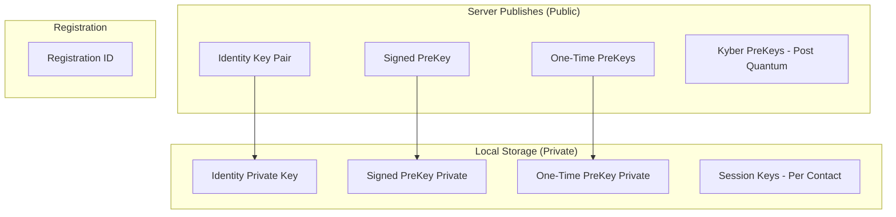
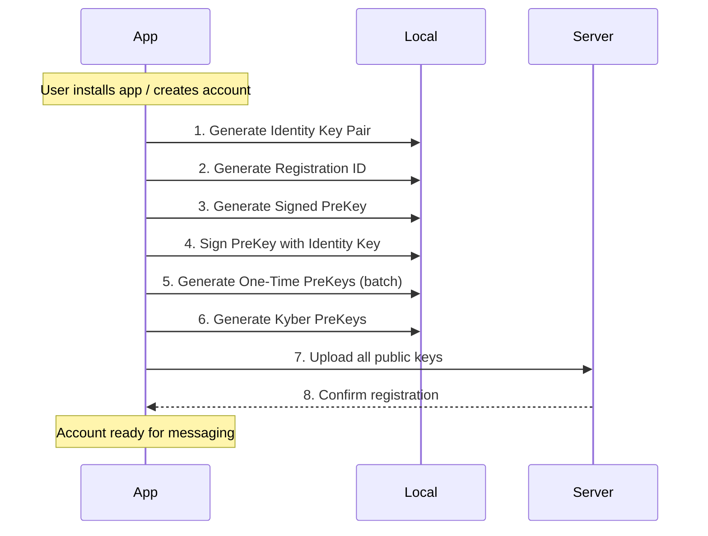
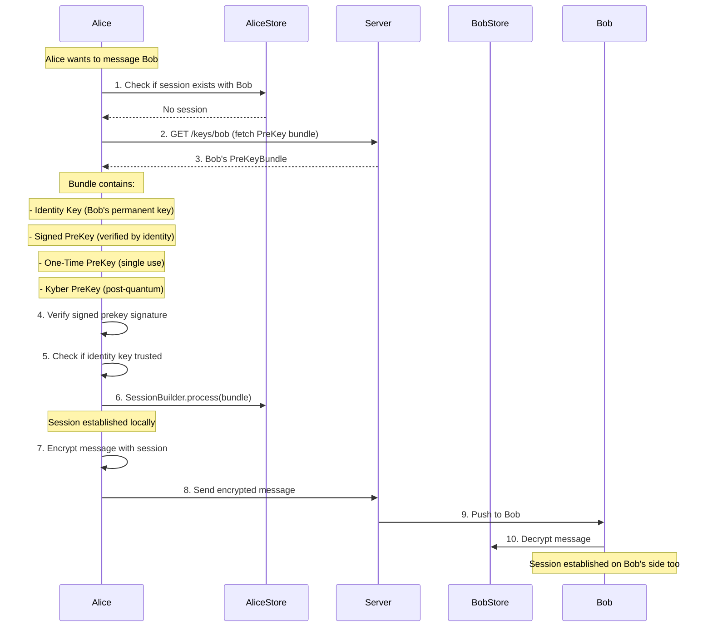

# Signal Protocol Integration Guide

> **Practical guide for integrating Signal Protocol into your messaging application**

## What is Signal Protocol?

Signal Protocol is an **end-to-end encryption protocol** that provides:

| Feature | Description |
|---------|-------------|
| **Forward Secrecy** | Each message uses a new key; compromising one message doesn't compromise others |
| **Future Secrecy** | Even if keys are compromised, past messages stay secure |
| **Deniability** | Messages cannot be cryptographically proven to have come from you |
| **Asynchronous** | No need for both parties to be online simultaneously |

### Core Algorithm: Double Ratchet

The Double Ratchet algorithm combines:

1. **Symmetric Key Ratchet** - Every message creates a new key
2. **Diffie-Hellman Ratchet** - Provides forward secrecy through key agreement

```
Message 1: Key A → Key B → Key C
Message 2: Key C → Key D → Key E
Message 3: Key E → Key F → Key G

Each message uses a unique key derived from the previous
```

---

## Keys You Must Establish

### Overview: All Keys Required



### Key Types Explained

| Key | Size | Purpose | Lifetime | When Generated |
|-----|------|---------|----------|----------------|
| **Identity Key Pair** | 32 bytes (X25519) | User's permanent identity | Forever (until reset) | First registration |
| **Signed PreKey** | 32 bytes (X25519) | Session establishment | ~1 week, rotated periodically | Registration + rotation |
| **One-Time PreKey** | 32 bytes (X25519) | First message encryption | Single use, then deleted | PreKey batch upload |
| **Kyber PreKey** | 1568 bytes | Post-quantum security | ~1 week | Registration + rotation |
| **Registration ID** | 4 bytes | Unique account identifier | Forever | First registration |

---

## Step-by-Step: Before User Can Chat

### Phase 1: Account Registration



### Implementation: Registration Flow

```kotlin
class SignalProtocolSetup(
    private val secureRandom: SecureRandom = SecureRandom()
) {
    
    // ============================================
    // STEP 1: Generate Identity Key Pair
    // ============================================
    // This is the user's permanent identity - NEVER lose this!
    
    fun generateIdentityKeyPair(): IdentityKeyPair {
        val privateKey = Curve.generatePrivateKey(secureRandom)
        val publicKey = Curve.generatePublicKey(privateKey)
        
        return IdentityKeyPair(
            publicKey = IdentityKey(publicKey),
            privateKey = ECPrivateKey(privateKey)
        )
    }
    
    // ============================================
    // STEP 2: Generate Registration ID
    // ============================================
    // Random ID to identify this account installation
    
    fun generateRegistrationId(): Int {
        // 14-bit number (0-16383)
        return secureRandom.nextInt(16384)
    }
    
    // ============================================
    // STEP 3 & 4: Generate Signed PreKey
    // ============================================
    // PreKey signed by identity key, rotated weekly
    
    fun generateSignedPreKey(
        identityKeyPair: IdentityKeyPair,
        signedPreKeyId: Int = 1
    ): SignedPreKeyRecord {
        // Generate key pair
        val privateKey = Curve.generatePrivateKey(secureRandom)
        val publicKey = Curve.generatePublicKey(privateKey)
        
        // Sign with identity key
        val signature = Curve.calculateSignature(
            identityKeyPair.privateKey.serialize(),
            publicKey.serialize()
        )
        
        return SignedPreKeyRecord(
            id = signedPreKeyId,
            timestamp = System.currentTimeMillis(),
            keyPair = ECKeyPair(publicKey, ECPrivateKey(privateKey)),
            signature = signature
        )
    }
    
    // ============================================
    // STEP 5: Generate One-Time PreKeys (Batch)
    // ============================================
    // Used for first message in each new session
    
    fun generateOneTimePreKeys(
        startId: Int,
        count: Int = 100
    ): List<PreKeyRecord> {
        return (startId until startId + count).map { id ->
            val privateKey = Curve.generatePrivateKey(secureRandom)
            val publicKey = Curve.generatePublicKey(privateKey)
            
            PreKeyRecord(
                id = id,
                keyPair = ECKeyPair(publicKey, ECPrivateKey(privateKey))
            )
        }
    }
    
    // ============================================
    // STEP 6: Generate Kyber PreKeys (Post-Quantum)
    // ============================================
    // Optional but recommended for future-proofing
    
    fun generateKyberPreKeys(
        startId: Int,
        count: Int = 100
    ): List<KyberPreKeyRecord> {
        return (startId until startId + count).map { id ->
            // Use Kyber-1024 for quantum resistance
            val keyPair = KyberKeyPair.generate(KeyType.KYBER_1024)
            
            KyberPreKeyRecord(
                id = id,
                timestamp = System.currentTimeMillis(),
                keyPair = keyPair
            )
        }
    }
}
```

### Complete Registration Implementation

```kotlin
class AccountRegistration(
    private val serverApi: ServerApi,
    private val localStore: LocalKeyStore
) {
    private val setup = SignalProtocolSetup()
    
    /**
     * Complete registration flow - MUST be called before any messaging
     */
    suspend fun register(phoneNumber: String): RegistrationResult {
        try {
            // ===== STEP 1: Generate Identity Key Pair =====
            val identityKeyPair = setup.generateIdentityKeyPair()
            Log.i(TAG, "Generated identity key pair")
            
            // ===== STEP 2: Generate Registration ID =====
            val registrationId = setup.generateRegistrationId()
            Log.i(TAG, "Generated registration ID: $registrationId")
            
            // ===== STEP 3 & 4: Generate Signed PreKey =====
            val signedPreKey = setup.generateSignedPreKey(identityKeyPair, 1)
            Log.i(TAG, "Generated signed prekey")
            
            // ===== STEP 5: Generate One-Time PreKeys =====
            val oneTimePreKeys = setup.generateOneTimePreKeys(1, 100)
            Log.i(TAG, "Generated ${oneTimePreKeys.size} one-time prekeys")
            
            // ===== STEP 6: Generate Kyber PreKeys =====
            val kyberPreKeys = setup.generateKyberPreKeys(1, 100)
            Log.i(TAG, "Generated ${kyberPreKeys.size} kyber prekeys")
            
            // ===== STEP 7: Store Keys Locally =====
            localStore.saveIdentityKeyPair(identityKeyPair)
            localStore.saveRegistrationId(registrationId)
            localStore.saveSignedPreKey(signedPreKey)
            localStore.storePreKeys(oneTimePreKeys)
            localStore.storeKyberPreKeys(kyberPreKeys)
            Log.i(TAG, "Saved all keys locally")
            
            // ===== STEP 8: Upload Public Keys to Server =====
            val uploadRequest = PreKeyUploadRequest(
                identityKey = identityKeyPair.publicKey.serialize(),
                signedPreKey = SignedPreKeyUpload(
                    keyId = signedPreKey.id,
                    publicKey = signedPreKey.keyPair.publicKey.serialize(),
                    signature = signedPreKey.signature
                ),
                oneTimePreKeys = oneTimePreKeys.map { 
                    PreKeyUpload(
                        keyId = it.id,
                        publicKey = it.keyPair.publicKey.serialize()
                    )
                },
                kyberPreKeys = kyberPreKeys.map {
                    KyberPreKeyUpload(
                        keyId = it.id,
                        publicKey = it.keyPair.publicKey.serialize()
                    )
                }
            )
            
            serverApi.uploadPreKeys(phoneNumber, uploadRequest)
            Log.i(TAG, "Uploaded all public keys to server")
            
            return RegistrationResult.Success(
                registrationId = registrationId,
                identityKeyFingerprint = identityKeyPair.publicKey.fingerprint
            )
            
        } catch (e: Exception) {
            Log.e(TAG, "Registration failed", e)
            return RegistrationResult.Failed(e.message ?: "Unknown error")
        }
    }
}

// Data classes for upload
data class PreKeyUploadRequest(
    val identityKey: ByteArray,
    val signedPreKey: SignedPreKeyUpload,
    val oneTimePreKeys: List<PreKeyUpload>,
    val kyberPreKeys: List<KyberPreKeyUpload>
)

data class SignedPreKeyUpload(
    val keyId: Int,
    val publicKey: ByteArray,
    val signature: ByteArray
)

data class PreKeyUpload(
    val keyId: Int,
    val publicKey: ByteArray
)

data class KyberPreKeyUpload(
    val keyId: Int,
    val publicKey: ByteArray
)

sealed class RegistrationResult {
    data class Success(
        val registrationId: Int,
        val identityKeyFingerprint: String
    ) : RegistrationResult()
    
    data class Failed(val error: String) : RegistrationResult()
}
```

---

## Phase 2: Starting a Conversation

### What Happens When User Starts Chat



### Implementation: Starting First Chat

```kotlin
class ConversationManager(
    private val protocolStore: SignalProtocolStore,
    private val serverApi: ServerApi
) {
    /**
     * MUST be called before sending first message to someone
     * Establishes cryptographic session using their PreKeys
     */
    suspend fun establishSession(recipientId: String, deviceId: Int): SessionResult {
        val address = SignalProtocolAddress(recipientId, deviceId)
        
        // Check if session already exists
        if (protocolStore.containsSession(address)) {
            return SessionResult.AlreadyExists(recipientId)
        }
        
        // Fetch recipient's PreKey bundle from server
        val preKeyBundle = fetchPreKeyBundle(recipientId, deviceId)
        
        // Validate and process bundle
        return processPreKeyBundle(address, preKeyBundle)
    }
    
    private suspend fun fetchPreKeyBundle(
        recipientId: String,
        deviceId: Int
    ): PreKeyBundle {
        val response = serverApi.getPreKeys(recipientId, deviceId)
        
        return PreKeyBundle(
            registrationId = response.registrationId,
            deviceId = response.deviceId,
            
            // Identity Key - permanent public key
            identityKey = IdentityKey(response.identityKey, 0),
            
            // Signed PreKey - verified by identity
            signedPreKeyId = response.signedPreKey.keyId,
            signedPreKey = ECPublicKey(response.signedPreKey.publicKey),
            signedPreKeySignature = response.signedPreKey.signature,
            
            // One-Time PreKey - consumed on use
            preKeyId = response.preKey?.keyId ?: -1,
            preKey = response.preKey?.publicKey?.let { ECPublicKey(it) },
            
            // Kyber PreKey - post-quantum (optional)
            kyberPreKeyId = response.kyberPreKey?.keyId ?: -1,
            kyberPreKey = response.kyberPreKey?.publicKey
        )
    }
    
    private fun processPreKeyBundle(
        address: SignalProtocolAddress,
        bundle: PreKeyBundle
    ): SessionResult {
        try {
            // ===== VALIDATION STEP 1: Verify Signed PreKey Signature =====
            val identityKey = bundle.identityKey
            val signedPreKeyBytes = bundle.signedPreKey.serialize()
            
            identityKey.publicKey.verifySignature(
                signedPreKeyBytes,
                bundle.signedPreKeySignature
            )
            Log.i(TAG, "Signed prekey signature verified")
            
            // ===== VALIDATION STEP 2: Check Identity Trust =====
            val knownIdentity = protocolStore.getIdentity(address)
            
            if (knownIdentity != null && knownIdentity != identityKey) {
                // Identity key has changed - SECURITY EVENT
                // User should be notified and asked to verify
                return SessionResult.IdentityChanged(
                    recipientId = address.name,
                    newIdentityKey = identityKey
                )
            }
            
            // ===== PROCESS STEP 3: Build Session =====
            val sessionBuilder = SessionBuilder(protocolStore, address)
            sessionBuilder.process(bundle)
            
            // ===== STORE STEP 4: Save Identity =====
            protocolStore.saveIdentity(address, identityKey)
            
            Log.i(TAG, "Session established with ${address.name}:${address.deviceId}")
            
            return SessionResult.Established(recipientId, deviceId)
            
        } catch (e: InvalidKeyException) {
            return SessionResult.InvalidKey(e.message ?: "Invalid key in bundle")
        } catch (e: UntrustedIdentityException) {
            return SessionResult.UntrustedIdentity(e.identifier)
        } catch (e: Exception) {
            return SessionResult.Failed(e.message ?: "Unknown error")
        }
    }
}

sealed class SessionResult {
    data class AlreadyExists(val recipientId: String) : SessionResult()
    data class Established(val recipientId: String, val deviceId: Int) : SessionResult()
    data class IdentityChanged(
        val recipientId: String,
        val newIdentityKey: IdentityKey
    ) : SessionResult()
    data class InvalidKey(val error: String) : SessionResult()
    data class UntrustedIdentity(val identifier: String) : SessionResult()
    data class Failed(val error: String) : SessionResult()
}
```

---

## Phase 3: Sending First Message

### Complete Send Flow

```kotlin
class MessageSender(
    private val protocolStore: SignalProtocolStore,
    private val conversationManager: ConversationManager,
    private val serverApi: ServerApi,
    private val sessionLock: ReentrantLock = ReentrantLock()
) {
    /**
     * Send a message - handles session establishment automatically
     */
    suspend fun sendMessage(
        recipientId: String,
        deviceId: Int,
        message: ByteArray
    ): SendResult {
        val address = SignalProtocolAddress(recipientId, deviceId)
        
        return sessionLock.withLock {
            try {
                // ===== STEP 1: Ensure session exists =====
                if (!protocolStore.containsSession(address)) {
                    val sessionResult = conversationManager.establishSession(recipientId, deviceId)
                    
                    when (sessionResult) {
                        is SessionResult.IdentityChanged -> {
                            return SendResult.IdentityChangeRequired(
                                sessionResult.recipientId,
                                sessionResult.newIdentityKey
                            )
                        }
                        is SessionResult.Failed,
                        is SessionResult.InvalidKey -> {
                            return SendResult.SessionError(
                                (sessionResult as? SessionResult.Failed)?.error
                                    ?: (sessionResult as? SessionResult.InvalidKey)?.error
                                    ?: "Unknown session error"
                            )
                        }
                        else -> { /* Session established, continue */ }
                    }
                }
                
                // ===== STEP 2: Encrypt message =====
                val cipher = SessionCipher(protocolStore, address)
                val paddedMessage = addPadding(message)
                val encryptedMessage = cipher.encrypt(paddedMessage)
                
                // ===== STEP 3: Determine message type =====
                val envelopeType = when (encryptedMessage.type) {
                    CiphertextMessage.PREKEY_TYPE -> {
                        Log.i(TAG, "Sending PreKey message (first message in session)")
                        EnvelopeType.PREKEY_BUNDLE
                    }
                    CiphertextMessage.WHISPER_TYPE -> {
                        Log.i(TAG, "Sending Signal message (existing session)")
                        EnvelopeType.CIPHERTEXT
                    }
                    else -> EnvelopeType.CIPHERTEXT
                }
                
                // ===== STEP 4: Send to server =====
                serverApi.sendMessage(
                    recipientId = recipientId,
                    deviceId = deviceId,
                    envelopeType = envelopeType,
                    content = encryptedMessage.serialize(),
                    timestamp = System.currentTimeMillis()
                )
                
                Log.i(TAG, "Message sent to $recipientId:$deviceId")
                
                SendResult.Success(
                    recipientId = recipientId,
                    deviceId = deviceId,
                    isNewSession = encryptedMessage.type == CiphertextMessage.PREKEY_TYPE
                )
                
            } catch (e: NoSessionException) {
                SendResult.NoSession(recipientId)
            } catch (e: UntrustedIdentityException) {
                SendResult.UntrustedIdentity(recipientId, e.untrustedIdentity)
            } catch (e: Exception) {
                SendResult.NetworkError(e.message ?: "Network error")
            }
        }
    }
    
    private fun addPadding(data: ByteArray): ByteArray {
        // PKCS#7 style padding to multiple of 16
        val paddingSize = 16 - (data.size % 16)
        return data + ByteArray(paddingSize)
    }
}

enum class EnvelopeType {
    PREKEY_BUNDLE,  // First message (session creation)
    CIPHERTEXT      // Subsequent messages
}

sealed class SendResult {
    data class Success(
        val recipientId: String,
        val deviceId: Int,
        val isNewSession: Boolean
    ) : SendResult()
    
    data class IdentityChangeRequired(
        val recipientId: String,
        val newIdentityKey: IdentityKey
    ) : SendResult()
    
    data class NoSession(val recipientId: String) : SendResult()
    data class SessionError(val error: String) : SendResult()
    data class UntrustedIdentity(
        val recipientId: String,
        val identityKey: IdentityKey
    ) : SendResult()
    data class NetworkError(val error: String) : SendResult()
}
```

---

## Phase 4: Receiving First Message

### Complete Receive Flow

```kotlin
class MessageReceiver(
    private val protocolStore: SignalProtocolStore,
    private val sessionLock: ReentrantLock = ReentrantLock()
) {
    /**
     * Receive and decrypt message
     * Automatically establishes session on first message
     */
    fun receiveMessage(envelope: Envelope): ReceiveResult {
        return sessionLock.withLock {
            when (envelope.type) {
                EnvelopeType.PREKEY_BUNDLE -> {
                    // First message from sender - establishes session
                    receivePreKeyMessage(envelope)
                }
                EnvelopeType.CIPHERTEXT -> {
                    // Subsequent message
                    receiveSignalMessage(envelope)
                }
            }
        }
    }
    
    private fun receivePreKeyMessage(envelope: Envelope): ReceiveResult {
        val senderAddress = SignalProtocolAddress(
            envelope.sourceServiceId,
            envelope.sourceDeviceId
        )
        
        return try {
            Log.i(TAG, "Receiving PreKey message from ${senderAddress.name}")
            
            // Create cipher and decrypt
            val cipher = SessionCipher(protocolStore, senderAddress)
            val preKeyMessage = PreKeySignalMessage(envelope.content)
            val plaintext = cipher.decrypt(preKeyMessage)
            
            // Session is now established!
            Log.i(TAG, "Session established with ${senderAddress.name}")
            
            // Remove padding
            val unpadded = removePadding(plaintext)
            
            ReceiveResult.Success(
                senderAddress = senderAddress,
                plaintext = unpadded,
                isNewSession = true
            )
            
        } catch (e: InvalidMessageException) {
            ReceiveResult.InvalidMessage(senderAddress.name, e)
        } catch (e: InvalidKeyException) {
            ReceiveResult.InvalidKey(senderAddress.name, e)
        } catch (e: UntrustedIdentityException) {
            ReceiveResult.UntrustedIdentity(
                senderAddress.name,
                e.untrustedIdentity
            )
        } catch (e: Exception) {
            ReceiveResult.DecryptionError(e.message ?: "Unknown error")
        }
    }
    
    private fun receiveSignalMessage(envelope: Envelope): ReceiveResult {
        val senderAddress = SignalProtocolAddress(
            envelope.sourceServiceId,
            envelope.sourceDeviceId
        )
        
        return try {
            // Must have existing session
            if (!protocolStore.containsSession(senderAddress)) {
                return ReceiveResult.NoSession(
                    senderAddress.name,
                    "Received message but no session exists"
                )
            }
            
            val cipher = SessionCipher(protocolStore, senderAddress)
            val signalMessage = SignalMessage(envelope.content)
            val plaintext = cipher.decrypt(signalMessage)
            
            val unpadded = removePadding(plaintext)
            
            ReceiveResult.Success(
                senderAddress = senderAddress,
                plaintext = unpadded,
                isNewSession = false
            )
            
        } catch (e: NoSessionException) {
            ReceiveResult.NoSession(senderAddress.name, e.message ?: "No session")
        } catch (e: DuplicateMessageException) {
            // Message already processed - idempotent
            ReceiveResult.Duplicate(senderAddress.name)
        } catch (e: Exception) {
            ReceiveResult.DecryptionError(e.message ?: "Unknown error")
        }
    }
    
    private fun removePadding(data: ByteArray): ByteArray {
        var end = data.size
        while (end > 0 && data[end - 1] == 0.toByte()) {
            end--
        }
        return data.copyOfRange(0, end)
    }
}

data class Envelope(
    val type: EnvelopeType,
    val sourceServiceId: String,
    val sourceDeviceId: Int,
    val content: ByteArray,
    val timestamp: Long
)

sealed class ReceiveResult {
    data class Success(
        val senderAddress: SignalProtocolAddress,
        val plaintext: ByteArray,
        val isNewSession: Boolean
    ) : ReceiveResult()
    
    data class NoSession(
        val senderId: String,
        val message: String
    ) : ReceiveResult()
    
    data class InvalidMessage(
        val senderId: String,
        val error: InvalidMessageException
    ) : ReceiveResult()
    
    data class InvalidKey(
        val senderId: String,
        val error: InvalidKeyException
    ) : ReceiveResult()
    
    data class UntrustedIdentity(
        val senderId: String,
        val identityKey: IdentityKey
    ) : ReceiveResult()
    
    data class Duplicate(val senderId: String) : ReceiveResult()
    data class DecryptionError(val error: String) : ReceiveResult()
}
```

---

## Local Storage Requirements

### Interface You Must Implement

```kotlin
/**
 * You MUST implement this interface to store Signal Protocol data
 * Can use SQLite, SharedPreferences, or any secure storage
 */
interface SignalProtocolStore : 
    IdentityKeyStore, 
    PreKeyStore, 
    SignedPreKeyStore, 
    SessionStore,
    KyberPreKeyStore,
    SenderKeyStore {
    
    // Identity key - permanent user identity
    val identityKeyPair: IdentityKeyPair
    val localRegistrationId: Int
}

interface IdentityKeyStore {
    fun getIdentity(address: SignalProtocolAddress): IdentityKey?
    fun saveIdentity(address: SignalProtocolAddress, identityKey: IdentityKey): Boolean
    fun isTrustedIdentity(
        address: SignalProtocolAddress,
        identityKey: IdentityKey,
        direction: Direction
    ): Boolean
}

interface PreKeyStore {
    fun loadPreKey(preKeyId: Int): PreKeyRecord
    fun storePreKey(preKeyId: Int, record: PreKeyRecord)
    fun containsPreKey(preKeyId: Int): Boolean
    fun removePreKey(preKeyId: Int)  // Called after one-time use
}

interface SignedPreKeyStore {
    fun loadSignedPreKey(signedPreKeyId: Int): SignedPreKeyRecord
    fun loadSignedPreKeys(): List<SignedPreKeyRecord>
    fun storeSignedPreKey(signedPreKeyId: Int, record: SignedPreKeyRecord)
    fun containsSignedPreKey(signedPreKeyId: Int): Boolean
    fun removeSignedPreKey(signedPreKeyId: Int)
}

interface SessionStore {
    fun loadSession(address: SignalProtocolAddress): SessionRecord
    fun loadExistingSessions(addresses: List<SignalProtocolAddress>): List<SessionRecord>
    fun storeSession(address: SignalProtocolAddress, record: SessionRecord)
    fun containsSession(address: SignalProtocolAddress): Boolean
    fun deleteSession(address: SignalProtocolAddress)
    fun deleteAllSessions(name: String)
    fun archiveSession(address: SignalProtocolAddress)  // For resets
}

enum class Direction {
    SENDING, RECEIVING
}
```

### SQLite Implementation Example

```kotlin
class SQLiteSignalProtocolStore(
    private val database: SQLiteDatabase,
    override val identityKeyPair: IdentityKeyPair,
    override val localRegistrationId: Int
) : SignalProtocolStore {
    
    // ===== IDENTITY KEY STORE =====
    
    override fun getIdentity(address: SignalProtocolAddress): IdentityKey? {
        database.query(
            "identities",
            arrayOf("identity_key"),
            "address = ?",
            arrayOf(address.toString()),
            null, null, null
        ).use { cursor ->
            if (cursor.moveToFirst()) {
                return IdentityKey(cursor.getBlob(0), 0)
            }
        }
        return null
    }
    
    override fun saveIdentity(
        address: SignalProtocolAddress,
        identityKey: IdentityKey
    ): Boolean {
        val existing = getIdentity(address)
        
        val values = ContentValues().apply {
            put("address", address.toString())
            put("identity_key", identityKey.serialize())
            put("timestamp", System.currentTimeMillis())
        }
        
        database.insertWithOnConflict(
            "identities", null, values,
            SQLiteDatabase.CONFLICT_REPLACE
        )
        
        return existing != null && existing != identityKey
    }
    
    override fun isTrustedIdentity(
        address: SignalProtocolAddress,
        identityKey: IdentityKey,
        direction: Direction
    ): Boolean {
        val known = getIdentity(address)
        
        // Trust on first use (TOFU)
        if (known == null) return true
        
        // Trust if same key
        return known == identityKey
    }
    
    // ===== SESSION STORE =====
    
    override fun loadSession(address: SignalProtocolAddress): SessionRecord {
        database.query(
            "sessions",
            arrayOf("record"),
            "address = ? AND device_id = ?",
            arrayOf(address.name, address.deviceId.toString()),
            null, null, null
        ).use { cursor ->
            if (cursor.moveToFirst()) {
                return SessionRecord(cursor.getBlob(0))
            }
        }
        return SessionRecord()  // Empty session
    }
    
    override fun storeSession(
        address: SignalProtocolAddress,
        record: SessionRecord
    ) {
        val values = ContentValues().apply {
            put("address", address.name)
            put("device_id", address.deviceId)
            put("record", record.serialize())
        }
        
        database.insertWithOnConflict(
            "sessions", null, values,
            SQLiteDatabase.CONFLICT_REPLACE
        )
    }
    
    override fun containsSession(address: SignalProtocolAddress): Boolean {
        val session = loadSession(address)
        return session.hasSessionState(
            localRegistrationId,
            address.name
        )
    }
    
    override fun deleteSession(address: SignalProtocolAddress) {
        database.delete(
            "sessions",
            "address = ? AND device_id = ?",
            arrayOf(address.name, address.deviceId.toString())
        )
    }
    
    // ===== PREKEY STORE =====
    
    override fun loadPreKey(preKeyId: Int): PreKeyRecord {
        database.query(
            "prekeys",
            arrayOf("record"),
            "_id = ?",
            arrayOf(preKeyId.toString()),
            null, null, null
        ).use { cursor ->
            if (cursor.moveToFirst()) {
                return PreKeyRecord(cursor.getBlob(0))
            }
        }
        throw InvalidKeyIdException("PreKey not found: $preKeyId")
    }
    
    override fun removePreKey(preKeyId: Int) {
        // Delete after one-time use
        database.delete(
            "prekeys",
            "_id = ?",
            arrayOf(preKeyId.toString())
        )
    }
    
    // ... implement other methods similarly
}
```

---

## Quick Reference: Checklist Before Chat

### For App Developers

```
☐ Registration (One-time)
  ├── Generate Identity Key Pair
  ├── Generate Registration ID
  ├── Generate Signed PreKey (sign with identity)
  ├── Generate 100 One-Time PreKeys
  ├── Generate Kyber PreKeys (optional)
  ├── Store ALL keys locally (encrypted!)
  └── Upload PUBLIC keys to server

☐ Before First Message to Someone
  ├── Fetch their PreKey bundle from server
  ├── Verify signed prekey signature
  ├── Check identity key trust
  ├── Process bundle → SessionBuilder.process()
  └── Session is now established

☐ Sending Message
  ├── Check if session exists
  ├── If not, establish session first
  ├── Encrypt with SessionCipher
  ├── Send PreKeySignalMessage (first) or SignalMessage (subsequent)
  └── Server delivers to recipient

☐ Receiving Message
  ├── Receive PreKeySignalMessage (first) or SignalMessage
  ├── Decrypt with SessionCipher
  ├── Session automatically created on first message
  └── Return plaintext to app

☐ Key Rotation (Periodic)
  ├── Rotate Signed PreKey weekly
  ├── Refill One-Time PreKeys when low (< 20)
  └── Upload new public keys to server
```

### Key Lifecycle

| Key | When Generated | When Used | When Deleted |
|-----|---------------|-----------|--------------|
| Identity Key | First registration | Every session | Never (until reset) |
| Signed PreKey | Registration + weekly rotation | New sessions | After rotation |
| One-Time PreKey | Batch upload | First message only | After one use |
| Session Key | First message | Every message | On session reset |

---

## Related Documentation

- [Signal Protocol Messaging](Signal-Protocol-Messaging.md) - Detailed encryption/decryption
- [Master Key Flow](Master-Key-Flow.md) - Key backup and recovery
- [Security & Cryptography](Security-Cryptography.md) - Cryptographic details