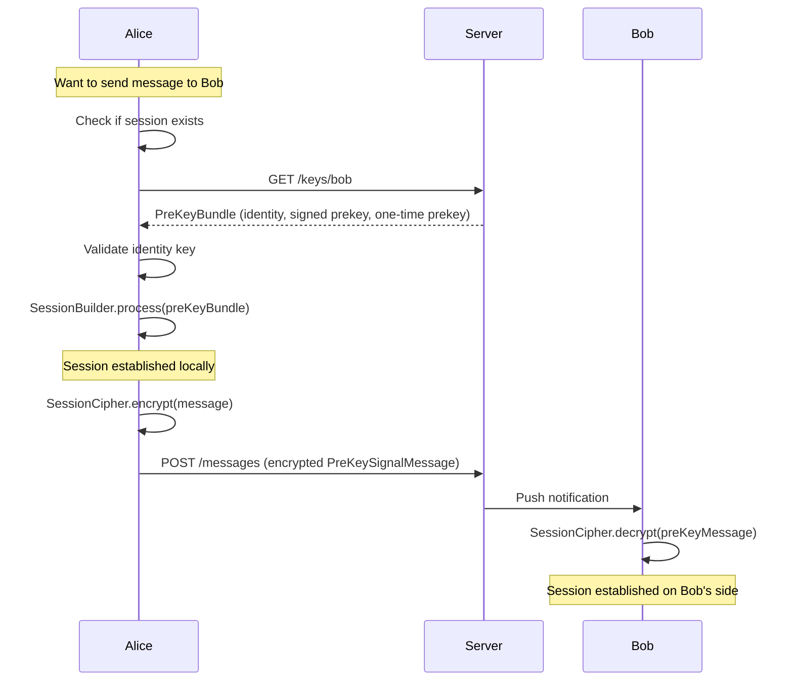
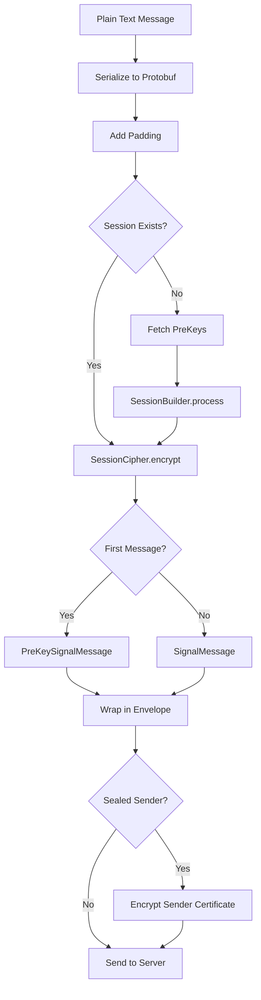
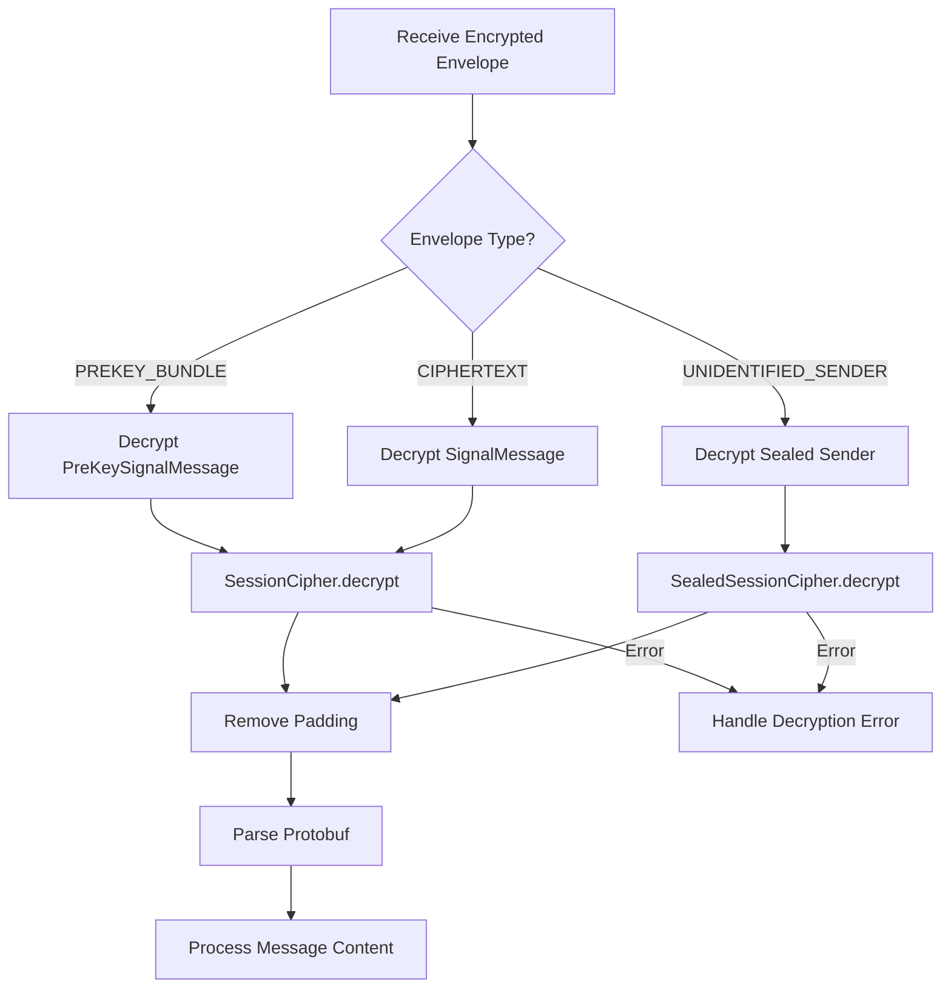
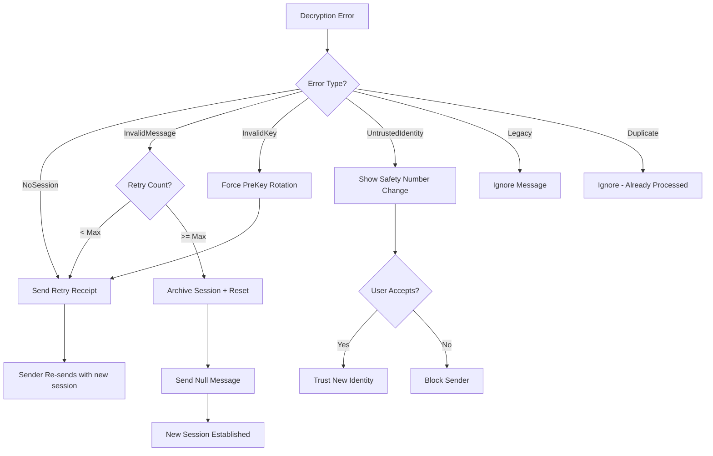

# Signal Protocol: Session Handshake, Encryption & Decryption

> **Fully portable implementation guide for Signal Protocol messaging flow**

## Overview

Signal uses the **Signal Protocol** (formerly TextSecure Protocol) for end-to-end encrypted messaging. This document covers the complete flow from session establishment to error recovery.

### Key Components

| Component | Purpose | Location |
|-----------|---------|----------|
| **SessionBuilder** | Creates new sessions using PreKey bundles | `libsignal` |
| **SessionCipher** | Encrypts/decrypts messages | `libsignal` |
| **SignalProtocolStore** | Stores keys and sessions | Your implementation |
| **PreKeyBundle** | Contains public keys for session creation | Server-provided |

---

## 1. Session Handshake (Starting a Chat)

### Overview

When you send a message to someone for the first time (or after session reset), you need to establish a cryptographic session using their PreKey bundle.

### Flow Diagram



### Step-by-Step Implementation

#### Step 1: Check for Existing Session

```kotlin
fun hasSession(recipientAddress: SignalProtocolAddress): Boolean {
    return protocolStore.containsSession(recipientAddress)
}

// Usage
val address = SignalProtocolAddress(recipientServiceId, deviceId)
if (!hasSession(address)) {
    // Need to fetch PreKeys and establish session
}
```

#### Step 2: Fetch PreKey Bundle from Server

```kotlin
data class PreKeyBundle(
    val registrationId: Int,           // Bob's registration ID
    val deviceId: Int,                 // Bob's device ID
    val preKeyId: Int,                 // One-time prekey ID
    val preKey: ECPublicKey,           // One-time prekey (optional but recommended)
    val signedPreKeyId: Int,           // Signed prekey ID
    val signedPreKey: ECPublicKey,     // Signed prekey
    val signedPreKeySignature: ByteArray, // Signature of signed prekey
    val identityKey: IdentityKey       // Bob's identity key
)

suspend fun fetchPreKeyBundle(recipientId: String, deviceId: Int): PreKeyBundle {
    val response = httpClient.get("/v2/keys/$recipientId/$deviceId")
    return PreKeyBundle(
        registrationId = response.registrationId,
        deviceId = response.deviceId,
        preKeyId = response.preKey.id,
        preKey = Curve.decodePoint(response.preKey.publicKey, 0),
        signedPreKeyId = response.signedPreKey.id,
        signedPreKey = Curve.decodePoint(response.signedPreKey.publicKey, 0),
        signedPreKeySignature = response.signedPreKey.signature,
        identityKey = IdentityKey(response.identityKey, 0)
    )
}
```

#### Step 3: Validate and Process PreKey Bundle

```kotlin
fun processPreKeyBundle(
    protocolStore: SignalProtocolStore,
    address: SignalProtocolAddress,
    preKeyBundle: PreKeyBundle
) {
    // 1. Verify signed prekey signature
    val identityKey = preKeyBundle.identityKey
    val signedPreKey = preKeyBundle.signedPreKey
    val signature = preKeyBundle.signedPreKeySignature
    
    try {
        identityKey.publicKey.verifySignature(
            signedPreKey.serialize(),
            signature
        )
    } catch (e: InvalidKeyException) {
        throw InvalidPreKeyException("Invalid signed prekey signature")
    }
    
    // 2. Check if identity is trusted
    val knownIdentity = protocolStore.getIdentity(address)
    if (knownIdentity != null && knownIdentity != identityKey) {
        // Identity has changed - need user confirmation
        throw UntrustedIdentityException("Identity key changed for $address")
    }
    
    // 3. Process the bundle - creates session
    val sessionBuilder = SessionBuilder(protocolStore, address)
    sessionBuilder.process(preKeyBundle)
    
    // 4. Save identity
    protocolStore.saveIdentity(address, identityKey)
}
```

#### Step 4: Signal Protocol Store Implementation

```kotlin
interface SignalProtocolStore : IdentityKeyStore, PreKeyStore, 
                                    SignedPreKeyStore, SessionStore {

    // Identity Key Store
    fun getIdentity(address: SignalProtocolAddress): IdentityKey?
    fun saveIdentity(address: SignalProtocolAddress, identityKey: IdentityKey): Boolean
    fun isTrustedIdentity(
        address: SignalProtocolAddress,
        identityKey: IdentityKey,
        direction: Direction
    ): Boolean

    // PreKey Store
    fun loadPreKey(preKeyId: Int): PreKeyRecord
    fun storePreKey(preKeyId: Int, record: PreKeyRecord)
    fun containsPreKey(preKeyId: Int): Boolean
    fun removePreKey(preKeyId: Int)

    // Signed PreKey Store
    fun loadSignedPreKey(signedPreKeyId: Int): SignedPreKeyRecord
    fun loadSignedPreKeys(): List<SignedPreKeyRecord>
    fun storeSignedPreKey(signedPreKeyId: Int, record: SignedPreKeyRecord)
    fun containsSignedPreKey(signedPreKeyId: Int): Boolean

    // Session Store
    fun loadSession(address: SignalProtocolAddress): SessionRecord
    fun storeSession(address: SignalProtocolAddress, record: SessionRecord)
    fun containsSession(address: SignalProtocolAddress): Boolean
    fun deleteSession(address: SignalProtocolAddress)
    fun deleteAllSessions(address: String)
}

// Simple in-memory implementation for testing
class InMemorySignalProtocolStore(
    private val identityKeyPair: IdentityKeyPair,
    private val registrationId: Int
) : SignalProtocolStore {
    
    private val sessions = mutableMapOf<String, SessionRecord>()
    private val preKeys = mutableMapOf<Int, PreKeyRecord>()
    private val signedPreKeys = mutableMapOf<Int, SignedPreKeyRecord>()
    private val identities = mutableMapOf<String, IdentityKey>()
    
    override fun getIdentity(address: SignalProtocolAddress): IdentityKey? {
        return identities[address.toString()]
    }
    
    override fun saveIdentity(address: SignalProtocolAddress, identityKey: IdentityKey): Boolean {
        val existing = identities[address.toString()]
        identities[address.toString()] = identityKey
        return existing != null && existing != identityKey
    }
    
    override fun isTrustedIdentity(
        address: SignalProtocolAddress,
        identityKey: IdentityKey,
        direction: Direction
    ): Boolean {
        val known = identities[address.toString()]
        // Trust on first use, or trust if same key
        return known == null || known == identityKey
    }
    
    override fun loadSession(address: SignalProtocolAddress): SessionRecord {
        return sessions[address.toString()] ?: SessionRecord()
    }
    
    override fun storeSession(address: SignalProtocolAddress, record: SessionRecord) {
        sessions[address.toString()] = record
    }
    
    override fun containsSession(address: SignalProtocolAddress): Boolean {
        val session = sessions[address.toString()] ?: return false
        return session.hasSessionState(registrationId, address.toString())
    }
    
    // ... other methods
}
```

---

## 2. Message Encryption

### Flow Diagram



### Encryption Implementation

```kotlin
class MessageEncryptor(
    private val protocolStore: SignalProtocolStore,
    private val sessionLock: Any = ReentrantLock()
) {
    
    /**
     * Encrypt a message for a recipient
     * Returns either PreKeySignalMessage (first message) or SignalMessage (subsequent)
     */
    fun encrypt(
        recipientAddress: SignalProtocolAddress,
        plaintext: ByteArray
    ): CiphertextMessage {
        synchronized(sessionLock) {
            // Ensure session exists
            if (!protocolStore.containsSession(recipientAddress)) {
                throw NoSessionException("No session for $recipientAddress")
            }
            
            // Create cipher and encrypt
            val cipher = SessionCipher(protocolStore, recipientAddress)
            
            // Pad message (Signal uses PKCS#7 style padding)
            val paddedMessage = addPadding(plaintext)
            
            return cipher.encrypt(paddedMessage)
        }
    }
    
    /**
     * Encrypt with automatic session establishment
     */
    suspend fun encryptWithSessionEstablishment(
        recipientAddress: SignalProtocolAddress,
        plaintext: ByteArray,
        preKeyFetcher: suspend () -> PreKeyBundle
    ): CiphertextMessage {
        synchronized(sessionLock) {
            // Check/create session
            if (!protocolStore.containsSession(recipientAddress)) {
                val preKeyBundle = preKeyFetcher()
                val builder = SessionBuilder(protocolStore, recipientAddress)
                builder.process(preKeyBundle)
            }
            
            return encrypt(recipientAddress, plaintext)
        }
    }
    
    private fun addPadding(data: ByteArray): ByteArray {
        // Signal uses padding to multiples of 16 bytes
        val paddingLength = 16 - (data.size % 16)
        val padded = ByteArray(data.size + paddingLength)
        System.arraycopy(data, 0, padded, 0, data.size)
        // Padding bytes are set to 0
        return padded
    }
}

// Usage
val encryptor = MessageEncryptor(protocolStore)
val address = SignalProtocolAddress(recipientServiceId, deviceId)
val plaintext = "Hello, Signal!".toByteArray()

try {
    val encrypted = encryptor.encrypt(address, plaintext)
    
    when (encrypted.type) {
        CiphertextMessage.PREKEY_TYPE -> {
            // First message - send as PreKeySignalMessage
            val preKeyMessage = PreKeySignalMessage(encrypted.serialize())
            sendToServer(preKeyMessage)
        }
        CiphertextMessage.WHISPER_TYPE -> {
            // Subsequent message - send as SignalMessage
            val signalMessage = SignalMessage(encrypted.serialize())
            sendToServer(signalMessage)
        }
    }
} catch (e: NoSessionException) {
    // Need to fetch PreKeys first
}
```

### Sealed Sender (Sender Certificate)

For privacy, Signal uses "Sealed Sender" which hides the sender's identity:

```kotlin
data class SealedSenderMessage(
    val ciphertext: ByteArray,
    val senderCertificate: SenderCertificate
)

fun encryptSealedSender(
    recipientAddress: SignalProtocolAddress,
    plaintext: ByteArray,
    senderCertificate: SenderCertificate
): ByteArray {
    // 1. Encrypt message normally
    val innerMessage = encrypt(recipientAddress, plaintext)
    
    // 2. Wrap in UnidentifiedSenderMessageContent
    val content = UnidentifiedSenderMessageContent(
        innerMessage,
        senderCertificate,
        ContentHint.DEFAULT.value
    )
    
    // 3. Encrypt with sealed sender cipher
    val sealedCipher = SealedSessionCipher(
        protocolStore,
        localAddress.serviceId,
        localAddress.number,
        localDeviceId
    )
    
    return sealedCipher.encrypt(recipientAddress, content)
}
```

---

## 3. Message Decryption

### Flow Diagram



### Decryption Implementation

```kotlin
class MessageDecryptor(
    private val protocolStore: SignalProtocolStore,
    private val sessionLock: Any = ReentrantLock()
) {
    
    /**
     * Decrypt a PreKeySignalMessage (first message in session)
     */
    fun decryptPreKeyMessage(
        senderAddress: SignalProtocolAddress,
        ciphertext: ByteArray
    ): DecryptionResult {
        synchronized(sessionLock) {
            return try {
                val cipher = SessionCipher(protocolStore, senderAddress)
                val preKeyMessage = PreKeySignalMessage(ciphertext)
                
                val plaintext = cipher.decrypt(preKeyMessage)
                
                // Clear sender key shared state (reset group encryption)
                protocolStore.clearSenderKeySharedWith(setOf(senderAddress))
                
                DecryptionResult.Success(
                    plaintext = removePadding(plaintext),
                    isNewSession = true
                )
            } catch (e: Exception) {
                handleDecryptionError(senderAddress, e)
            }
        }
    }
    
    /**
     * Decrypt a SignalMessage (subsequent messages)
     */
    fun decryptSignalMessage(
        senderAddress: SignalProtocolAddress,
        ciphertext: ByteArray
    ): DecryptionResult {
        synchronized(sessionLock) {
            return try {
                val cipher = SessionCipher(protocolStore, senderAddress)
                val signalMessage = SignalMessage(ciphertext)
                
                val plaintext = cipher.decrypt(signalMessage)
                
                DecryptionResult.Success(
                    plaintext = removePadding(plaintext),
                    isNewSession = false
                )
            } catch (e: Exception) {
                handleDecryptionError(senderAddress, e)
            }
        }
    }
    
    /**
     * Decrypt a Sealed Sender message (anonymous sender)
     */
    fun decryptSealedSenderMessage(
        ciphertext: ByteArray,
        serverTimestamp: Long
    ): DecryptionResult {
        synchronized(sessionLock) {
            return try {
                val cipher = SealedSessionCipher(
                    protocolStore,
                    localAddress.serviceId,
                    localAddress.number,
                    localDeviceId
                )
                
                val validator = CertificateValidator(trustRoot)
                val result = cipher.decrypt(validator, ciphertext, serverTimestamp)
                
                val senderAddress = SignalProtocolAddress(
                    result.senderUuid,
                    result.deviceId
                )
                
                DecryptionResult.Success(
                    plaintext = removePadding(result.paddedMessage),
                    senderAddress = senderAddress,
                    isNewSession = result.ciphertextMessageType == CiphertextMessage.PREKEY_TYPE
                )
            } catch (e: Exception) {
                handleDecryptionError(null, e)
            }
        }
    }
    
    private fun removePadding(data: ByteArray): ByteArray {
        // Remove trailing null bytes (padding)
        var end = data.size
        while (end > 0 && data[end - 1] == 0.toByte()) {
            end--
        }
        return data.copyOf(end)
    }
    
    private fun handleDecryptionError(
        address: SignalProtocolAddress?,
        error: Exception
    ): DecryptionResult {
        return when (error) {
            is InvalidMessageException -> DecryptionResult.InvalidMessage(address, error)
            is NoSessionException -> DecryptionResult.NoSession(address, error)
            is InvalidKeyException -> DecryptionResult.InvalidKey(address, error)
            is InvalidKeyIdException -> DecryptionResult.InvalidKeyId(address, error)
            is LegacyMessageException -> DecryptionResult.LegacyMessage(address, error)
            is DuplicateMessageException -> DecryptionResult.DuplicateMessage(address, error)
            is UntrustedIdentityException -> DecryptionResult.UntrustedIdentity(address, error)
            else -> DecryptionResult.UnknownError(error)
        }
    }
}

sealed class DecryptionResult {
    data class Success(
        val plaintext: ByteArray,
        val senderAddress: SignalProtocolAddress? = null,
        val isNewSession: Boolean = false
    ) : DecryptionResult()
    
    data class InvalidMessage(
        val address: SignalProtocolAddress?,
        val error: InvalidMessageException
    ) : DecryptionResult()
    
    data class NoSession(
        val address: SignalProtocolAddress?,
        val error: NoSessionException
    ) : DecryptionResult()
    
    data class InvalidKey(
        val address: SignalProtocolAddress?,
        val error: InvalidKeyException
    ) : DecryptionResult()
    
    data class InvalidKeyId(
        val address: SignalProtocolAddress?,
        val error: InvalidKeyIdException
    ) : DecryptionResult()
    
    data class LegacyMessage(
        val address: SignalProtocolAddress?,
        val error: LegacyMessageException
    ) : DecryptionResult()
    
    data class DuplicateMessage(
        val address: SignalProtocolAddress?,
        val error: DuplicateMessageException
    ) : DecryptionResult()
    
    data class UntrustedIdentity(
        val address: SignalProtocolAddress?,
        val error: UntrustedIdentityException
    ) : DecryptionResult()
    
    data class UnknownError(val error: Exception) : DecryptionResult()
}
```

---

## 4. Handling Decryption Failures

### Error Types and Recovery Strategies

| Error Type | Cause | Recovery Strategy |
|------------|-------|-------------------|
| **NoSessionException** | No session record exists | Fetch PreKeys, rebuild session |
| **InvalidMessageException** | Corrupted message or wrong key | Request retry from sender |
| **InvalidKeyException** | Invalid PreKey or signed PreKey | Fetch new PreKeys |
| **InvalidKeyIdException** | PreKey not found on server | Fetch fresh PreKeys |
| **LegacyMessageException** | Old protocol version | Update protocol version |
| **UntrustedIdentityException** | Identity key changed | Prompt user for verification |
| **DuplicateMessageException** | Message already processed | Ignore (idempotent) |

### Error Handling Flow



### Retry Receipt Implementation

When decryption fails, Signal sends a "retry receipt" to request the sender to re-send:

```kotlin
class RetryManager(
    private val messageSender: MessageSender,
    private val protocolStore: SignalProtocolStore
) {
    private val errorCounts = mutableMapOf<String, ErrorCount>()
    private val maxRetryCount = 5
    private val retryWindowMs = 60_000L // 1 minute
    
    data class ErrorCount(
        var count: Int,
        var lastErrorTime: Long
    )
    
    /**
     * Handle decryption error - decides whether to retry or reset
     */
    suspend fun handleDecryptionError(
        senderId: String,
        deviceId: Int,
        envelope: Envelope,
        error: ProtocolException
    ): ErrorAction {
        val now = System.currentTimeMillis()
        val errorCount = errorCounts.getOrPut(senderId) { ErrorCount(0, 0) }
        
        // Reset count if outside window
        if (now - errorCount.lastErrorTime > retryWindowMs) {
            errorCount.count = 0
        }
        
        errorCount.count++
        errorCount.lastErrorTime = now
        
        // Check if max retries exceeded
        if (errorCount.count > maxRetryCount) {
            return ErrorAction.SessionReset(
                reason = "Max retry count exceeded: ${errorCount.count}"
            )
        }
        
        // Create retry receipt
        val retryMessage = DecryptionErrorMessage.forOriginalMessage(
            envelope.content,
            envelope.type.toCiphertextType(),
            envelope.timestamp,
            deviceId
        )
        
        return when (error) {
            is ProtocolNoSessionException -> {
                // No session - need fresh PreKeys
                ErrorAction.FetchPreKeysAndRetry(retryMessage)
            }
            is ProtocolInvalidMessageException -> {
                // Invalid message - just retry
                ErrorAction.SendRetryReceipt(retryMessage)
            }
            is ProtocolInvalidKeyException -> {
                // Invalid key - force rotation then retry
                ErrorAction.RotatePreKeysAndRetry(retryMessage)
            }
            else -> {
                ErrorAction.SessionReset("Unhandled error type: ${error::class.simpleName}")
            }
        }
    }
    
    /**
     * Send retry receipt to sender
     */
    suspend fun sendRetryReceipt(
        recipientAddress: SignalProtocolAddress,
        groupId: ByteArray?,
        retryMessage: DecryptionErrorMessage
    ) {
        messageSender.sendRetryReceipt(
            recipientAddress,
            groupId,
            retryMessage
        )
    }
}

sealed class ErrorAction {
    data class SendRetryReceipt(val retryMessage: DecryptionErrorMessage) : ErrorAction()
    data class FetchPreKeysAndRetry(val retryMessage: DecryptionErrorMessage) : ErrorAction()
    data class RotatePreKeysAndRetry(val retryMessage: DecryptionErrorMessage) : ErrorAction()
    data class SessionReset(val reason: String) : ErrorAction()
}
```

### Automatic Session Reset

When retries fail, Signal performs an automatic session reset:

```kotlin
class SessionResetManager(
    private val protocolStore: SignalProtocolStore,
    private val messageSender: MessageSender
) {
    private val resetIntervalMs = TimeUnit.SECONDS.toMillis(3600) // 1 hour minimum between resets
    
    /**
     * Perform automatic session reset
     */
    suspend fun performAutomaticReset(
        recipientId: String,
        deviceId: Int,
        sentTimestamp: Long
    ): ResetResult {
        // 1. Archive existing sessions
        protocolStore.archiveSessions(recipientId, deviceId)
        
        // 2. Clear sender key shared state
        protocolStore.clearSenderKeySharedWith(listOf(
            SignalProtocolAddress(recipientId, deviceId)
        ))
        
        // 3. Insert error message in chat
        insertSessionResetMessage(recipientId, deviceId, sentTimestamp)
        
        // 4. Check if enough time has passed since last reset
        val lastResetTime = getLastResetTime(recipientId, deviceId)
        val timeSinceReset = System.currentTimeMillis() - lastResetTime
        
        if (timeSinceReset < resetIntervalMs) {
            return ResetResult.TooSoon(timeSinceReset)
        }
        
        // 5. Send null message to trigger new session
        try {
            messageSender.sendNullMessage(
                SignalProtocolAddress(recipientId, deviceId)
            )
            
            // 6. Update last reset time
            setLastResetTime(recipientId, deviceId, System.currentTimeMillis())
            
            return ResetResult.Success
        } catch (e: Exception) {
            return ResetResult.Failed(e)
        }
    }
    
    private fun insertSessionResetMessage(
        recipientId: String,
        deviceId: Int,
        timestamp: Long
    ) {
        // Insert a local message indicating session was reset
        database.insertChatSessionRefreshedMessage(
            recipientId,
            deviceId,
            timestamp - 1
        )
    }
}

sealed class ResetResult {
    object Success : ResetResult()
    data class TooSoon(val timeSinceReset: Long) : ResetResult()
    data class Failed(val error: Exception) : ResetResult()
}
```

---

## 5. Complete Message Flow

### Sending a Message (Complete)

```kotlin
class SecureMessageClient(
    private val protocolStore: SignalProtocolStore,
    private val networkClient: NetworkClient,
    private val sessionLock: Any = ReentrantLock()
) {
    suspend fun sendMessage(
        recipientId: String,
        deviceId: Int,
        message: ByteArray
    ): SendMessageResult {
        val address = SignalProtocolAddress(recipientId, deviceId)
        
        return synchronized(sessionLock) {
            try {
                // Step 1: Ensure session exists
                if (!protocolStore.containsSession(address)) {
                    val preKeys = fetchPreKeys(recipientId, deviceId)
                    establishSession(address, preKeys)
                }
                
                // Step 2: Encrypt message
                val cipher = SessionCipher(protocolStore, address)
                val paddedMessage = addPadding(message)
                val encrypted = cipher.encrypt(paddedMessage)
                
                // Step 3: Create envelope
                val envelope = when (encrypted.type) {
                    CiphertextMessage.PREKEY_TYPE -> Envelope(
                        type = Envelope.Type.PREKEY_BUNDLE,
                        content = encrypted.serialize(),
                        timestamp = System.currentTimeMillis()
                    )
                    else -> Envelope(
                        type = Envelope.Type.CIPHERTEXT,
                        content = encrypted.serialize(),
                        timestamp = System.currentTimeMillis()
                    )
                }
                
                // Step 4: Send to server
                networkClient.sendMessage(recipientId, envelope)
                
                SendMessageResult.Success(address, encrypted.type == CiphertextMessage.PREKEY_TYPE)
                
            } catch (e: UntrustedIdentityException) {
                SendMessageResult.UntrustedIdentity(recipientId, e.identityKey)
            } catch (e: NoSessionException) {
                SendMessageResult.NoSession(recipientId)
            } catch (e: Exception) {
                SendMessageResult.NetworkError(e)
            }
        }
    }
    
    private suspend fun establishSession(
        address: SignalProtocolAddress,
        preKeyBundles: List<PreKeyBundle>
    ) {
        for (bundle in preKeyBundles) {
            val builder = SessionBuilder(protocolStore, address)
            builder.process(bundle)
        }
    }
}
```

### Receiving a Message (Complete)

```kotlin
class SecureMessageReceiver(
    private val protocolStore: SignalProtocolStore,
    private val retryManager: RetryManager,
    private val sessionLock: Any = ReentrantLock()
) {
    suspend fun receiveMessage(envelope: Envelope): ReceiveResult {
        return synchronized(sessionLock) {
            try {
                when (envelope.type) {
                    Envelope.Type.PREKEY_BUNDLE -> {
                        val sender = SignalProtocolAddress(
                            envelope.sourceServiceId,
                            envelope.sourceDevice
                        )
                        decryptPreKeyMessage(sender, envelope.content)
                    }
                    
                    Envelope.Type.CIPHERTEXT -> {
                        val sender = SignalProtocolAddress(
                            envelope.sourceServiceId,
                            envelope.sourceDevice
                        )
                        decryptSignalMessage(sender, envelope.content)
                    }
                    
                    Envelope.Type.UNIDENTIFIED_SENDER -> {
                        decryptSealedSenderMessage(envelope.content, envelope.serverTimestamp)
                    }
                    
                    else -> ReceiveResult.UnknownType(envelope.type)
                }
            } catch (e: ProtocolException) {
                handleProtocolError(envelope, e)
            }
        }
    }
    
    private suspend fun handleProtocolError(
        envelope: Envelope,
        error: ProtocolException
    ): ReceiveResult {
        val senderId = error.sender ?: envelope.sourceServiceId
        val deviceId = error.senderDevice
        
        val action = retryManager.handleDecryptionError(
            senderId,
            deviceId,
            envelope,
            error
        )
        
        return when (action) {
            is ErrorAction.SendRetryReceipt -> {
                retryManager.sendRetryReceipt(
                    SignalProtocolAddress(senderId, deviceId),
                    null,
                    action.retryMessage
                )
                ReceiveResult.RetryRequested(senderId)
            }
            is ErrorAction.FetchPreKeysAndRetry -> {
                // Fetch fresh PreKeys
                val preKeys = fetchPreKeys(senderId, deviceId)
                establishSession(SignalProtocolAddress(senderId, deviceId), preKeys)
                
                retryManager.sendRetryReceipt(
                    SignalProtocolAddress(senderId, deviceId),
                    null,
                    action.retryMessage
                )
                ReceiveResult.SessionRebuilt(senderId)
            }
            is ErrorAction.RotatePreKeysAndRetry -> {
                // Force PreKey rotation
                rotatePreKeys()
                
                retryManager.sendRetryReceipt(
                    SignalProtocolAddress(senderId, deviceId),
                    null,
                    action.retryMessage
                )
                ReceiveResult.PreKeysRotated(senderId)
            }
            is ErrorAction.SessionReset -> {
                sessionResetManager.performAutomaticReset(
                    senderId,
                    deviceId,
                    envelope.timestamp
                )
                ReceiveResult.SessionReset(senderId, action.reason)
            }
        }
    }
}
```

---

## 6. Key Storage Schema

### Database Tables for Protocol Store

```sql
-- Identity Keys
CREATE TABLE identities (
    address TEXT PRIMARY KEY,
    identity_key BLOB NOT NULL,
    first_use BOOLEAN DEFAULT 0,
    timestamp INTEGER DEFAULT 0,
    verified INTEGER DEFAULT 0,
    nonblocking_approval BOOLEAN DEFAULT 0
);

-- Sessions (Double Ratchet state)
CREATE TABLE sessions (
    _id INTEGER PRIMARY KEY AUTOINCREMENT,
    address TEXT NOT NULL,
    device_id INTEGER NOT NULL,
    record BLOB NOT NULL,
    UNIQUE(address, device_id)
);

-- PreKeys (One-time)
CREATE TABLE prekeys (
    _id INTEGER PRIMARY KEY AUTOINCREMENT,
    prekey_id INTEGER UNIQUE NOT NULL,
    record BLOB NOT NULL
);

-- Signed PreKeys
CREATE TABLE signed_prekeys (
    _id INTEGER PRIMARY KEY AUTOINCREMENT,
    prekey_id INTEGER UNIQUE NOT NULL,
    record BLOB NOT NULL,
    timestamp INTEGER DEFAULT 0
);

-- Kyber PreKeys (Post-quantum)
CREATE TABLE kyber_prekeys (
    _id INTEGER PRIMARY KEY AUTOINCREMENT,
    prekey_id INTEGER UNIQUE NOT NULL,
    record BLOB NOT NULL,
    timestamp INTEGER DEFAULT 0
);

-- Sender Keys (Group encryption)
CREATE TABLE sender_keys (
    _id INTEGER PRIMARY KEY AUTOINCREMENT,
    address TEXT NOT NULL,
    device_id INTEGER NOT NULL,
    distribution_id TEXT NOT NULL,
    record BLOB NOT NULL,
    UNIQUE(address, device_id, distribution_id)
);
```

---

## 7. Quick Reference

### Message Types

| Type | Value | When Used |
|------|-------|-----------|
| **PREKEY_BUNDLE** | 1 | First message (contains session setup) |
| **CIPHERTEXT** | 2 | Subsequent messages |
| **UNIDENTIFIED_SENDER** | 3 | Sealed sender (privacy) |
| **PLAINTEXT_CONTENT** | 4 | Decryption error fallback |

### Content Hints

| Hint | Value | Meaning |
|------|-------|---------|
| **DEFAULT** | 1 | Important message, show error if decryption fails |
| **RESENDABLE** | 2 | Can request resend if decryption fails |
| **IMPLICIT** | 3 | Don't show error if decryption fails |

### Key Sizes

| Key Type | Size |
|----------|------|
| Identity Key | 32 bytes (X25519) |
| Signed PreKey | 32 bytes (X25519) |
| One-Time PreKey | 32 bytes (X25519) |
| Kyber PreKey | 1568 bytes (Kyber-1024) |
| Session Key | 32 bytes (derived) |

---

## Related Documentation

- [Master Key Flow](Master-Key-Flow.md) - Key management
- [Security & Cryptography](Security-Cryptography.md) - Cryptographic details
- [Business Domain - Identity Context](Business-Domain.md#identity-context) - Domain concepts