# Use Cases

> Key user interactions and business workflows in Signal Android.

## Primary Use Cases

### UC-01: Register Account

**Actor**: New User
**Goal**: Create a new Signal account

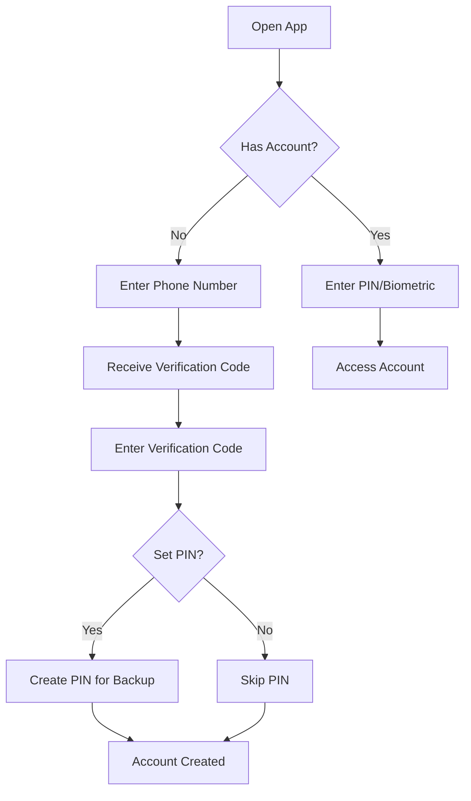

**Preconditions**:
- Valid phone number
- Network connectivity
- Not rate-limited

**Main Flow**:
1. User opens Signal
2. User enters phone number
3. Signal sends verification code via SMS/voice
4. User enters verification code
5. (Optional) User creates PIN for SVR2 backup
6. Signal generates cryptographic keys
7. Account is created on server

**Alternative Flows**:
- **Device Transfer**: Transfer account from another device via QR code
- **Restore Backup**: Restore from local or cloud backup

**Code Location**: `feature/registration/`

---

### UC-02: Send Direct Message

**Actor**: Registered User
**Goal**: Send an encrypted message to a contact

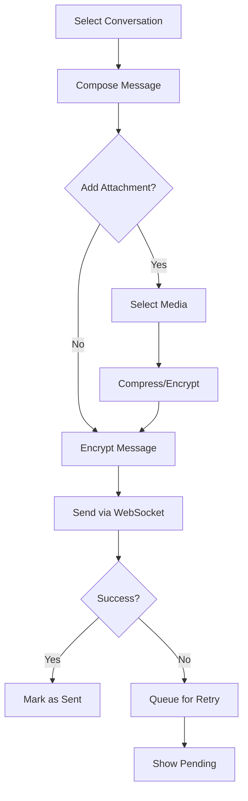

**Preconditions**:
- User has Signal account
- Recipient is a Signal user
- Network connectivity (or queued for later)

**Main Flow**:
1. User selects or creates conversation
2. User composes message text
3. (Optional) User adds attachments
4. Signal encrypts message using Signal Protocol
5. Signal sends encrypted message to server
6. Signal stores message in local database
7. Server delivers to recipient(s)

**Business Rules**:
- Messages are end-to-end encrypted
- Failed sends are queued with exponential backoff
- Disappearing messages auto-delete after timer

**Code Location**: `messages/`, `conversation/`

---

### UC-03: Receive Message

**Actor**: Registered User
**Goal**: Receive and read an encrypted message

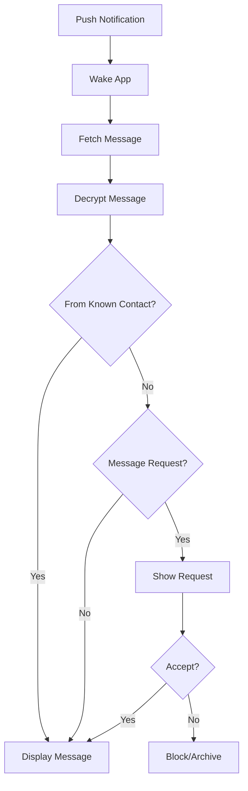

**Main Flow**:
1. Signal receives push notification
2. App wakes and fetches encrypted message
3. Signal decrypts message using Signal Protocol
4. Signal stores in local database
5. UI displays message in conversation

**Business Rules**:
- Unknown senders create message requests
- Read receipts sent if enabled
- Message appears in notification

**Code Location**: `push/`, `messages/`

---

### UC-04: Create Group

**Actor**: Registered User
**Goal**: Create a new Signal group

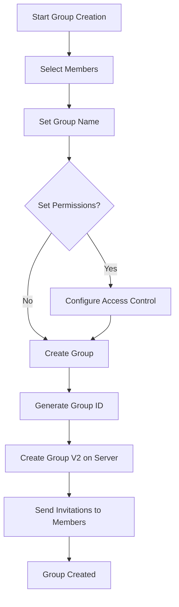

**Preconditions**:
- User has Signal account
- Selected members are Signal users
- User has network connectivity

**Main Flow**:
1. User initiates group creation
2. User selects members from contacts
3. User sets group name and avatar
4. (Optional) User configures permissions
5. Signal creates Group V2 on server
6. Signal sends invitations to members
7. Group appears in user's conversation list

**Business Rules**:
- Groups use Group V2 protocol
- Maximum 1,000 members
- Creator is automatically admin

**Code Location**: `groups/`

---

### UC-05: Make Voice/Video Call

**Actor**: Registered User
**Goal**: Initiate an encrypted voice or video call

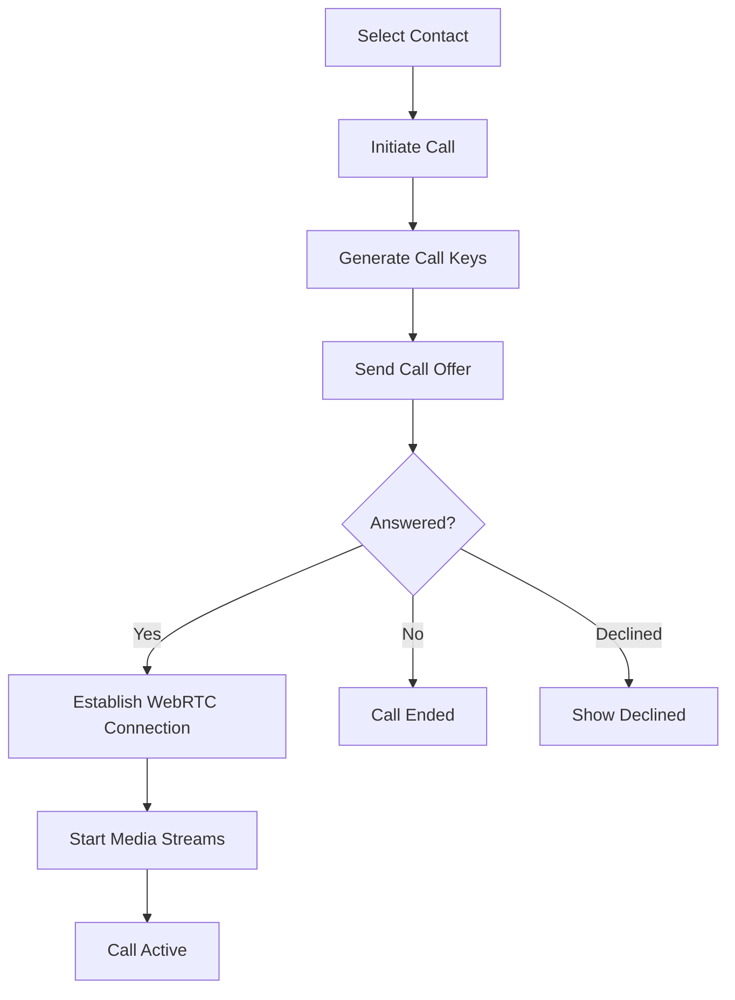

**Preconditions**:
- User has Signal account
- Recipient is a Signal user
- Microphone/camera permission (if video)

**Main Flow**:
1. User selects contact and initiates call
2. Signal generates call cryptographic keys
3. Signal sends call offer via server
4. Recipient receives ringing notification
5. On answer, WebRTC connection established
6. Encrypted media streams begin
7. Call UI shows video/audio controls

**Technical Details**:
- Uses RingRTC (Signal's WebRTC fork)
- Media encrypted with SRTP
- Signaling via WebSocket
- TURN servers for NAT traversal

**Code Location**: `components/webrtc/`, `ringrtc/`

---

### UC-06: Send Payment

**Actor**: Registered User
**Goal**: Send MobileCoin to a contact

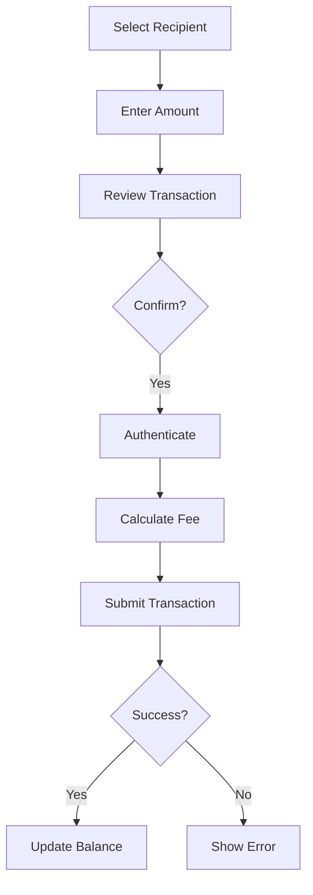

**Preconditions**:
- User has Signal account
- User has set up MobileCoin wallet
- User has sufficient balance + fee
- Recipient has payments enabled

**Main Flow**:
1. User selects recipient for payment
2. User enters amount and optional note
3. Signal estimates transaction fee
4. User confirms payment
5. User authenticates (PIN/biometric)
6. Signal submits transaction to MobileCoin network
7. Transaction is recorded locally
8. Payment appears in chat

**Business Rules**:
- Payments are irreversible
- Fees are paid to MobileCoin network
- Geographic restrictions may apply

**Code Location**: `payments/`

---

### UC-07: Link Desktop Device

**Actor**: Registered User
**Goal**: Link a desktop client to existing account

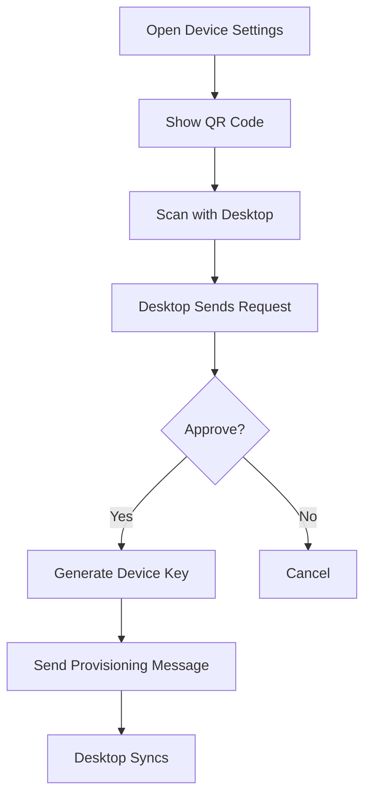

**Preconditions**:
- User has Signal account on mobile
- Desktop app is installed
- Both devices have network connectivity

**Main Flow**:
1. User opens linked devices settings
2. Signal displays QR code with provisioning info
3. User scans QR code with desktop app
4. Desktop sends provisioning request
5. Mobile prompts user to approve
6. On approval, Signal generates device-specific keys
7. Desktop receives provisioning message
8. Desktop syncs account state

**Business Rules**:
- Primary device is always mobile
- Each device has unique identity key
- Messages are encrypted per-device

**Code Location**: `linkdevice/`

---

### UC-08: Backup and Restore

**Actor**: Registered User
**Goal**: Backup and restore Signal data

#### Backup Flow

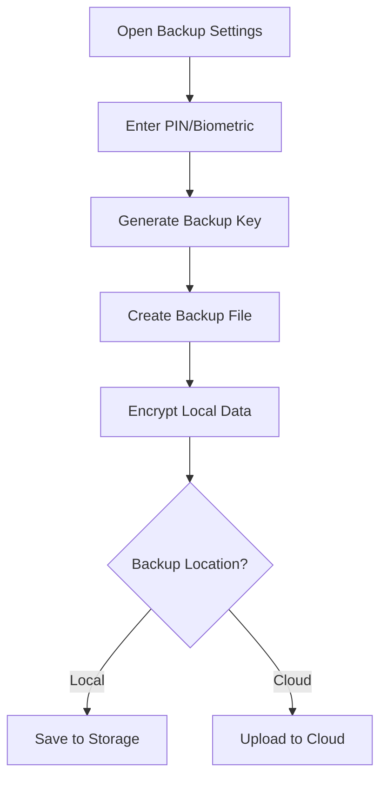

#### Restore Flow

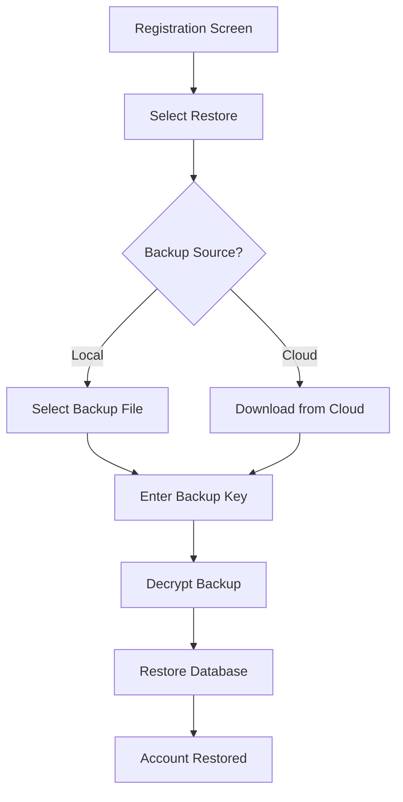

**Backup Types**:
- **Full Backup**: Complete database backup (local file)
- **SVR2 Backup**: Cryptographic keys backed up to Signal servers
- **Media Backup**: Attachments backed up separately

**Code Location**: `backup/`

---

## Protocol Use Cases

### UC-09: Establish Session

**Actor**: Sender Device
**Goal**: Create encrypted channel with recipient device

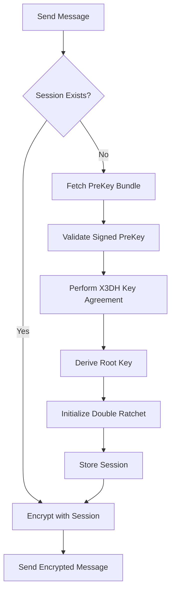

**Preconditions**:
- Sender has Signal account
- Recipient is registered on Signal
- Network connectivity

**Main Flow**:
1. Sender initiates message send
2. Signal checks for existing session with recipient device
3. If no session, fetch PreKey bundle from server
4. Validate signed PreKey signature with identity key
5. Perform X3DH key agreement:
   - DH1 = DH(IK_sender, SPK_recipient)
   - DH2 = DH(EK_sender, IK_recipient)
   - DH3 = DH(EK_sender, SPK_recipient)
   - DH4 = DH(EK_sender, OPK_recipient) if available
6. Derive root key from combined DH outputs
7. Initialize Double Ratchet state
8. Store session in SessionTable
9. Encrypt message with new session

**Multi-Device Handling**:
- For recipients with multiple devices, establish session for each device
- Each device gets unique session with independent ratchet state
- All sessions use same identity key but different PreKeys

**Code Location**: `lib/libsignal-service/.../SignalServiceMessageSender.java:2831-2870`

---

### UC-10: Distribute Sender Key

**Actor**: Group Member
**Goal**: Share group encryption key with other members

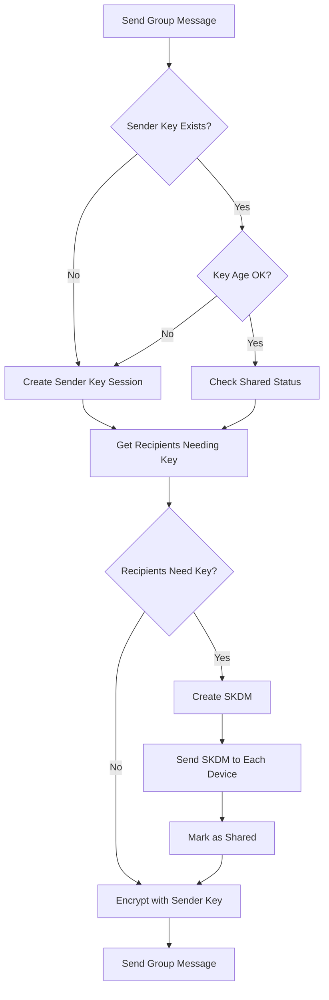

**Preconditions**:
- Sender is member of Signal group
- DistributionId exists for group

**Main Flow**:
1. Sender initiates group message send
2. Signal checks sender key age, rotates if too old
3. Signal checks which recipients have received this sender key
4. For recipients missing the key:
   - Create SenderKeyDistributionMessage (SKDM)
   - Send SKDM to all devices of each recipient
   - Mark sender key as shared in SenderKeySharedTable
5. Encrypt message once with sender key
6. Send encrypted message to all recipients

**Security Guarantees**:
- One encryption for all recipients (efficient)
- Sender key rotated when membership changes
- Removed members cannot decrypt future messages

**Code Location**: `lib/libsignal-service/.../SignalServiceMessageSender.java:2480-2613`

---

### UC-11: Handle Group Membership Change

**Actor**: System
**Goal**: Maintain group security when membership changes

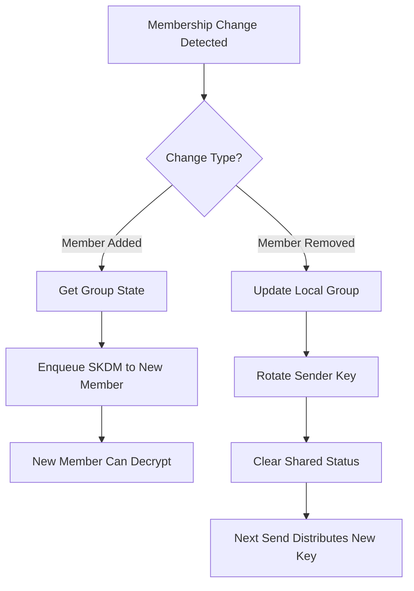

**Member Added Flow**:
1. Server notifies of new member
2. Local group state updated
3. SenderKeyDistributionSendJob enqueued
4. SKDM sent to new member's devices
5. Member can decrypt future group messages

**Member Removed Flow**:
1. Server notifies of member removal
2. Local group state updated
3. Sender key rotated (deleted + cleared shared status)
4. Next group message creates new sender key
5. New key distributed to remaining members only
6. Removed member cannot decrypt future messages

**Code Location**: `app/.../groups/v2/processing/GroupsV2StateProcessor.kt`, `app/.../crypto/SenderKeyUtil.java:18-23`

---

## Secondary Use Cases

### UC-09: Report Spam/Block User

**Actor**: Registered User
**Goal**: Block unwanted contact

1. User views conversation or profile
2. User selects "Block" option
3. Signal adds recipient to blocked list
4. Future messages are silently discarded
5. User can optionally report as spam

**Code Location**: `blocked/`

---

### UC-10: Set Disappearing Messages

**Actor**: Registered User
**Goal**: Configure message auto-deletion

1. User opens conversation settings
2. User selects disappearing messages
3. User chooses duration (off, 30s, 5m, 1h, 1d, 1w)
4. Signal updates conversation settings
5. New messages auto-delete after duration

**Code Location**: `conversation/`

---

### UC-11: Create Call Link

**Actor**: Registered User
**Goal**: Create shareable call link for group call

1. User selects "Create Call Link"
2. Signal generates unique call link
3. User can share link with anyone
4. Recipients can join via link
5. Call host can administer call

**Code Location**: `calls/links/`

---

### UC-12: Send Story

**Actor**: Registered User
**Goal**: Share ephemeral content with contacts

1. User captures or selects media
2. User adds text, drawings, or filters
3. User selects audience (all contacts, custom)
4. Signal posts story
5. Story expires after 24 hours

**Code Location**: `stories/`

---

## Related Documentation

- [Business Domain](Business-Domain.md) - Domain concepts and terminology
- [C4 Component Diagram](C4-Component-Diagram.md) - Technical implementation
- [Features](Features.md) - Feature overview